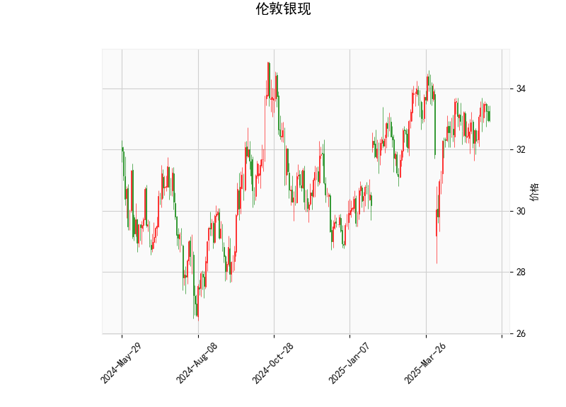

### 伦敦银现技术分析结果解读

#### 1. 对技术指标的详细分析
基于提供的伦敦银现（XAG/USD）技术分析数据，我们可以从多个角度解读当前的市场状况。当前价格为32.955，整体指标显示市场处于相对中性偏看涨的状态，但缺乏强烈的趋势信号。下面是对关键指标的逐一分析：

- **RSI（相对强弱指数）**：当前RSI值为51.02。这表明市场处于中性区域（RSI通常在30-70之间为中性），既非超买（RSI>70）也非超卖（RSI<30）。RSI略高于50，暗示近期买方力量稍占上风，但整体动能有限，价格可能继续在当前水平盘整。如果RSI持续上升至60以上，可能预示短期上行趋势。

- **MACD（移动平均收敛散度）**：MACD线值为0.1296，信号线值为0.1021，直方图（MACD Hist）值为0.0275（正值）。MACD线高于信号线，且直方图为正，表明短期存在看涨信号。这通常意味着多头力量正在增强，可能触发价格反弹。然而，直方图值较小，表明这一信号并不强烈。如果MACD直方图继续扩大，价格可能向上突破；反之，如果直方图转为负值，则需警惕潜在回调。

- **布林带（Bollinger Bands）**：上轨为34.69，中轨为32.88，下轨为31.08。当前价格（32.955）接近中轨，处于布林带的中间区域，这反映出市场缺乏明显的波动性，价格可能在该范围内震荡。中轨作为动态支撑位，如果价格向上突破上轨（34.69），可能形成强势上行；反之，如果跌破下轨（31.08），则可能进入弱势下行阶段。目前的布林带宽度较窄，暗示市场可能即将出现突破（向上或向下），投资者需密切关注。

- **K线形态**：形态包括“CDLMATCHINGLOW”和“CDLSHORTLINE”。CDLMATCHINGLOW表示最近K线出现了两个相似的低点，这通常被视为潜在支撑位，可能预示价格即将反弹或止跌。CDLSHORTLINE则表示K线实体较短，反映出市场不确定性增强，价格波动较小，可能处于盘整阶段。总体而言，这些形态暗示短期内价格可能企稳并尝试向上，但需结合其他指标确认。

综合上述指标，伦敦银现当前处于一个中性偏看涨的态势。RSI和MACD提供了一些积极信号，而布林带和K线形态则强调了潜在的支撑和盘整。市场可能在32-35的区间内波动，但缺乏强烈趋势。

#### 2. 近期可能存在的投资或套利机会及策略判断
基于上述分析，伦敦银现近期可能存在短期投资机会，特别是围绕支撑位和潜在突破的交易。以下是对机会的评估和策略建议：

- **投资机会评估**：
  - **潜在看涨机会**：MACD的正直方图和CDLMATCHINGLOW形态暗示短期反弹可能。如果价格突破布林带上轨（34.69），这可能触发更广泛的上涨趋势，尤其在全球经济不确定性（如通胀或地缘政治事件）推动贵金属需求时。当前RSI中性也为进场提供了安全边际。
  - **潜在套利机会**：伦敦银现作为现货市场，可与期货（如COMEX银期货）或相关衍生品（如期权）进行跨市场套利。例如，如果现货价格与期货价格出现价差（目前现货在32.955附近），投资者可考虑无风险套利策略，如现货-期货价差套利。但需注意，当前指标显示市场波动性较低，套利机会可能较短暂，且需监控全球银市供需动态（如工业需求或美元波动）。
  - **风险因素**：如果RSI升至超买区或MACD直方图反转，价格可能回落至下轨（31.08）附近，增加回调风险。总体上，机会更多适合短期交易者，而非长期持有者。

- **投资策略建议**：
  - **买入策略**：在当前价格附近（32.955）考虑小仓位买入，设置止损在下轨（31.08）以下。触发条件：若MACD直方图扩大或价格突破上轨（34.69），增加仓位。目标位可设在34-35区间，结合RSI确认避免超买。
  - **卖出策略**：如果K线形态出现更多看跌信号（如价格跌破中轨），可考虑卖出或做空。止盈位设在上轨附近，止损控制在5-10%的范围内。
  - **套利策略**：针对跨市场机会，建议使用价差套利——例如，在现货市场买入并在期货市场卖出（或反之），但需实时监控价差收敛。风险管理：使用杠杆控制在20%以内，并结合布林带宽度作为波动预警。
  - **整体风险管理**：采用多元化组合（如结合黄金或其他贵金属），并监控宏观因素（如美联储政策或银矿供应）。短期内，优先选择高流动性平台（如MT4），并每日复盘指标变化。

总之，近期伦敦银现的投资机会以短期看涨为主，适合经验丰富的交易者操作。但市场不确定性较高，建议结合基本面分析（如银价与美元汇率的关系）并严格止损，以控制风险。