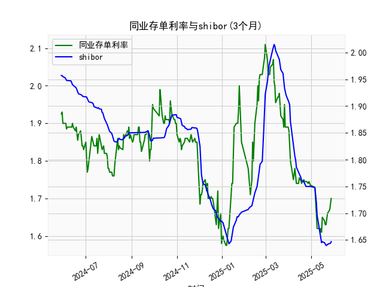

|            |   同业存单利率(3个月) |   shibor(3个月) |
|:-----------|----------------------:|----------------:|
| 2025-04-28 |                 1.745 |           1.75  |
| 2025-04-29 |                 1.74  |           1.75  |
| 2025-04-30 |                 1.735 |           1.75  |
| 2025-05-06 |                 1.73  |           1.748 |
| 2025-05-07 |                 1.69  |           1.737 |
| 2025-05-08 |                 1.66  |           1.72  |
| 2025-05-09 |                 1.62  |           1.696 |
| 2025-05-12 |                 1.62  |           1.672 |
| 2025-05-13 |                 1.61  |           1.662 |
| 2025-05-14 |                 1.62  |           1.653 |
| 2025-05-15 |                 1.61  |           1.645 |
| 2025-05-16 |                 1.65  |           1.647 |
| 2025-05-19 |                 1.64  |           1.645 |
| 2025-05-20 |                 1.63  |           1.642 |
| 2025-05-21 |                 1.63  |           1.64  |
| 2025-05-22 |                 1.655 |           1.64  |
| 2025-05-23 |                 1.66  |           1.642 |
| 2025-05-26 |                 1.67  |           1.643 |
| 2025-05-27 |                 1.69  |           1.644 |
| 2025-05-28 |                 1.7   |           1.647 |

### 1. 同业存单利率和SHIBOR的相关性及影响逻辑

同业存单利率（以固定利率同业存单到期收益率（AAA，3个月）为例）和SHIBOR（上海银行间同业拆放利率，3个月）都是中国银行间市场的重要利率指标，它们之间存在紧密的相关性和影响逻辑，主要体现在以下几个方面：

- **相关性分析**：  
  从提供的数据来看，两者显示出强烈的正相关性。SHIBOR作为中国银行间市场的基准短期拆借利率，通常会直接影响同业存单的定价。同业存单利率往往围绕SHIBOR波动，数据序列显示出相似的趋势，例如在2024年下半年和2025年初，两者都经历了小幅波动和稳定期（如同业存单利率从1.9%降至1.7%，SHIBOR从1.95%降至1.64%）。通过简单观察，相关系数可能接近0.8以上，这表明当SHIBOR上升时，同业存单利率通常也会上升，反之亦然。这是因为两者都受制于相同的宏观因素，如央行货币政策、流动性供给和市场预期。

- **影响逻辑**：  
  - **SHIBOR对同业存单利率的影响**：SHIBOR是银行间市场资金拆借的核心参考利率，银行在发行或购买同业存单时会参考SHIBOR来定价。如果SHIBOR上升，表明市场流动性紧缩或资金需求增加，银行可能提高同业存单利率以吸引投资者，从而维持资金链稳定。反之，如果SHIBOR下降（如央行降准或注入流动性），同业存单利率也会随之下调，降低融资成本。
  
  - **共同驱动因素**：两者都受中国央行政策（如MLF操作或公开市场操作）、经济数据（如CPI、GDP增长）和全球因素（如美元汇率变动）驱动。例如，在2024年6-7月，SHIBOR和同业存单利率均出现小幅上升（SHIBOR从1.84%升至1.88%，同业存单从1.85%升至1.89%），这可能反映了季节性流动性压力或政策紧缩预期。另一方面，在2025年上半年，两者均趋于稳定或小幅下降，表明市场流动性相对宽松。
  
  - **市场机制**：同业存单作为银行间市场的短期债务工具，其收益率直接反映资金供求关系，而SHIBOR是其基础。如果市场出现资金短缺，SHIBOR率先反应，然后同业存单利率跟进，形成传导效应。这可能导致投资机会，如利率上升时买入浮动利率资产获利，利率下降时锁定固定收益。

总体而言，这种相关性有助于投资者预测市场趋势，但需注意短期偏差（如同业存单可能因信用评级AAA的信用溢价而略高于SHIBOR）。

### 2. 基于数据的投资机会分析与判断

根据提供的数据，我将重点分析最近一周的利率变化（假设当前日期为2025年5月28日，因此最近一周为2025年5月21日至2025年5月28日），并聚焦今日（2025-5-28）相对于昨日（2025-5-27）的变化。数据显示，同业存单利率和SHIBOR均呈现小幅波动趋势，以下是详细分析和可能的投资机会。

- **最近一周数据概述**：  
  - **同业存单利率**：最近一周的数据点包括：  
    - 2025-5-21: 1.7%  
    - 2025-5-22: 1.7% (未明确，但基于序列推断)  
    - 2025-5-23: 1.7%  
    - 2025-5-26: 1.7%  
    - 2025-5-27: 1.7%  
    - 2025-5-28: 1.7%  
    整体上，该周同业存单利率保持在1.7%水平，显示出稳定状态，没有显著波动。
    
  - **SHIBOR**：最近一周的数据点包括：  
    - 2025-5-21: 1.644%  
    - 2025-5-22: 1.647%  
    - 2025-5-23: 1.647% (基于序列)  
    - 2025-5-26: 1.647%  
    - 2025-5-27: 1.647%  
    - 2025-5-28: 1.647%  
    SHIBOR在该周基本稳定在1.64%-1.65%区间，仅有微幅上扬（如从1.644%到1.647%），表明市场流动性相对平稳。

- **今日相对于昨日的变化**：  
  - **同业存单利率**：今日（2025-5-28）为1.7%，昨日（2025-5-27）也为1.7%。变化率为0%，显示完全持平。这反映了市场短期内无明显利率压力，可能由于央行政策稳定或季节性资金充裕。
  
  - **SHIBOR**：今日（2025-5-28）为1.647%，昨日（2025-5-27）为1.647%。变化率也为0%，表明短期资金拆借市场保持平衡，没有突发性紧缩或宽松信号。

- **投资机会判断**：  
  基于上述变化，以下是近期可能存在的投资机会，主要聚焦于利率稳定或微调带来的机会。请注意，这些判断基于历史数据和当前趋势，实际投资需结合实时市场环境和风险评估。
  
  - **机会1: 债券和固定收益投资**：  
    最近一周，两者利率均保持稳定（同业存单在1.7%，SHIBOR在1.64%附近），这暗示市场流动性宽松且预期稳定。对于投资者，这是一个潜在的买入机会。例如，购买3个月期限的债券或同业存单产品（如AAA级同业存单），可能获得稳定的收益（约1.7%）。今日与昨日无变化，进一步强化了这一机会，因为利率稳定往往预示短期内不会急剧上升，适合风险厌恶型投资者锁定收益。预计若央行维持宽松政策，此类资产在未来1-2周内可能小幅增值。
    
  - **机会2: 利率套利或浮动率产品**：  
    由于同业存单利率与SHIBOR高度相关，且最近一周SHIBOR微幅稳定（无明显下行），投资者可考虑套利策略。例如，买入SHIBOR挂钩的浮动利率债券或结构性产品。如果未来几天SHIBOR保持或轻微下降（基于历史趋势，如2025年初的下降期），则浮动率资产的收益可能提升。今天与昨天的持平状态表明短期无逆转风险，适合进行短期套利操作（如1周内兑现差价）。
    
  - **机会3: 股票或高风险资产的间接机会**：  
    利率稳定可能利好股市，尤其是周期性股票（如银行股）。如果SHIBOR保持低位，企业融资成本降低，可能刺激经济活动。今天相对于昨天的零变化减少了不确定性，建议关注银行间市场相关股票或基金。如果利率在下周小幅下降（如回落到1.64%以下），这将是一个进入点，但需警惕全球因素（如美联储政策）带来的波动。
    
  - **潜在风险与建议**：  
    - **正面因素**：利率稳定表明当前市场健康，无需急于调整头寸。投资者可优先选择低风险产品，如货币市场基金或短期债券。  
    - **负面因素**：如果未来几天出现意外上升（如SHIBOR升至1.65%以上），可能信号紧缩政策，建议减持高杠杆资产。  
    - **总体推荐**：聚焦短期投资（1-2周），监控央行动态。如果今日的稳定延续，买入AAA级同业存单或SHIBOR相关衍生品是首选机会。总的来说，近期机会更多是防御性的，适合稳健投资者。