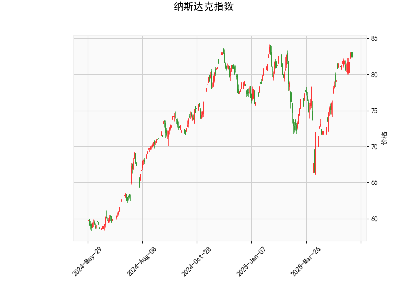

# 纳斯达克指数的技术分析结果解读

## 1. 技术指标分析
基于提供的纳斯达克指数数据，我们可以从多个维度分析当前的市场状况。以下是对关键指标的详细解读，这些指标反映了价格趋势、动量和潜在反转信号。

### RSI（相对强弱指数）
- **当前值**：65.88
- **解读**：RSI高于70通常被视为超买状态，这表明纳斯达克指数可能已过度上涨，短期内存在回调风险。65.88的水平显示市场动量强劲，但投资者需警惕潜在的修正，尤其是如果外部因素（如经济数据或地缘事件）施压。总体上，这暗示短期内价格可能面临下行压力。

### MACD（移动平均收敛散度）
- **MACD线**：1.84
- **信号线**：1.81
- **柱状图（MACD Hist）**：0.03（正值）
- **解读**：MACD线高于信号线，且柱状图为正，表明短期内存在看涨信号。这反映了价格动量向上，可能驱动指数进一步上涨。然而，差距较小（仅0.03），显示势头并不强烈。如果柱状图开始缩小或转向负值，将是看跌的预警信号。

### 布林带（Bollinger Bands）
- **上轨**：84.38
- **中轨**：76.24
- **下轨**：68.10
- **当前价**：82.55
- **解读**：当前价格位于中轨和上轨之间，接近上轨（84.38），这表明指数处于相对高位，波动性可能增加。布林带的收缩或扩张通常预示市场波动：如果价格突破上轨，可能继续上涨；反之，如果回落至中轨以下，则可能进入修正阶段。整体上，这显示市场处于中性偏涨，但离上轨较近增加了回调的可能性。

### K线形态
- **形态**：CDLMATCHINGLOW 和 CDLSHORTLINE
- **解读**：
  - **CDLMATCHINGLOW**：这是一个潜在看跌形态，通常表示价格可能在短期内逆转。它暗示市场可能从当前高位回落，尤其在RSI超买的背景下。
  - **CDLSHORTLINE**：这反映了短期价格波动或不确定性，可能表示市场缺乏明确方向。结合其他指标，这可能预示小幅调整或横盘整理，而不是大幅趋势变化。

**总体技术分析总结**：纳斯达克指数显示混合信号。MACD的看涨信号支持进一步上涨，但RSI的超买状态、布林带接近上轨以及K线形态的看跌暗示增加了风险。市场可能处于短期顶部，投资者应密切关注外部因素（如美联储政策或科技股表现），以评估是否会触发回调。

## 2. 近期可能存在的投资或套利机会和策略
基于上述技术分析，我们可以判断纳斯达克指数的潜在机会。当前的市场环境显示出上涨潜力，但也伴随显著风险。以下是针对近期（短期内几周）的分析和建议策略，重点关注风险管理和机会挖掘。

### 可能的投资机会
- **看涨机会**：MACD的正向信号表明，如果指数维持在布林带中轨以上，短期内可能继续上涨（例如向84.38上轨测试）。这为多头投资者提供买入点，尤其如果市场情绪乐观（如科技股反弹）。然而，RSI超买的风险可能导致波动性增加。
- **看跌机会**：RSI和K线形态的信号提示潜在回调。如果价格跌破中轨（76.24），这可能触发更广泛的修正，提供做空或卖出机会。近期机会可能集中在短期调整上，例如通过ETF或期货合约。
- **套利机会**：纳斯达克指数与相关资产（如科技股ETF、期货或期权）之间可能存在价格不一致。例如，如果纳斯达克现货价格与期货价格脱节，或与关联指数（如S&P 500）出现相对价值差异，这可用于套利策略。但需注意，当前信号混合，套利窗口可能短暂，且依赖市场流动性。

### 推荐投资策略
- **多头策略（买入）**：
  - **时机**：如果MACD柱状图扩大且价格稳定在上轨以下，可考虑在当前价位（82.55）附近买入纳斯达克相关ETF（如QQQ）。目标位设在84.50附近。
  - **风险管理**：设置止损在布林带中轨（76.24）以下，以防范RSI引发的回调。结合RSI，如果其回落至60以下，再加仓。
  
- **空头策略（卖出或做空）**：
  - **时机**：基于CDLMATCHINGLOW形态，如果RSI超过70且价格未能突破上轨，可做空指数期货或相关期权。目标位设在中轨（76.24）或下轨（68.10）。
  - **风险管理**：止盈设在当前价位以上，监控MACD信号以避免反转。

- **中性或套利策略**：
  - **跨市套利**：如果纳斯达克与S&P 500或其他指数的相对价值偏离（例如，通过计算价差），可采用配对交易：在纳斯达克做多，同时在相关资产做空，反之亦然。当前混合信号适合这种策略，以捕捉短期不一致。
  - **波动率策略**：利用布林带的窄幅波动，购买期权 straddles 或 strangles，以获利于潜在的大幅波动。预计短期内波动率会上升。

- **总体风险提示**：投资决策应结合基本面因素（如经济数据、通胀预期）。纳斯达克作为科技驱动指数，容易受全球事件影响。建议采用分批入场和严格止损，以控制风险。长期投资者可等待更清晰的信号，而短期交易者应优先关注MACD和RSI的动态变化。

通过以上分析，纳斯达克指数短期内可能呈现“小幅上涨或回调”的格局，投资者需谨慎行事，结合个人风险偏好制定策略。