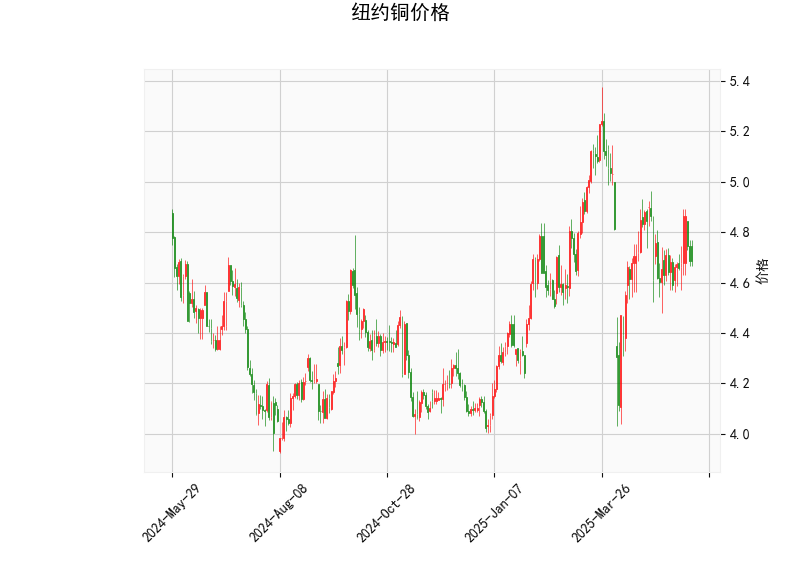

### 纽约铜价格的技术分析结果分析

#### 1. 对技术分析结果的详细解读
基于提供的纽约铜价格数据，我们可以从多个技术指标角度进行分析，以评估当前市场的态势。当前价格为4.684，整体指标显示出市场处于相对中性偏震荡的状态，但也存在一些潜在的转折信号。以下是对各指标的逐一分析：

- **RSI（相对强弱指数）**：当前RSI值为48.08。这是一个中性水平，处于30-70的正常区间内，但略低于50，暗示市场可能轻微超卖。RSI低于50通常表示卖方力量稍占上风，但尚未进入超卖区（低于30），因此短期内可能出现反弹或修正。如果RSI回升至50以上，将是看涨的积极信号。

- **MACD（移动平均收敛散度）**：MACD线值为-0.0008，信号线值为-0.0075，MACD直方图值为0.0067。从这些数值来看，MACD线高于信号线（尽管两者均为负值），这形成了一个看涨交叉（Bullish Crossover）。这表明短期内卖方动能可能正在减弱，买方力量开始积累。然而，整体MACD仍处于负值区域，暗示熊市趋势尚未完全逆转。如果MACD直方图继续扩大（保持正值），这可能预示价格反弹的加强。

- **布林带（Bollinger Bands）**：上轨为5.233，中轨为4.786，下轨为4.338。目前价格4.684位于中轨附近（略低于中轨），这表明价格处于布林带的中间区域，市场波动相对稳定。没有明显突破上轨或下轨，显示出横盘整理的特征。如果价格跌破下轨（4.338），可能触发进一步下行；反之，如果反弹至中轨以上，将是多头信号。布林带的宽度显示当前市场波动率中等，适合观察潜在突破机会。

- **K线形态**：识别出的形态包括“CDLMATCHINGLOW”和“CDLSHORTLINE”。CDLMATCHINGLOW表示最近K线形成了两个相似的低点，这通常被视为潜在的底部信号，暗示市场可能在当前水平找到支撑，预示着反弹机会。CDLSHORTLINE则表示K线实体较短，反映出市场不确定性和波动率降低，买卖双方力量均衡。这种组合暗示短期内价格可能维持震荡，但如果伴随其他指标的看涨信号，CDLMATCHINGLOW可能成为逆转的催化剂。

总体而言，技术指标呈现混合信号：RSI和MACD显示轻微看涨倾向（超卖和交叉信号），布林带表明中性区间，而K线形态强调潜在支撑。这可能意味着纽约铜价格短期内处于整理阶段，等待进一步确认方向。

#### 2. 近期可能存在的投资或套利机会和策略判断
基于上述分析，纽约铜市场当前存在一定的投资机会，特别是短期反弹的可能性。但市场不确定性较高，投资者需谨慎，结合风险管理进行操作。以下是针对近期机会的判断和策略建议：

- **可能的投资机会**：
  - **短期反弹机会**：RSI超卖、MACD看涨交叉以及CDLMATCHINGLOW的底部信号共同暗示，价格可能从当前水平反弹。铜作为工业金属，其价格往往受全球经济复苏（如制造业需求）影响，如果外部因素（如经济数据或库存报告）正面，短期上涨概率增加。预计价格可能测试中轨（4.786）或上轨（5.233），提供10-15%的潜在涨幅空间。
  - **套利机会**：铜市场常与相关商品（如铝、原油或大宗商品指数）相关联。如果铜价相对其他金属（如LME铜与COMEX铜的价差）出现异常（如基于布林带的波动率差异），可能存在跨市场套利机会。例如，如果纽约铜价格相对于伦敦金属交易所（LME）铜价偏低，投资者可以通过价差套利获利。但当前数据显示市场中性，因此套利需等待价差扩大。

- **投资策略建议**：
  - **多头策略**：如果MACD直方图持续正值且价格企稳在中轨以上，建议买入多头头寸（如期货或ETF）。入场点可设在4.700附近，目标位为5.000（中轨上方），止损设在下轨以下（4.300）。这是一种低风险入场策略，适合短期交易者。
  - **风险控制策略**：鉴于RSI和MACD的混合信号，采用“买入并持有短期”的方法，并设置严格止损（如价格跌破4.500）。同时，结合基本面分析（如关注全球铜库存和中国需求数据），避免单纯依赖技术指标。
  - **套利策略**：如果观察到铜价与相关资产（如原油或股指）的相关性弱化，可考虑统计套利。例如，利用布林带的波动率差异，在纽约铜和LME铜之间建立对冲头寸（如买入纽约铜、卖出LME铜）。但需监控交易成本和流动性，确保价差收敛。当前环境下，套利机会尚不明显，适合经验丰富的投资者。

总体风险提示：铜市场受宏观因素（如地缘政治、通胀和需求波动）影响较大，当前技术信号虽有看涨迹象，但若全球经济放缓，价格可能进一步下行。建议投资者在实际操作前进行模拟测试，并结合资金管理原则（如仓位控制在总资金的10%以内）来执行策略。