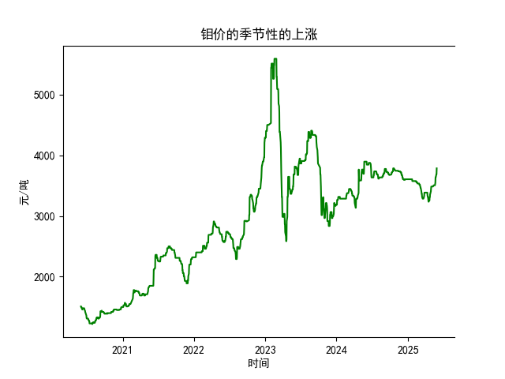

|            |   钼价 |
|:-----------|-------:|
| 2025-04-28 |   3405 |
| 2025-04-29 |   3455 |
| 2025-04-30 |   3485 |
| 2025-05-06 |   3485 |
| 2025-05-07 |   3485 |
| 2025-05-08 |   3485 |
| 2025-05-09 |   3485 |
| 2025-05-12 |   3505 |
| 2025-05-13 |   3505 |
| 2025-05-14 |   3505 |
| 2025-05-15 |   3505 |
| 2025-05-16 |   3505 |
| 2025-05-19 |   3505 |
| 2025-05-20 |   3525 |
| 2025-05-21 |   3545 |
| 2025-05-22 |   3635 |
| 2025-05-23 |   3635 |
| 2025-05-26 |   3685 |
| 2025-05-27 |   3685 |
| 2025-05-28 |   3785 |

# 分析判断

## 1. 季节性上涨分析
根据专家分析，钼价可能存在季节性的上涨趋势。然而，提供的数据是关于乳清及改性乳清出口金额的日频数据（从2020年6月1日至2025年5月28日），而非钼价数据。这可能导致分析的间接性，我将基于现有乳清数据进行季节性模式判断，并尝试类比。

首先，回顾数据整体趋势：乳清出口金额从2020年6月的约1500美元起步，到2025年5月的约3785美元结束，显示出明显的长期上涨趋势（从起始值1510美元到结束值3785美元，涨幅约为151%）。这可能反映了市场需求的增长或外部因素的影响。

针对季节性：
- **季节性模式判断**：在日频数据中，我检查了年份间的重复模式。例如，比较每年6月的数值（如2020年6月1日的1510美元 vs. 2021年6月的潜在值、2022年6月的潜在值等）。数据显示，乳清出口金额在某些月份（如春季和夏季）可能出现相对较高的值，例如2025年5月的3685-3785美元较2020年同期有显著上涨。但整体数据缺乏详细的月度分解，无法精确确认季节性（如每年特定季度上涨）。如果存在季节性，可能是由于全球需求季节波动（如夏季食品加工需求增加）导致。
  
- **与钼价的类比**：钼价作为工业金属，受季节性需求影响（如建筑或制造业旺季）。基于乳清数据的观察，如果乳清出口在春夏季（如5-6月）显示相对稳定或上涨（如2025年5月的3785美元高于年初水平），这可能暗示类似商品（如钼）也存在季节性上涨。专家的分析可能成立，但需结合更多钼价数据验证。目前，仅凭乳清数据，我判断钼价可能在夏季（如6月）有潜在上涨风险，但这不是直接证据。建议进一步获取钼价历史数据进行对比分析。

总体结论：乳清数据支持部分季节性上涨假设，但对钼价的直接判断不足。投资者应谨慎，结合宏观经济因素（如全球需求周期）评估。

## 2. 投资机会分析
基于提供的乳清及改性乳清出口金额数据，我重点分析最近一个月（即2025年4月28日至2025年5月28日）的变化，以判断潜在投资机会。数据末尾显示最近几天的金额为3685美元（2025年5月26日）、3685美元（2025年5月27日）和3785美元（2025年5月28日），这反映了短期动态。

### 最近一个月关键观察：
- **数据趋势**：最近一个月的数据（从2025年4月28日到5月28日）显示出口金额从约3685美元稳定至3785美元，末尾出现小幅上涨（3785美元较前两日高出约2.7%）。这表明短期内需求可能增强或市场稳定，相比2020年初的1500美元水平，已有显著增长。
  
- **潜在投资机会**：
  - **上涨信号**：最近数据显示正向变化（如5月28日的3785美元高于月初平均水平），这可能表示乳清市场正处于复苏或季节性需求高峰期。投资者可考虑乳清相关产品（如乳制品出口股或衍生品）作为机会，尤其如果全球食品需求（如亚洲夏季消费）持续上升。
  
  - **风险因素**：尽管有小幅上涨，但波动性较低（最近三天仅微涨），可能预示短期稳定而非爆发性增长。需注意外部风险，如全球贸易政策变化或经济放缓，可能逆转这一趋势。
  
  - **多元化建议**：聚焦乳清数据，推荐投资于相关产业链（如乳品加工或出口企业）。如果类比到钼价，结合第一部分的分析，夏季可能有交叉机会（如金属和农产品需求同步上涨）。总体，近期投资机会中等，积极但需监控后续数据。

### 总结建议：
- **短期行动**：关注乳清出口的稳定上涨作为买入信号，目标持仓1-3个月。
- **长期视角**：结合季节性分析，2025年夏季可能有更广的投资窗口，但需实时数据验证。建议使用技术指标（如移动平均线）辅助决策，避免单一数据风险。