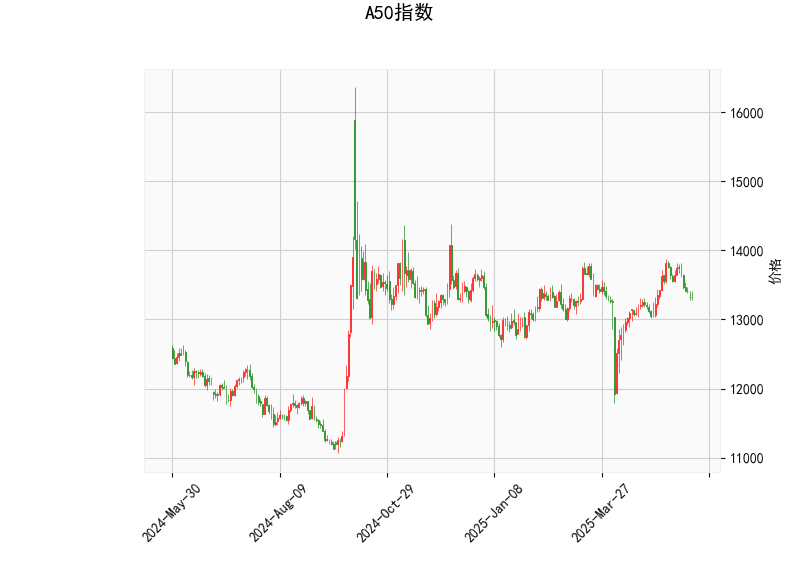

### 技术分析结果解读

#### 1. **当前价与布林轨道**
- **当前价（13320）**略高于布林线中轨（13309.85），但远低于上轨（13986.27），表明价格处于**中性偏弱区域**，短期未形成明显趋势。
- **布林带形态**：上下轨差值较大（约1353点），显示市场**波动率较高**，但当前价贴近中轨，可能进入震荡阶段。若价格突破上轨或下轨，可能触发单边行情。

#### 2. **RSI（相对强弱指数）**
- **RSI值45.93**处于中性区间（30-70），但接近50分水岭，显示市场**多空力量均衡**，短期缺乏方向性。需警惕若RSI跌破40可能加速下行，反之突破50可能转强。

#### 3. **MACD指标**
- **MACD线（45.84）低于信号线（93.03）**，且柱状图（-47.19）负值扩大，表明**空头动能占优**，短期存在进一步回调压力。但若柱状图缩窄（即MACD与信号线收敛），可能预示短期反弹。

#### 4. **K线形态**
- **CDLDOJI、CDLSPINNINGTOP、CDLLONGLEGGEDDOJI**：均为“十字星”或“长腿十字星”形态，反映市场**犹豫不决**，买卖双方争夺激烈。
- **CDLHIGHWAVE**（高浪线）：显示波动剧烈但方向不明。
- **CDLMATCHINGLOW**（匹配低点）：在下跌趋势中可能暗示短期止跌，但需配合其他信号确认。

---

### 投资/套利机会与策略

#### 1. **短期交易策略**
- **空头机会**：若价格跌破布林下轨（12633）且MACD柱状图持续扩大，可轻仓做空，目标看向前低支撑（如12500附近）。
- **多头机会**：若价格站稳中轨（13309.85）并伴随RSI回升至50以上，可尝试做多，目标看向布林上轨（13986）。

#### 2. **波段操作**
- **区间震荡策略**：当前价处于布林中轨附近，结合K线十字星形态，可在12633-13986区间内高抛低吸，止损设于区间外2%。

#### 3. **MACD背离套利**
- 若价格创新低但MACD柱状图缩窄（底背离），可能预示反转，可布局多单；反之顶背离则考虑空单。

#### 4. **事件驱动策略**
- 关注A50成分股财报、中国宏观经济数据（如PMI、CPI）或政策变动（如降息预期），利用布林带突破或MACD金叉/死叉顺势交易。

---

### 风险提示
- **假突破风险**：布林带在高波动环境下可能出现假突破，需结合成交量确认。
- **K线形态矛盾**：CDLMATCHINGLOW（看涨）与CDLHIGHWAVE（中性）信号冲突，需等待价格验证。
- **外部冲击**：美联储政策、地缘政治等黑天鹅事件可能打破技术面逻辑。