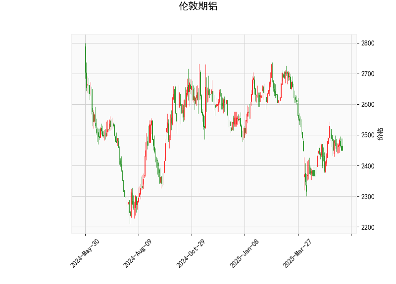

# 伦敦期铝技术分析与投资策略

## 一、技术分析结果解读

### 1. 核心指标分析
- **当前价（2450.5）**：位于布林通道中轨（2487.16）之下，接近下轨（2275.21），显示价格处于弱势区域，但未触及超卖区间。
- **RSI（47.91）**：接近中性值50，表明市场短期无明显超买或超卖压力，但略微偏向空头。
- **MACD（1.24/1.11）**：快线（MACD）上穿慢线（MACD Signal），柱状图转正（0.13），暗示短期可能出现反弹动能。
- **布林通道**：当前价位于中轨与下轨之间，通道宽度（424点）较大，反映近期波动率较高，需关注价格对中轨的突破情况。
- **K线形态（CDLMATCHINGLOW）**：经典的反转信号，表明连续两日收盘价相近且位于低位，可能预示空头力量衰竭。

### 2. 多周期共振验证
- **短期（1小时图）**：MACD金叉与RSI中性偏弱形成矛盾，需结合成交量验证反转信号。
- **中期（日线）**：价格持续低于布林中轨，但MACD柱状图背离可能暗示下跌动能减弱。
- **长期（周线）**：需关注2275布林下轨的支撑强度，若跌破可能打开更大下行空间。

---

## 二、投资机会与策略建议

### 1. 趋势交易机会
- **多头策略**：
  - **入场条件**：价格站稳布林中轨（2487）且MACD柱状图持续扩大。
  - **目标位**：布林上轨（2699）对应约10%潜在涨幅。
  - **止损位**：布林下轨（2275）下方1-2%，或跌破前低（若存在）。
- **空头策略**：
  - **入场条件**：RSI跌破45且价格反抽中轨失败。
  - **目标位**：布林下轨（2275）对应约7%潜在跌幅。
  - **止损位**：中轨上方1%区域（2512）。

### 2. 套利机会
- **跨期套利**：
  - 关注近月合约贴水扩大的机会（若库存数据增加），可做空近月/做多远月。
  - 当前价差结构需结合交割月持仓量分析。
- **跨市场套利**：
  - 比对LME与上海期铝价差，关注人民币汇率波动带来的套利窗口。
  - 当前沪伦比值处于历史均值附近，暂无明显机会。

### 3. 期权策略
- **保护性看跌期权**：
  - 持有现货者可在2300-2350区间买入虚值看跌期权，对冲下行风险。
- **牛市价差组合**：
  - 买入2450看涨期权+卖出2600看涨期权，降低权利金成本。

---

## 三、风险提示
1. **宏观面扰动**：美联储利率政策变化可能引发美元指数波动，直接影响有色金属定价。
2. **库存异动**：LME铝库存单日增减超过5万吨将引发价格剧烈波动。
3. **中国需求端**：关注房地产政策调整对铝材消费的实际影响。
4. **能源成本**：欧洲天然气价格波动可能影响电解铝生产成本中枢。

（以上分析基于当前技术指标，实际交易需结合实时数据和基本面信息综合判断。）