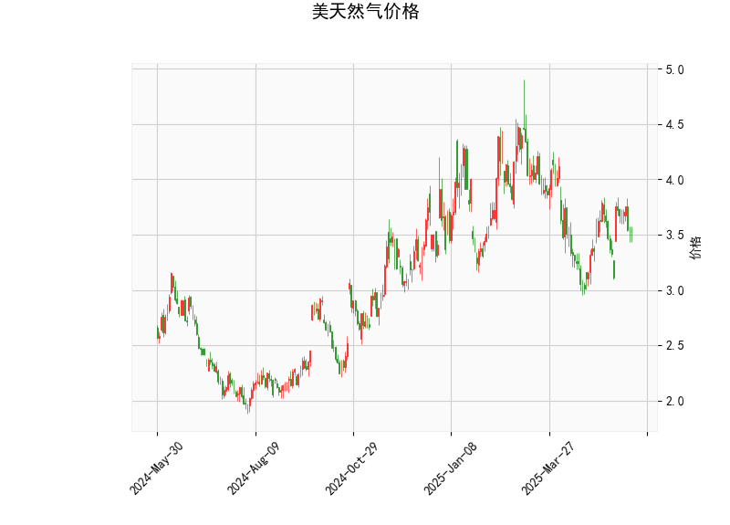

# 美国天然气价格技术分析及投资策略

## 一、技术分析解读

### 1. 核心指标分析
- **价格与布林轨道**：当前价3.535低于布林中轨（3.643），处于中下轨区间，但距离下轨（2.971）仍有约16%空间，短期下跌动能有限。
- **RSI（49.11）**：接近50中性值，显示多空力量均衡，无明确超买/超卖信号。
- **MACD指标**：MACD线（0.021）上穿信号线（0.013），柱状图转正，暗示短期反弹可能，但动能较弱（绝对值小于0.01）。
- **K线形态**：包含多个**十字星**（CDLDOJI、CDLLONGLEGGEDDOJI）和**纺锤线**（CDLSPINNINGTOP），反映市场犹豫，需警惕趋势反转可能。

### 2. 关键矛盾点
- **多空信号交织**：MACD金叉与价格未突破中轨形成矛盾，需结合布林带收敛（上轨4.315/下轨2.971）观察突破方向。
- **波动率提示**：布林带宽度（上轨-下轨=1.344）显示当前波动率较高，但价格处于中轨附近，方向选择迫近。

---

## 二、投资机会与策略

### 1. 趋势跟踪策略
- **多头机会**：若价格站稳布林中轨（3.643）且MACD柱持续扩大，可轻仓做多，目标上轨4.315，止损设于近期低点（如3.4下方）。
- **空头机会**：若价格跌破3.4且RSI下破45，可能加速测试下轨2.971，但需警惕冬季需求预期支撑。

### 2. 套利策略
- **跨期套利**：关注近月-远月合约价差，若库存数据显示季节性累库不及预期，可做多近月/做空远月。
- **波动率交易**：买入跨式期权组合（Long Straddle），利用布林带收窄后可能的突破行情。

### 3. 风险提示
- **事件驱动风险**：极端天气、地缘政治（如欧洲能源危机传导）可能引发价格跳空。
- **技术面局限**：当前K线形态显示市场犹豫，建议仓位控制在5%以下，突破确认后加仓。

---

**结论**：短期建议观望等待布林带突破信号，重点关注价格对中轨3.643的争夺。中期关注冬季需求启动时点，若库存数据配合，3.5以下价位具备长线配置价值。