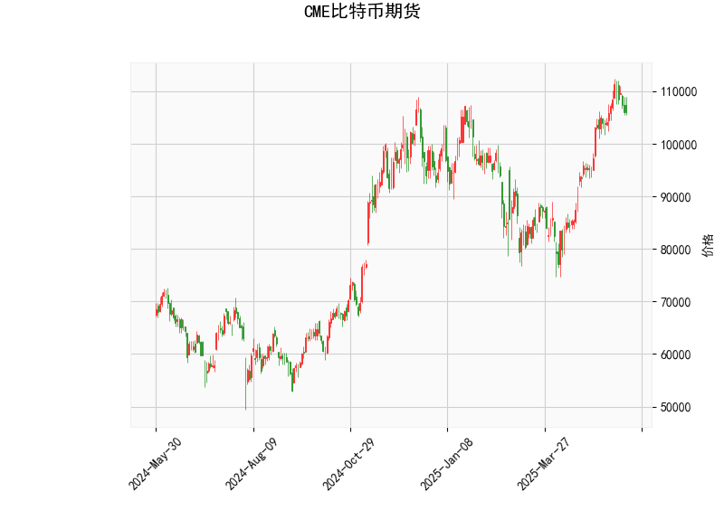

# CME比特币期货技术分析及投资策略

## 一、技术指标解析

### 1. 核心指标分析
- **当前价**：106,090美元，位于布林带中轨（92,669美元）和上轨（112,862美元）之间，接近上轨但未突破，显示短期存在上涨动能但面临阻力。
- **RSI（60.76）**：处于中性区间偏上沿，未进入超买区域（>70），反映市场情绪谨慎乐观，但需警惕冲高回落风险。
- **MACD**：MACD线（4,067）低于信号线（4,625），柱状图负值（-558），暗示短期动能偏弱，但若MACD线向上拐头则可能形成反弹信号。
- **布林带**：价格运行于中上轨区间，上轨压力位112,862美元，中轨支撑92,669美元，若突破上轨可能加速上涨，跌破中轨则可能向下轨（72,476美元）回落。
- **K线形态**：出现CDLMATCHINGLOW（匹配低点形态），通常为**下跌趋势中的看涨反转信号**，需结合当前价格位置验证有效性。

---

## 二、潜在机会与策略

### 1. 趋势交易机会
- **突破策略**：若价格放量突破布林带上轨（112,862美元），可顺势做多，目标前高区域（115,000-120,000美元），止损设于中轨下方（92,000美元）。
- **回调策略**：若价格回落至中轨（92,669美元）附近且RSI未跌破50，可分批布局多单，目标上轨压力位，止损设于下轨（72,476美元）下方。

### 2. 套利机会
- **跨期套利**：若近月合约溢价显著高于远月（Contango结构），可做空近月/做多远月组合，反之（Backwardation）则反向操作（需补充期限结构数据验证）。
- **波动率套利**：布林带收窄（当前带宽40,385美元）后若出现突破，可买入跨式期权组合（Long Straddle）押注波动率放大。

---

## 三、风险提示
1. **MACD背离风险**：MACD柱状图持续为负且价格滞涨，需警惕假突破后快速回调。
2. **RSI超买修正**：若RSI突破70后快速回落，可能引发多头平仓潮。
3. **K线形态失效**：CDLMATCHINGLOW需确认是否出现在连续下跌后，若当前处于高位震荡则信号可靠性下降。

**结论**：短期建议观望价格对布林带上轨的测试结果，突破后跟进做多，回调至中轨则分批建仓。套利需结合衍生品市场流动性及资金费率动态调整。