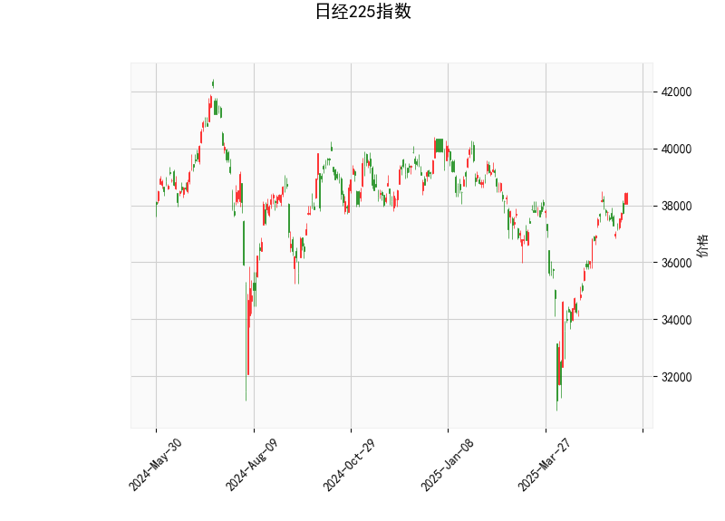

### 日经225指数技术分析结果解析

#### 1. 技术指标分析
- **当前价与布林轨道**  
  当前价（**38,432.98**）位于布林轨道中轨（**36,307.61**）和上轨（**39,746.11**）之间，接近上轨，表明短期市场处于**偏强区间**，但需警惕上轨附近的潜在压力。若价格突破上轨，可能加速上涨；若未能突破，可能回调至中轨附近。

- **RSI（相对强弱指数）**  
  RSI值为**66.28**，接近超买阈值（70），显示市场存在一定买盘压力。但尚未进入超买区，短期仍有上涨惯性，需关注后续是否持续放量突破或出现顶背离信号。

- **MACD指标**  
  MACD线（**551.59**）高于信号线（**501.39**），且柱状图（**50.20**）为正值并扩大，形成“金叉”后的加速上行，表明**上涨动能增强**，短期趋势偏多。

- **K线形态**  
  包含多个关键形态：  
  - **CDLBELTHOLD**：可能预示当前趋势（上涨）的延续。  
  - **CDLCLOSINGMARUBOZU**（收盘秃线）：收盘价接近最高价，显示买方主导，短期看涨。  
  - **CDLLONGLINE**（长脚线）：反映市场犹豫，需结合其他指标判断方向。  
  - **CDLMARUBOZU**（秃线）：实体较长且无影线，表明趋势强劲，当前为看涨信号。  
  综合来看，K线形态**整体偏多**，但需关注高位回调风险。

---

#### 2. 近期投资机会与策略建议

##### **机会判断**  
- **短期看涨机会**：  
  - MACD金叉且柱状图扩张，RSI未超买，价格接近布林上轨但未突破，若放量突破上轨（**39,746**），可顺势追多，目标看向前高或更高阻力位。  
  - 若价格回调至布林中轨（**36,307**）附近且RSI回落至50以下，可视为支撑位买入机会。  

- **潜在套利策略**：  
  - **布林带区间交易**：  
    - 接近上轨时部分止盈，回调至中轨时回补仓位。  
    - 若价格跌破中轨且MACD死叉，可轻仓试空，目标下轨（**32,869**）。  
  - **MACD趋势跟随**：  
    - 持有现有仓位直至MACD柱状图缩量或死叉信号出现。  
    - 若MACD持续扩张，可分批加仓。  

- **风险提示**：  
  - RSI接近超买区，若价格未能突破布林上轨，可能引发技术性回调。  
  - 关注日本央行政策动向、日元汇率波动及全球风险偏好变化，这些因素可能放大指数波动。  

##### **操作建议**  
- **多头策略**：  
  - 突破**39,746**后加仓，止损设于布林中轨下方（如**36,000**）。  
  - 持有至RSI超买（>70）或MACD顶背离时逐步减仓。  
- **对冲策略**：  
  - 若持仓量较大，可买入看跌期权或做空相关衍生品对冲高位风险。  

---

#### 3. 总结  
日经225指数短期技术面偏多，但需警惕高位压力。建议结合布林带和MACD动态调整仓位，同时关注宏观经济事件对趋势的潜在影响。