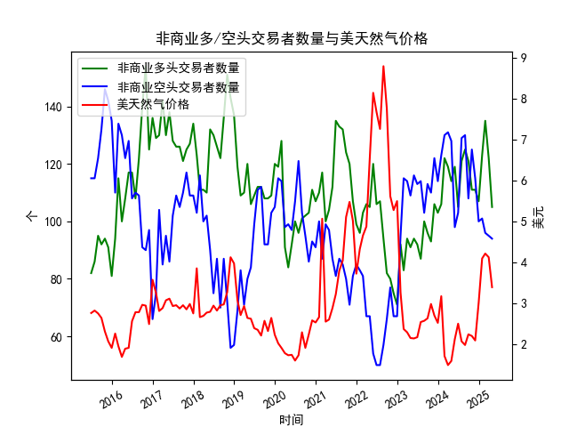

|            |   非商业多头交易者数量 |   非商业空头交易者数量 |   美天然气价格 |
|:-----------|-----------------------:|-----------------------:|---------------:|
| 2023-09-30 |                     96 |                    113 |           2.64 |
| 2023-10-31 |                     93 |                    110 |           2.99 |
| 2023-11-30 |                    106 |                    122 |           2.71 |
| 2023-12-31 |                    103 |                    114 |           2.53 |
| 2024-01-31 |                    106 |                    123 |           3.18 |
| 2024-02-29 |                    122 |                    130 |           1.72 |
| 2024-03-31 |                    119 |                    131 |           1.5  |
| 2024-04-30 |                    114 |                    128 |           1.6  |
| 2024-05-31 |                    119 |                     98 |           2.13 |
| 2024-06-30 |                    105 |                    103 |           2.51 |
| 2024-07-31 |                    121 |                    129 |           2.08 |
| 2024-08-31 |                    125 |                    130 |           1.99 |
| 2024-09-30 |                    121 |                    108 |           2.25 |
| 2024-10-31 |                    111 |                    125 |           2.21 |
| 2024-11-30 |                    111 |                    115 |           2.1  |
| 2024-12-31 |                    107 |                    100 |           3.02 |
| 2025-01-31 |                    123 |                    101 |           4.1  |
| 2025-02-28 |                    135 |                     96 |           4.22 |
| 2025-03-31 |                    122 |                     95 |           4.13 |
| 2025-04-30 |                    105 |                     94 |           3.4  |

### 近期投资机会分析（聚焦最近三个月：2025年2月-2025年4月）

#### 1. **多头与空头持仓对比**
   - **多头持仓（非商业）**：
     - **2025年2月**：135.0 → **2025年3月**：122.0（↓13.0，**环比-9.6%**）  
     - **2025年3月**：122.0 → **2025年4月**：105.0（↓17.0，**环比-13.9%**）  
     - **趋势**：连续两月大幅下降，反映投资者对天然气价格上涨的预期明显降温。
   - **空头持仓（非商业）**：
     - **2025年2月**：96.0 → **2025年3月**：95.0（↓1.0，**环比-1.0%**）  
     - **2025年3月**：95.0 → **2025年4月**：94.0（↓1.0，**环比-1.1%**）  
     - **趋势**：空头持仓持续小幅减少，市场悲观情绪未进一步加剧。

   **关键矛盾**：多头快速撤离但空头未同步增仓，市场短期可能进入超卖状态，需警惕反弹机会。

---

#### 2. **价格与持仓联动分析**
   - **天然气价格**：
     - **2025年2月**：4.22美元 → **2025年3月**：4.13美元（↓0.09，**环比-2.1%**）  
     - **2025年3月**：4.13美元 → **2025年4月**：3.40美元（↓0.73，**环比-17.7%**）  
     - **趋势**：4月价格暴跌至近三年低位（3.40美元），与多头持仓锐减形成共振。
   - **多空比（多头/空头）**：
     - **2025年2月**：1.41 → **2025年3月**：1.28 → **2025年4月**：1.12  
     - **解读**：多空比持续走低，市场情绪极度悲观，但4月价格跌幅远超持仓变化，可能存在超跌修复需求。

---

#### 3. **潜在机会与风险**
   - **短期反弹机会**：
     - **触发条件**：若空头持仓进一步下降或价格企稳于3.40美元附近，可能引发技术性反弹（目标看向3.80-4.00美元区间）。  
     - **催化因素**：极端持仓分化（空头未增仓）叠加价格超跌，市场对利空反应已较充分。
   - **中期风险**：
     - 若需求端（如暖冬预期、库存高企）持续疲软，价格可能继续承压，需关注后续库存数据及天气预测。
   - **对冲策略**：
     - **看涨期权保护**：在3.40美元附近布局看涨期权，博弈超跌反弹。  
     - **空头套保**：若价格跌破3.20美元，空头持仓可能重新入场，需警惕趋势延续风险。

---

#### 4. **关键月份对比（2025年4月 vs. 2025年3月）**
   | 指标                | 2025年3月 | 2025年4月 | 变化幅度   |
   |---------------------|-----------|-----------|------------|
   | **多头持仓（个）**   | 122.0     | 105.0     | ↓13.9%     |
   | **空头持仓（个）**   | 95.0      | 94.0      | ↓1.1%      |
   | **价格（美元）**     | 4.13      | 3.40      | ↓17.7%     |

   **结论**：4月价格与持仓呈现“戴维斯双杀”现象，但空头未同步发力，短期市场或进入底部博弈阶段。

---

#### 5. **操作建议**
   - **激进策略**：在3.40-3.50美元区间轻仓试多，止损3.20美元，目标3.80美元以上。  
   - **保守策略**：等待价格站稳3.60美元或空头持仓显著下降后跟进。  
   - **风险提示**：关注5月库存报告及地缘政治因素（如天然气管道供应扰动）。