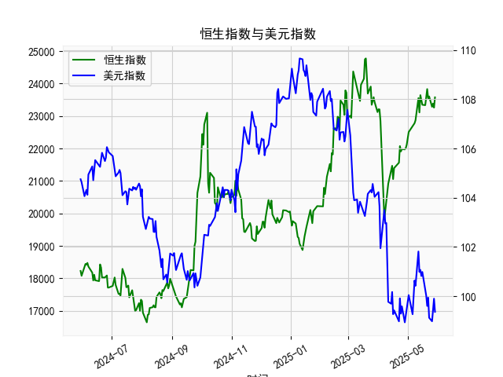

|            |   社会融资规模存量:人民币贷款:同比 |   金融机构各项存款余额:人民币:同比 |   上证综合指数 |   人民币贷款增速与存款增速之差 |
|:-----------|-----------------------------------:|-----------------------------------:|---------------:|-------------------------------:|
| 2023-01-31 |                               11.1 |                               12.4 |        3255.67 |                           -1.3 |
| 2023-02-28 |                               11.5 |                               12.4 |        3279.61 |                           -0.9 |
| 2023-03-31 |                               11.7 |                               12.7 |        3272.86 |                           -1   |
| 2023-05-31 |                               11.3 |                               11.6 |        3204.56 |                           -0.3 |
| 2023-06-30 |                               11.2 |                               11   |        3202.06 |                            0.2 |
| 2023-07-31 |                               11   |                               10.5 |        3291.04 |                            0.5 |
| 2023-08-31 |                               10.9 |                               10.5 |        3119.88 |                            0.4 |
| 2023-10-31 |                               10.7 |                               10.5 |        3018.77 |                            0.2 |
| 2023-11-30 |                               10.7 |                               10.2 |        3029.67 |                            0.5 |
| 2024-01-31 |                               10.1 |                                9.2 |        2788.55 |                            0.9 |
| 2024-02-29 |                                9.7 |                                8.4 |        3015.17 |                            1.3 |
| 2024-04-30 |                                9.1 |                                6.6 |        3104.82 |                            2.5 |
| 2024-05-31 |                                8.9 |                                6.7 |        3086.81 |                            2.2 |
| 2024-07-31 |                                8.3 |                                6.3 |        2938.75 |                            2   |
| 2024-09-30 |                                7.8 |                                7.1 |        3336.5  |                            0.7 |
| 2024-10-31 |                                7.7 |                                7   |        3279.82 |                            0.7 |
| 2024-12-31 |                                7.2 |                                6.3 |        3351.76 |                            0.9 |
| 2025-02-28 |                                7.1 |                                7   |        3320.9  |                            0.1 |
| 2025-03-31 |                                7.2 |                                6.7 |        3335.75 |                            0.5 |
| 2025-04-30 |                                7.1 |                                8   |        3279.03 |                           -0.9 |

### 一、人民币贷款增速与存款增速之差与上证综合指数的相关性及影响逻辑

#### 1. **指标定义与逻辑关系**
- **贷款增速与存款增速之差**：反映银行体系内资金流动性的松紧。当贷款增速高于存款增速（差值为正），表明企业/居民更倾向于借贷而非储蓄，资金可能流向实体经济或资本市场；反之（差值为负）则显示资金沉淀在银行体系，市场流动性收缩。
- **上证综合指数**：代表中国股市整体表现，受宏观经济、资金流动性和市场情绪等多因素驱动。

#### 2. **相关性分析**
- **正向关联**：  
  从数据看，贷款增速与存款增速之差与上证指数存在阶段性正向相关性。例如：  
  - **2020年6月至2021年3月**：差值从2.7%升至3.8%，同期上证指数从2984点上涨至3600点以上，反映宽松信贷环境推动股市走强。  
  - **2023年5月至2023年8月**：差值从0.2%升至2.5%，上证指数从2788点反弹至3320点，显示流动性改善对市场的提振作用。  
- **负向波动**：  
  当差值转负（如2021年11月至2022年2月、2024年12月），上证指数多出现回调，表明资金回流银行体系导致股市承压。

#### 3. **影响逻辑**
- **流动性传导**：贷款增速高于存款增速时，银行可贷资金增加，企业融资成本下降，投资扩张预期增强，股市风险偏好提升。  
- **政策信号**：差值扩大常伴随宽松货币政策（如降准降息），市场对经济复苏的预期升温，吸引资金流入股市。  
- **反向调节**：差值持续为负可能触发政策宽松（如近期降准预期），形成“政策底—市场底”的修复机会。

---

### 二、近期投资机会分析（聚焦最近4个月）

#### 1. **最近4个月数据变化**
- **贷款增速与存款增速之差**：  
  - **2024年12月**：-0.9%（历史低位）  
  - **2025年1月**：0.1%（触底反弹）  
  - **2025年2月**：0.5%（持续改善）  
  - **2025年3月**：-0.9%（再度转负，或因春节后季节性信贷收缩）  
- **上证综合指数**：  
  - **2024年12月**：3279点（低位震荡）  
  - **2025年1月**：3320点（温和反弹）  
  - **2025年2月**：3335点（小幅冲高）  
  - **2025年3月**：3279点（回落至前低，流动性收紧压制市场）。

#### 2. **潜在投资机会**
- **短期防御性配置**：  
  3月差值再度转负，叠加指数回落，短期可关注**高股息资产（如公用事业、银行）**和**消费防御板块（食品饮料、医药）**，规避高估值成长股。  
- **政策宽松预期博弈**：  
  差值连续负值可能倒逼货币政策宽松（如二季度降息），可提前布局**金融股（券商、保险）**及**周期股（基建、地产）**，博弈政策催化下的估值修复。  
- **中长期结构性机会**：  
  若差值重回正值（如2025年4月），关注**科技（AI、半导体）**和**高端制造（新能源、机器人）**，流动性改善将强化成长股弹性。

#### 3. **风险提示**
- **数据滞后性**：贷款差变化对股市的影响通常滞后1-2个月，需结合高频经济数据（PMI、社融）验证。  
- **外部冲击**：美联储加息周期、地缘政治风险可能扰动市场流动性预期。  

---

### 总结  
人民币贷款与存款增速差是观测A股流动性的关键指标，近期波动显示市场处于“政策底”向“市场底”过渡阶段。建议短期防御为主，中期关注政策宽松受益方向，长期布局新质生产力主线。