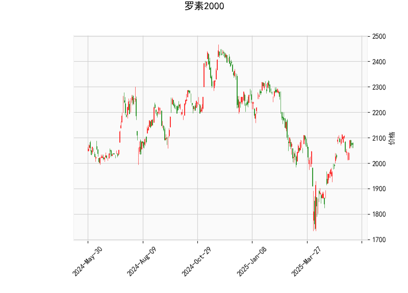

### 1. 罗素2000指数技术分析结果解读

#### **当前价与布林轨道**  
- **当前价**（2074.78）位于布林轨道**中轨（1999.91）与上轨（2179.65）之间**，略高于中轨，但距离上轨仍有约5%的空间，表明市场处于**中性偏多区间**，但未进入超买区域。  
- **布林带宽度**：上轨与下轨间距较大（359点），显示近期市场波动率较高，但当前价未触及极端值，短期内可能维持震荡上行趋势。  

#### **RSI（相对强弱指数）**  
- **RSI为56.84**，接近中性区间上沿（50-70），表明市场**买方力量略占优**，但未进入超买（>70）。若RSI进一步上升至65以上，需警惕回调风险。  

#### **MACD指标**  
- **MACD线（23.42）低于信号线（25.12）**，形成**死叉雏形**，且柱状图（-1.70）为负值，暗示短期动能可能转弱，需关注是否持续下行。  
- 当前MACD仍处于零轴上方，长期趋势尚未逆转，但短期需警惕回调。  

#### **K线形态**  
- **CDLMATCHINGLOW**：低位匹配形态，通常出现在下跌趋势末期，暗示空方力量衰竭，可能形成短期底部。  
- **CDLSPINNINGTOP**：纺锤线形态，反映市场犹豫不决，多空力量暂时平衡，可能预示趋势反转或盘整。  
- **综合来看**：两种形态均属反转信号，但需配合价格突破关键位（如布林中轨或前高）确认有效性。

---

### 2. 近期投资或套利机会与策略

#### **潜在机会**  
1. **区间震荡策略（中性偏多）**  
   - **逻辑**：当前价位于布林中轨上方且RSI中性，可围绕布林带中轨（1999.91）与上轨（2179.65）区间操作。  
   - **操作**：  
     - **买入**：若价格回踩中轨且未跌破，结合RSI反弹（50以上），可轻仓做多，目标上轨附近。  
     - **止盈/止损**：上轨附近部分止盈，跌破中轨止损。  

2. **MACD死叉回调机会（短期看空）**  
   - **逻辑**：MACD死叉信号显示短期动能转弱，若价格跌破中轨，可能回踩下轨（1820.17）。  
   - **操作**：  
     - **做空**：确认MACD死叉且价格跌破中轨后，可轻仓做空，目标下轨附近。  
     - **止盈/止损**：反弹突破中轨或MACD重新金叉时止损。  

3. **反转形态确认后的趋势交易**  
   - **逻辑**：若价格突破上轨且RSI进入超买区（>70），可能开启新一轮上涨；若跌破中轨且MACD加速下行，则可能向下轨调整。  
   - **操作**：  
     - **突破上轨**：追多，目标前高（2200点附近），止损设于上轨下方。  
     - **跌破中轨**：追空，目标下轨，止损设于中轨上方。  

#### **风险提示**  
- **MACD与RSI背离**：若价格继续上行但MACD未同步走强（柱状图未转正），需警惕假突破风险。  
- **波动率放大**：布林带间距较宽，若突发消息引发价格剧烈波动，可能触发止损。  

---

**总结**：当前市场处于震荡偏多格局，但MACD死叉与K线反转信号提示短期回调风险。建议结合布林带与RSI分仓操作，严格设置止损，并关注关键位突破后的趋势跟随机会。