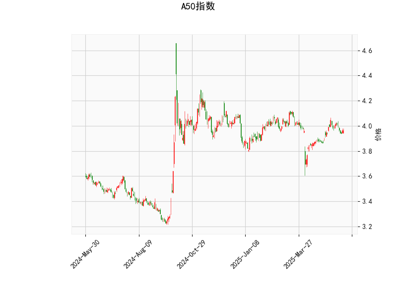

### 1. A50指数技术分析结果解读

#### （1）价格与布林轨道
- **当前价（3.966）**略高于布林中轨（3.9507），表明价格处于短期均衡区间，未形成单边趋势。
- **布林轨道形态**：当前价距离上轨（4.132）约**4.1%**，距离下轨（3.769）约**5%**，上下轨空间对称且未明显收窄，反映市场波动率稳定。若价格突破中轨并站稳，可能向对应轨道方向运行。

#### （2）RSI指标
- **RSI值51.79**处于中性区间（50附近），既无超买（>70）也无超卖（<30）信号，暗示多空力量暂时平衡。需关注RSI能否突破55或跌破45以确认短期方向。

#### （3）MACD指标
- **MACD线（0.0114）低于信号线（0.01625）**，柱状图（-0.00485）为负，显示短期动能偏弱，但两者均接近零轴，可能处于方向选择临界点。
- **潜在信号**：若MACD线向上金叉信号线且柱状图转正，可能触发反弹；若持续下行，需警惕回调风险。

#### （4）K线形态
- **无显著形态**（如头肩顶、吞没等），表明市场缺乏明确反转或延续信号，需结合其他指标判断趋势。

---

### 2. 近期投资/套利机会与策略

#### （1）区间震荡策略（中性市场）
- **逻辑**：价格在布林上下轨间震荡，RSI中性且MACD粘合。
- **操作**：
  - **买入条件**：价格回落至下轨（3.769）附近，且RSI未跌破40（避免超卖延续）。
  - **卖出条件**：价格反弹至上轨（4.132）附近，且RSI未突破60（避免超买延续）。
- **止损**：跌破下轨或突破上轨后回踩确认趋势。

#### （2）突破趋势策略（方向性机会）
- **向上突破**：
  - **触发条件**：价格站稳中轨（3.9507）并放量突破上轨（4.132），MACD金叉且RSI突破55。
  - **目标**：看向前高或布林轨道扩张后的上轨。
- **向下突破**：
  - **触发条件**：价格失守中轨并跌破下轨（3.769），MACD死叉且RSI跌破45。
  - **目标**：看向前低或布林轨道扩张后的下轨。

#### （3）MACD背离套利
- **底背离机会**：若价格创新低但RSI/MACD未同步走弱，可轻仓布局反弹。
- **顶背离风险**：若价格创新高但RSI/MACD动能衰减，需警惕回落。

#### （4）风险提示
- **假突破防范**：布林轨道突破需配合成交量放大（当前数据未提供量能信息）。
- **事件驱动**：A50指数受外围市场（如美股、汇率）及中国政策影响较大，需关注宏观面变化。

---

**总结**：当前A50指数处于震荡整理阶段，建议以区间高抛低吸为主，同时紧盯布林轨道突破与MACD/RSI共振信号。若突破确认，可顺势跟进趋势策略。