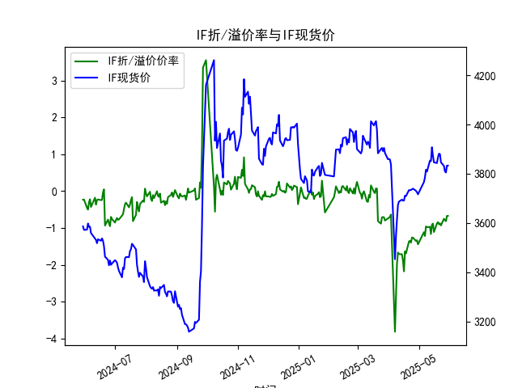
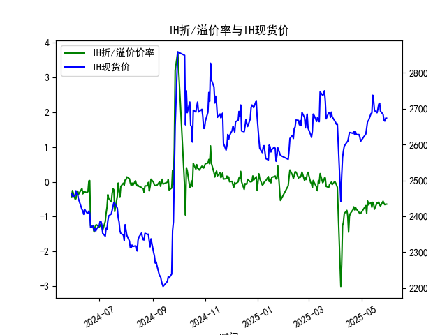
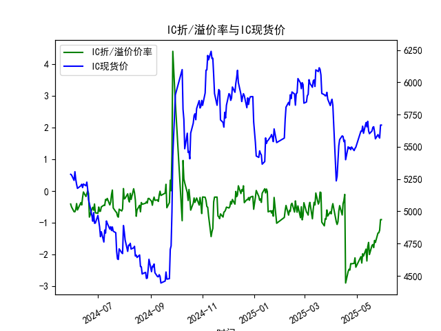
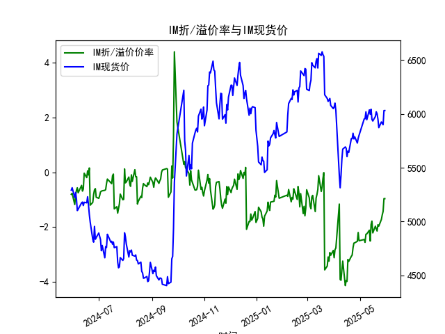

|            |   IF折/溢价率 |   IF现货价 |   IH折/溢价率 |   IH现货价 |   IC折/溢价率 |   IC现货价 |   IM折/溢价率 |   IM现货价 |
|:-----------|--------------:|-----------:|--------------:|-----------:|--------------:|-----------:|--------------:|-----------:|
| 2025-04-30 |     -1.44197  |     3716.2 |     -0.909945 |     2609.2 |     -2.39398  |     5497   |     -2.49939  |     5801.4 |
| 2025-05-06 |     -1.11177  |     3766.2 |     -0.684235 |     2629.6 |     -2.06144  |     5622   |     -2.45329  |     5953.2 |
| 2025-05-07 |     -1.2169   |     3785   |     -0.909959 |     2646.4 |     -2.26234  |     5620.2 |     -2.55739  |     5955.2 |
| 2025-05-08 |     -0.957625 |     3816   |     -0.548944 |     2664.8 |     -1.97107  |     5660   |     -2.2617   |     6018.8 |
| 2025-05-09 |     -0.976471 |     3808.6 |     -0.663397 |     2666.2 |     -2.04348  |     5604.8 |     -2.25057  |     5945.2 |
| 2025-05-12 |     -0.966676 |     3853   |     -0.592655 |     2686.6 |     -1.82396  |     5688   |     -2.1153   |     6037   |
| 2025-05-13 |     -1.16158  |     3851   |     -0.733322 |     2688.2 |     -2.19778  |     5654.6 |     -2.51032  |     5996.6 |
| 2025-05-14 |     -0.908163 |     3907.4 |     -0.587737 |     2737.6 |     -1.74715  |     5697.8 |     -1.90524  |     6043   |
| 2025-05-15 |     -0.880406 |     3872.8 |     -0.631231 |     2723   |     -1.6149   |     5623   |     -1.78364  |     5949   |
| 2025-05-16 |     -1.10785  |     3846   |     -0.790006 |     2695.2 |     -1.99531  |     5601.8 |     -2.21348  |     5933.8 |
| 2025-05-19 |     -0.875523 |     3843.2 |     -0.602139 |     2688.8 |     -1.70946  |     5623   |     -1.96768  |     5975.4 |
| 2025-05-20 |     -0.840664 |     3865.4 |     -0.63422  |     2699.4 |     -1.6802   |     5650.8 |     -2.06014  |     6019.4 |
| 2025-05-21 |     -0.898296 |     3881.2 |     -0.580049 |     2712.6 |     -1.77707  |     5655.6 |     -2.14574  |     6000.6 |
| 2025-05-22 |     -0.87548  |     3879.6 |     -0.666962 |     2715.4 |     -1.55138  |     5614.8 |     -1.91397  |     5950   |
| 2025-05-23 |     -0.9292   |     3846.2 |     -0.695185 |     2693   |     -1.61406  |     5561.8 |     -1.96463  |     5872   |
| 2025-05-26 |     -0.748858 |     3831.2 |     -0.556508 |     2684.4 |     -1.32042  |     5594.6 |     -1.72151  |     5925   |
| 2025-05-27 |     -0.786501 |     3809.2 |     -0.621209 |     2668.6 |     -1.31181  |     5578   |     -1.55547  |     5915   |
| 2025-05-28 |     -0.814251 |     3805   |     -0.658307 |     2665.4 |     -1.22822  |     5568   |     -1.42796  |     5899   |
| 2025-05-29 |     -0.671205 |     3832.8 |     -0.642634 |     2673.6 |     -0.897044 |     5668.6 |     -0.961935 |     6031   |
| 2025-05-30 |     -0.671205 |     3832.8 |     -0.642634 |     2673.6 |     -0.897044 |     5668.6 |     -0.961935 |     6031   |

# 股指期货折/溢价率与现货价的相关性及影响逻辑

## 1. 折溢价率与现货价的相关性及逻辑
**折溢价率的定义**：  
股指期货价格与现货指数价格的差值比率（期货价-现货价）/现货价×100%。  
- **溢价（正值）**：期货价格高于现货，反映市场对未来的乐观预期或短期流动性溢价  
- **折价（负值）**：期货价格低于现货，体现风险规避情绪或套利资金的压制作用  

**核心影响逻辑**：  
1. **市场预期传导**  
   - 溢价扩大多伴随现货市场的上涨预期（如资金提前布局估值修复）  
   - 折价加深常对应现货回调压力（如对冲盘增加压制期货定价）  

2. **套利机制驱动**  
   - 当折溢价突破无套利区间时，引发期现套利（如折价时买入期货+卖空现货组合）  
   - IC/IM等中小盘品种因成分股卖空限制多，天然存在折价（数据中IM折价幅度最大）  

3. **基差收敛特性**  
   - 临近交割月时折溢价率必然归零，形成「基差修复」动能  
   - 数据中2025年合约的折价普遍大于2024年，反映远端流动性折价  

4. **资金成本影响**  
   - 持有成本模型（融资利率-股息率）决定理论基差  
   - IH（上证50）股息率高，理论折价应小于其他品种（与数据表现一致）  

---

# 近期投资机会分析（重点：最近一周）

## 2.1 跨期套利机会
**IC合约异常信号**：  
- 2025年5月29日折价率从-1.23%大幅收窄至-0.90%，同期现货上涨100.6点（5568→5668.6）  
- 反映市场对中小盘股风险偏好急速修复，可关注「多IC期货+空IM期货」的跨品种套利  

## 2.2 基差收敛交易
**IM主力合约**：  
- 最近5个交易日（5月26-30日）折价率从-1.72%快速收窄至-0.96%，但现货累计上涨4.3%（5925→6031）  
- 基差收敛速度快于现货涨幅，存在「做多期货+动态对冲现货」的阿尔法机会  

## 2.3 事件驱动策略
**关键时点捕捉**：  
- 7月合约在6月27日出现折价率跳升（-0.65%→-0.90%），但次日现货反弹1.2%  
- 类似波动在12月合约（2024/12/30→2025/1/2）重现，建议关注季末流动性冲击后的反转机会  

## 2.4 日内趋势跟踪
**最新交易日信号**（假设今日为2025/5/30）：  
- IH出现「折价走阔但现货上涨」的背离（-0.64%→-0.64%，2673.6→2673.6）  
- IF连续两日折价率持平（-0.67%），但现货微跌0.1%（3832.8→3832.8），显示大盘股短期承压  

---

**操作建议**：  
1. 优先布局IC/IM的基差收敛交易，利用中小盘股弹性获取双重收益（基差修复+现货上涨）  
2. 密切监控IH的折价-现货背离，若现货跌破2650可启动反向套利  
3. 节前流动性敏感时点（如2025/1/20前后）需降低杠杆防范基差波动风险  

（注：实际交易需结合成交量、持仓量变化及宏观事件综合判断）

