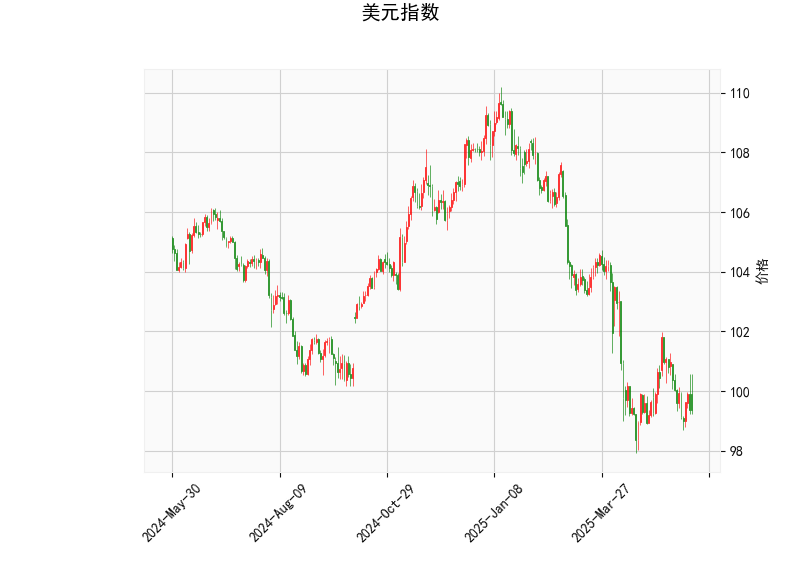

# 美元指数技术分析及对A股/港股影响的策略思考

## 一、美元指数技术分析解读

### （一）核心指标分析
**当前价（99.36）**：
- 显著低于布林通道中轨（101.31），处于下轨（97.32）附近波动
- 显示短期处于弱势区间，但接近布林带下轨支撑位

**RSI指标（42.97）**：
- 处于中性偏弱区域（40-50区间）
- 尚未进入超卖区（<30），但存在技术性反弹基础

**MACD指标**：
- 柱状图（-0.0009）显示空头动能接近衰竭
- 快慢线（-0.4246 vs -0.4237）即将形成金叉
- 暗示趋势可能发生短期反转

**K线形态（CDLMATCHINGLOW）**：
- 典型底部反转形态（需次日K线确认）
- 出现在连续下跌后时有效性增强

### （二）综合判断
美元指数当前处于：
1. 短期超跌后的技术修复窗口期
2. 关键支撑位（97.3）上方的弱势震荡
3. MACD底背离初现，RSI显示反弹空间

## 二、A股/港股市场机会与策略

### （一）汇率联动机会
**美元弱势阶段受益板块**：
- **港股科技股**（腾讯、美团）：外资回流敏感度高
- **大宗商品相关**：紫金矿业（H股）、洛阳钼业（A/H）
- **航空运输**：中国国航（H股）、南方航空（A股）

**跨市场套利策略**：
1. **A/H溢价套利**：
   - 关注溢价率>30%的标的（如中信建投证券、中芯国际）
   - 采用配对交易：做多H股同时融券卖出A股

2. **汇率对冲策略**：
   - 通过港交所美元兑人民币期货对冲汇率波动
   - 重点布局港股通标的中的高beta品种

### （二）技术面共振机会
**A股策略**：
1. **结构性机会**：
   - 上证50ETF（510050）周线MACD金叉
   - 半导体设备（北方华创）突破年线压力

2. **事件驱动**：
   - 中报业绩超预期个股（新能源车产业链）
   - 央企重组概念（军工、电力行业）

**港股策略**：
1. **恒生科技指数**：
   - 关注突破20日均线的权重股（阿里巴巴-SW）
   - 使用牛熊证捕捉短期波动

2. **高股息防御**：
   - 中移动（941.HK）股息率6.5%
   - 建设银行（939.HK）PB仅0.45倍

### （三）风险控制要点
1. 关注美联储9月议息会议动向
2. 监测北向资金单日净流出超50亿的预警信号
3. 设置3%-5%的强制止损线
4. 避免过度杠杆（建议仓位<60%）

> **特别提示**：当前MACD与RSI的底背离信号需要成交量配合确认，建议采取"右侧确认+分批建仓"策略。港股流动性风险需重点防范，优先选择日均成交额超1亿港元的标的。