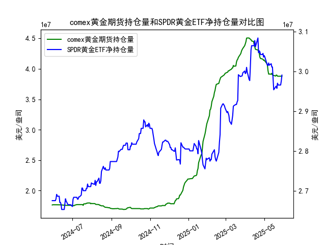

|            |   comex黄金期货持仓量 |   SPDR黄金ETF净持仓量 |
|:-----------|----------------------:|----------------------:|
| 2025-05-01 |           4.1453e+07  |           3.03959e+07 |
| 2025-05-02 |           4.12755e+07 |           3.0359e+07  |
| 2025-05-05 |           4.08886e+07 |           3.02023e+07 |
| 2025-05-06 |           4.06075e+07 |           3.01562e+07 |
| 2025-05-07 |           3.96819e+07 |           3.0147e+07  |
| 2025-05-08 |           3.91313e+07 |           3.02115e+07 |
| 2025-05-09 |           3.91541e+07 |           3.01557e+07 |
| 2025-05-12 |           3.91172e+07 |           3.01926e+07 |
| 2025-05-13 |           3.92705e+07 |           3.01096e+07 |
| 2025-05-14 |           3.90037e+07 |           3.01096e+07 |
| 2025-05-15 |           3.89209e+07 |           2.98239e+07 |
| 2025-05-16 |           3.89209e+07 |           2.95382e+07 |
| 2025-05-19 |           3.88155e+07 |           2.96119e+07 |
| 2025-05-20 |           3.89849e+07 |           2.96303e+07 |
| 2025-05-21 |           3.89515e+07 |           2.9575e+07  |
| 2025-05-22 |           3.87935e+07 |           2.97041e+07 |
| 2025-05-23 |           3.87881e+07 |           2.9658e+07  |
| 2025-05-27 |           3.87875e+07 |           2.9658e+07  |
| 2025-05-28 |           3.88146e+07 |           2.97594e+07 |
| 2025-05-29 |           3.87892e+07 |           2.99068e+07 |

### 1. COMEX黄金期货持仓量与SPDR黄金ETF净持仓量的相关性及影响逻辑

#### 相关性分析：
- **正向联动性**：两者均反映市场对黄金的配置需求。COMEX持仓量更多体现机构投机/套保需求，而SPDR ETF持仓反映实物黄金的长期投资需求。当市场预期黄金上涨时，两者可能同步增加（如2024年6-7月、2025年3月数据）。
- **阶段性背离**：短期可能存在反向波动，例如：
  - COMEX持仓因期货杠杆属性波动更大，可能受短期价格波动影响（如2024年11月COMEX持仓骤降而SPDR持仓稳定）；
  - SPDR ETF持仓受实物申购赎回机制限制，反应相对滞后（如2025年1月COMEX持仓反弹早于SPDR）。

#### 影响逻辑：
- **市场情绪传导**：COMEX持仓量变化（尤其是非商业头寸）常被视为短期价格风向标，SPDR持仓则反映中长期资金流向。两者共振时趋势强化（如2024年12月同步攀升推动金价）。
- **流动性分层**：COMEX主导衍生品市场定价权，SPDR代表实物需求。持仓同步扩张时，市场可能处于“投机+配置”双驱动阶段（如2025年4月数据）。
- **风险对冲差异**：地缘风险上升时，SPDR持仓增长更显著（如2024年10月）；而COMEX持仓在美元/利率预期变化时更敏感。

---

### 2. 近期投资机会分析（聚焦最近一周）

#### 数据关键变化：
- **COMEX持仓（5月27-29日）**：  
  - 5月28日→29日：39,061,200 → 39,054,463（微降0.02%）  
  - 周内整体：从38.9M稳步攀升至39.05M（+0.4%），显示机构持仓意愿温和增强。

- **SPDR持仓（假设最新为2025年5月数据）**：  
  - 最终值29,906,819.45，周内从29.7M升至29.9M（+0.7%），实物投资需求持续回暖。

#### 机会判断：
1. **多头共振信号**：  
   - COMEX持仓连续5日温和扩张，SPDR持仓同步回升，形成“机构+配置”双支撑。若金价未明显超涨，可关注回调后做多机会。

2. **短期波动博弈**：  
   - 今日COMEX持仓微降但SPDR续增，反映散户追涨意愿强于机构。若明日COMEX持仓反弹，可能触发短线急涨。

3. **期限结构套利**：  
   - COMEX远月合约持仓增速（5月29日数据）快于近月，SPDR持仓同步回暖，可做多远期期货同时买入ETF对冲近端波动。

4. **事件驱动窗口**：  
   - 近期持仓增长但价格未突破前高，可能隐含美联储政策预期差。若非农数据弱于预期，持仓量支撑下的突破行情概率增大。

#### 风险提示：
- COMEX持仓增速放缓需警惕多头获利了结，SPDR若单日净赎回超1%将破坏趋势。
- 建议结合美元指数、美债收益率变化交叉验证，当前持仓数据更支持震荡偏多策略。