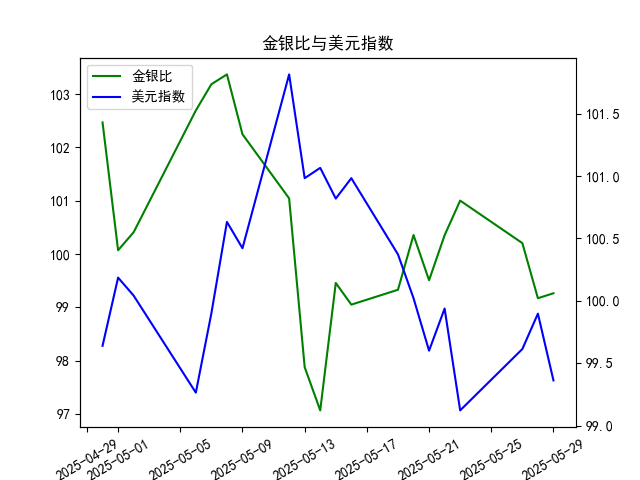

|            |    金价 |   银价 |   美元指数 |   金银比 |
|:-----------|--------:|-------:|-----------:|---------:|
| 2025-04-30 | 3302.05 | 32.225 |    99.6403 | 102.469  |
| 2025-05-01 | 3214.75 | 32.125 |   100.187  | 100.07   |
| 2025-05-02 | 3249.7  | 32.365 |   100.042  | 100.408  |
| 2025-05-06 | 3391.45 | 33.025 |    99.2654 | 102.693  |
| 2025-05-07 | 3392.25 | 32.875 |    99.9006 | 103.186  |
| 2025-05-08 | 3352.3  | 32.43  |   100.633  | 103.37   |
| 2025-05-09 | 3324.55 | 32.515 |   100.422  | 102.247  |
| 2025-05-12 | 3235.4  | 32.02  |   101.814  | 101.043  |
| 2025-05-13 | 3227.95 | 32.98  |   100.983  |  97.876  |
| 2025-05-14 | 3191.95 | 32.885 |   101.066  |  97.064  |
| 2025-05-15 | 3191.05 | 32.085 |   100.82   |  99.4561 |
| 2025-05-16 | 3182.95 | 32.135 |   100.983  |  99.0493 |
| 2025-05-19 | 3230.15 | 32.52  |   100.373  |  99.3281 |
| 2025-05-20 | 3261.55 | 32.5   |   100.022  | 100.355  |
| 2025-05-21 | 3299.65 | 33.16  |    99.6014 |  99.5069 |
| 2025-05-22 | 3284    | 32.725 |    99.9388 | 100.351  |
| 2025-05-23 | 3342.65 | 33.095 |    99.1231 | 101.002  |
| 2025-05-27 | 3296.7  | 32.9   |    99.6147 | 100.204  |
| 2025-05-28 | 3300.85 | 33.285 |    99.8978 |  99.1693 |
| 2025-05-29 | 3312.4  | 33.37  |    99.3633 |  99.2628 |

# 金银比与美元指数的相关性及影响逻辑

## 1. 金银比与美元指数的相关性及影响逻辑

**金银比（黄金价格/白银价格）**反映两种贵金属的相对强弱，常用于判断市场风险偏好。**美元指数**则体现美元对一篮子货币的汇率强弱，二者通过以下逻辑相互影响：

- **负相关性主导**：  
  美元走强时，以美元计价的黄金、白银价格承压。但白银因工业属性占比高（约50%），对经济周期更敏感，在美元强势伴随经济疲软时，白银跌幅通常大于黄金，导致**金银比上升**；反之，美元走弱时，白银的弹性更大，**金银比下降**。

- **避险情绪分化**：  
  当市场避险情绪升温（如地缘冲突），黄金作为“纯避险资产”涨幅常高于白银，推动金银比上升；若避险情绪源于经济衰退预期，白银的工业需求下降可能抵消其涨幅，同样推高金银比。

- **利率预期传导**：  
  美联储加息预期推高美元指数，同时打压无息资产（黄金、白银）。但黄金对实际利率更敏感，若通胀同步上升，黄金表现可能优于白银，导致金银比波动复杂化。

---

# 近期投资机会分析（基于最近一周数据）

## 2. 近期数据解读与投资机会

### 关键数据变化（以最近5个交易日为例）：
- **金银比**：  
  - 5月22日 → 5月27日：100.35 → 99.16（**显著下降**，白银相对走强）  
  - 5月28日 → 5月29日：99.17 → 99.26（**小幅反弹**，黄金日内表现略优）

- **美元指数**：  
  - 5月22日 → 5月27日：99.94 → 99.90（窄幅震荡）  
  - 5月28日 → 5月29日：99.90 → 99.36（**加速下跌**，支撑贵金属价格）

### 投资机会判断：
1. **贵金属多头窗口**：  
   - 美元指数连续下跌（尤其5月29日单日跌0.53点），叠加近期美国经济数据疲软，短期内贵金属价格（黄金、白银）可能延续反弹。
   - **优先关注白银**：金银比从高位回落，表明白银补涨动能更强，且其低估值对资金吸引力更大。

2. **金银比套利机会**：  
   - 最近一周金银比从100.35降至99.26后微幅反弹，若美元指数持续走弱且经济预期改善，可布局“做空金银比”（即多白银、空黄金），目标区间下看98.5-97.0。

3. **短期回调风险提示**：  
   - 5月29日金银比反弹（+0.09）与美元指数大跌背离，需警惕黄金短线获利盘抛压。若次日白银未跟涨，可能引发金银比进一步反弹，可轻仓试多黄金/白银对冲。

---

**结论**：当前美元走弱与金银比下行趋势共振，白银或为最优配置标的；激进投资者可关注金银比均值回归交易，需结合次日开盘表现确认动量延续性。