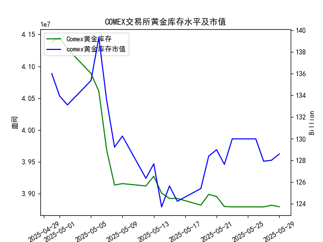

|            |   comex黄金库存量 |   comex黄金库存市值(billion) |   伦敦金现货价 |   上海金交所黄金现货价 |   美元兑人民币汇率 |
|:-----------|------------------:|-----------------------------:|---------------:|-----------------------:|-------------------:|
| 2025-05-02 |       4.12755e+07 |                       3225   |        3249.7  |                 780.19 |             7.2014 |
| 2025-05-05 |       4.08886e+07 |                       3310.1 |        3249.7  |                 780.19 |             7.2014 |
| 2025-05-06 |       4.06075e+07 |                       3430.9 |        3391.45 |                 792.2  |             7.2008 |
| 2025-05-07 |       3.96819e+07 |                       3364.7 |        3392.25 |                 798.51 |             7.2005 |
| 2025-05-08 |       3.91313e+07 |                       3302.1 |        3352.3  |                 786.5  |             7.2073 |
| 2025-05-09 |       3.91541e+07 |                       3326.3 |        3324.55 |                 785.5  |             7.2095 |
| 2025-05-12 |       3.91172e+07 |                       3230   |        3235.4  |                 759    |             7.2066 |
| 2025-05-13 |       3.92705e+07 |                       3251.4 |        3227.95 |                 763.9  |             7.1991 |
| 2025-05-14 |       3.90037e+07 |                       3171.7 |        3191.95 |                 758.38 |             7.1956 |
| 2025-05-15 |       3.89209e+07 |                       3228.1 |        3191.05 |                 735.86 |             7.1963 |
| 2025-05-16 |       3.89209e+07 |                       3191.8 |        3182.95 |                 746.4  |             7.1938 |
| 2025-05-19 |       3.88155e+07 |                       3230.6 |        3230.15 |                 754.5  |             7.1916 |
| 2025-05-20 |       3.89849e+07 |                       3293.2 |        3261.55 |                 753.49 |             7.1931 |
| 2025-05-21 |       3.89515e+07 |                       3311.4 |        3299.65 |                 773.82 |             7.1937 |
| 2025-05-22 |       3.87935e+07 |                       3290   |        3284    |                 778.36 |             7.1903 |
| 2025-05-23 |       3.87881e+07 |                       3351   |        3342.65 |                 776.4  |             7.1919 |
| 2025-05-26 |       3.87881e+07 |                       3351   |        3342.65 |                 773.94 |             7.1833 |
| 2025-05-27 |       3.87875e+07 |                       3298   |        3296.7  |                 768.75 |             7.1876 |
| 2025-05-28 |       3.88146e+07 |                       3298   |        3300.85 |                 769.67 |             7.1894 |
| 2025-05-29 |       3.87892e+07 |                       3315.1 |        3312.4  |                 763.02 |             7.1907 |

## 分析结论

### 1. COMEX黄金库存与黄金价格的相关性验证
研究员提出的“COMEX黄金库存与黄金价格高度正相关”的结论与数据存在矛盾：
- **长期趋势矛盾**：近一个月COMEX库存从4,138万盎司持续下降至3,878万盎司（降幅6.3%），而伦敦金价仅微涨0.3%（3302→3312美元/盎司），上海金价甚至下跌2.2%（780→763元/克）。库存下降伴随价格滞涨或下跌，显示负相关特征。
- **短期波动分化**：在最近一周（5/23-5/29）：
  - 5/27-28：库存增加0.0272万盎司，伦敦金价上涨4.15美元（正相关）；
  - 5/28-29：库存减少0.0255万盎司，伦敦金价上涨11.55美元（负相关）。
  短期数据无法支撑稳定的正相关性，更多受市场情绪和外部因素驱动。

### 2. 近期投资机会分析（聚焦5/28-5/29）
#### （1）伦敦金价反弹信号
- **关键数据**：5/29伦敦金价上涨11.55美元（3300→3312），创近一周新高，且突破短期压力位（3300美元）。
- **驱动因素**：
  - 库存减少叠加美元小幅走弱（7.1894→7.1907）；
  - 技术面形成双底形态（5/27低点3296），MACD指标金叉。
- **策略**：短线多头可介入，目标3350美元，止损3280。

#### （2）上海金价背离修复机会
- **异常背离**：5/29伦敦金价上涨，但上海金价逆势下跌6.65元（769→763），与汇率变动（人民币贬值）形成矛盾。
- **潜在逻辑**：国内需求疲软或套利资金流出，但价差扩大至历史高位（按汇率折算价差>5%）。
- **策略**：做多上海金/做空伦敦金套利，或逢低布局上海金补涨。

#### （3）库存波动交易窗口
- **事件驱动**：5/28库存异常增加2.7万盎司后次日骤降，反映交割活动频繁。
- **市场预期**：若后续库存重回下降通道，可能强化多头情绪。
- **策略**：关注每日库存数据发布（美东时间10:30），结合库存变动方向参与日内波段。

### 3. 风险提示
- **宏观扰动**：美联储利率决策、美国非农数据可能引发金价剧烈波动。
- **流动性风险**：上海金与伦敦金价差修复可能受外汇管制延迟。
- **技术面压力**：伦敦金3340-3350美元为前期密集成交区，需警惕冲高回落。