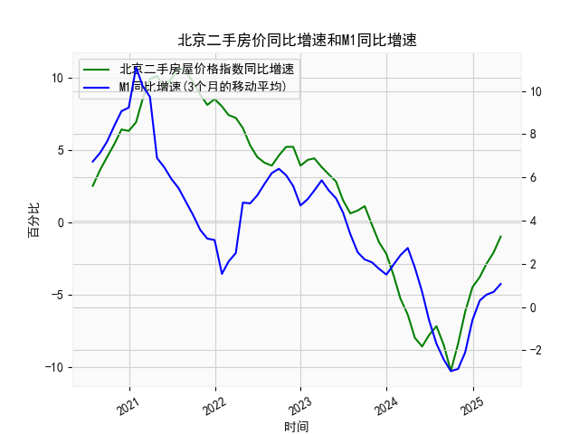

|            |   北京二手房屋价格指数同比增速 |   M1同比增速 |   M1同比增速(3个月的移动平均) |
|:-----------|-------------------------------:|-------------:|------------------------------:|
| 2023-09-30 |                            1.1 |          2.1 |                      2.2      |
| 2023-10-31 |                           -0.2 |          1.9 |                      2.06667  |
| 2023-11-30 |                           -1.4 |          1.3 |                      1.76667  |
| 2023-12-31 |                           -2.2 |          1.3 |                      1.5      |
| 2024-01-31 |                           -3.7 |          3.3 |                      1.96667  |
| 2024-02-29 |                           -5.3 |          2.6 |                      2.4      |
| 2024-03-31 |                           -6.4 |          2.3 |                      2.73333  |
| 2024-04-30 |                           -8   |          0.6 |                      1.83333  |
| 2024-05-31 |                           -8.6 |         -0.8 |                      0.7      |
| 2024-06-30 |                           -7.8 |         -1.7 |                     -0.633333 |
| 2024-07-31 |                           -7.2 |         -2.6 |                     -1.7      |
| 2024-08-31 |                           -8.5 |         -3   |                     -2.43333  |
| 2024-09-30 |                          -10.3 |         -3.3 |                     -2.96667  |
| 2024-10-31 |                           -8.4 |         -2.3 |                     -2.86667  |
| 2024-11-30 |                           -6.2 |         -0.7 |                     -2.1      |
| 2024-12-31 |                           -4.5 |          1.2 |                     -0.6      |
| 2025-01-31 |                           -3.8 |          0.4 |                      0.3      |
| 2025-02-28 |                           -2.9 |          0.1 |                      0.566667 |
| 2025-03-31 |                           -2.1 |          1.6 |                      0.7      |
| 2025-04-30 |                           -1   |          1.5 |                      1.06667  |

### 1. 北京二手房屋价格指数同比增速与M1同比增速的相关性及影响逻辑

#### **相关性分析**  
从数据趋势看，两者在长期内呈现**阶段性正相关**，但受政策干预和经济周期影响，相关性存在滞后性和波动性：  
- **扩张期（2020年7月-2021年中）**：M1增速从6.7%攀升至11.1%，同期房价增速从2.5%升至10.7%，显示流动性宽松直接推动房价上涨。  
- **收缩期（2021年末-2023年）**：M1增速从5.9%降至-2.96%，房价增速从8.5%跌至-8.6%，反映货币紧缩叠加调控政策（如房地产“三条红线”）导致市场下行。  
- **修复期（2024年至今）**：M1增速从-2.1%反弹至1.07%，房价同比跌幅从-10.3%收窄至-1.0%，表明流动性边际改善对市场企稳有支撑作用。

#### **影响逻辑**  
- **正向传导路径**：M1增长（企业活期存款增加、居民消费力提升）→ 市场流动性增强 → 购房需求释放 → 房价增速回升。  
- **政策干扰因素**：房地产调控政策（如限购、信贷限制）可能阻断M1增速向房价的直接传导，导致阶段性背离（如2021年M1下滑但房价仍惯性上涨）。  
- **预期驱动**：M1增速作为经济活跃度指标，可能通过信心效应影响购房者决策，形成“流动性宽松→预期改善→房价企稳”的链条。

---

### 2. 近期投资机会分析（基于最近4个月数据）

#### **关键数据变化（2025年1月-2025年4月）**  
| 指标              | 2025年1月 | 2025年2月 | 2025年3月 | 2025年4月 |  
|-------------------|-----------|-----------|-----------|-----------|  
| **房价同比增速**  | -6.2%     | -4.5%     | -3.8%     | -2.9%     |  
| **M1同比增速**    | -0.6%     | 0.3%      | 0.57%     | 0.7%      |  

#### **趋势解读**  
1. **房价跌幅持续收窄**：近4个月跌幅从-6.2%收窄至-2.9%，**本月（4月）环比改善0.9个百分点**，为近两年最快修复速度，显示市场接近触底。  
2. **M1增速转正并企稳**：M1增速自2024年12月（-2.1%）后连续4个月回升，4月达到0.7%，表明流动性环境逐步改善。  

#### **潜在投资机会**  
- **房地产板块超跌反弹**：  
  - **核心逻辑**：房价跌幅收窄+政策宽松预期（如限购松绑、房贷利率下调）可能推动地产股估值修复。  
  - **关注标的**：头部房企（现金流稳健）、房产中介平台、建材产业链。  
- **REITs与核心地段房产**：  
  - **逻辑**：市场企稳预期增强下，核心区域二手房交易量或率先回升，REITs（如长租公寓类）及优质地段房产具备配置价值。  
- **金融衍生品对冲机会**：  
  - **逻辑**：若M1增速持续回升但房价修复不及预期，可关注利率衍生品（如国债期货）对冲政策波动风险。  

#### **风险提示**  
- 政策落地不及预期可能导致修复节奏放缓。  
- 需密切关注居民收入预期及人口流动数据，验证需求端可持续性。  

---

### 结论  
近期M1增速转正与房价跌幅加速收窄形成共振，释放市场筑底信号。建议优先布局房地产产业链中弹性较高的标的，同时关注政策催化下的短期交易性机会。