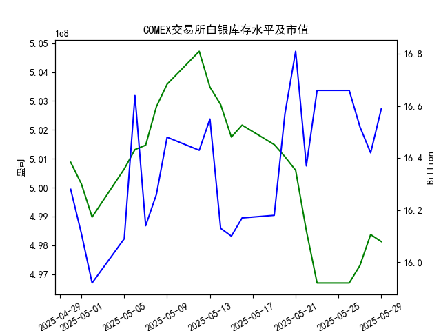

|            |   comex白银库存量 |   comex白银库存市值(billion) |   伦敦银现货价 |   上海金交所白银现货价 |   美元兑人民币汇率 |
|:-----------|------------------:|-----------------------------:|---------------:|-----------------------:|-------------------:|
| 2025-05-02 |       4.98978e+08 |                       31.91  |         32.365 |                   8163 |             7.2014 |
| 2025-05-05 |       5.00644e+08 |                       32.14  |         32.365 |                   8163 |             7.2014 |
| 2025-05-06 |       5.01317e+08 |                       33.19  |         33.025 |                   8221 |             7.2008 |
| 2025-05-07 |       5.01469e+08 |                       32.195 |         32.875 |                   8229 |             7.2005 |
| 2025-05-08 |       5.028e+08   |                       32.335 |         32.43  |                   8100 |             7.2073 |
| 2025-05-09 |       5.03581e+08 |                       32.73  |         32.515 |                   8150 |             7.2095 |
| 2025-05-12 |       5.04719e+08 |                       32.56  |         32.02  |                   8124 |             7.2066 |
| 2025-05-13 |       5.03481e+08 |                       32.88  |         32.98  |                   8214 |             7.1991 |
| 2025-05-14 |       5.02874e+08 |                       32.085 |         32.885 |                   8172 |             7.1956 |
| 2025-05-15 |       5.0175e+08  |                       32.085 |         32.085 |                   7967 |             7.1963 |
| 2025-05-16 |       5.02164e+08 |                       32.195 |         32.135 |                   8062 |             7.1938 |
| 2025-05-19 |       5.0149e+08  |                       32.265 |         32.52  |                   8113 |             7.1916 |
| 2025-05-20 |       5.01069e+08 |                       33.065 |         32.5   |                   8057 |             7.1931 |
| 2025-05-21 |       5.00598e+08 |                       33.575 |         33.16  |                   8237 |             7.1937 |
| 2025-05-22 |       4.98504e+08 |                       32.84  |         32.725 |                   8268 |             7.1903 |
| 2025-05-23 |       4.96695e+08 |                       33.535 |         33.095 |                   8244 |             7.1919 |
| 2025-05-26 |       4.96695e+08 |                       33.535 |         33.095 |                   8239 |             7.1833 |
| 2025-05-27 |       4.97303e+08 |                       33.215 |         32.9   |                   8189 |             7.1876 |
| 2025-05-28 |       4.98373e+08 |                       32.955 |         33.285 |                   8211 |             7.1894 |
| 2025-05-29 |       4.98128e+08 |                       33.3   |         33.37  |                   8202 |             7.1907 |

### 近期白银市场投资机会分析（聚焦最近一周及今日变化）

---

#### **1. COMEX白银库存与市值变化**
- **库存趋势**：  
  最近一周（5.23-5.29）库存从**4.9669e8**小幅波动至**4.9813e8**，5月29日（今日）较5月28日微降**0.05%**。尽管短期波动较小，但近一个月库存整体下降**4.8%**（5.0088e8→4.9813e8），显示长期供应趋紧。
- **市值波动**：  
  5月29日市值跳升至**16.59 billion**（昨日为16.42），结合库存微降和银价上涨，反映市场对白银的短期看涨情绪。

---

#### **2. 伦敦白银现货价格**
- **短期表现**：  
  5月28日→5月29日，伦敦银价从**33.285→33.370**（+0.26%），连续两日上涨。近一周累计涨幅达**1.97%**（32.725→33.370），技术面呈现上行趋势。
- **催化因素**：  
  库存下降与美元汇率波动（5.28-5.29人民币微贬）可能推动国际银价走强。

---

#### **3. 上海白银现货价格与跨市套利**
- **价格分化**：  
  上海银价5月29日微跌至**8202元/千克**（昨日8211），与伦敦银价走势分化。通过汇率换算，伦敦银价对应人民币约**7715元/千克**，显著低于上海市场的**8202元/千克**，价差达**487元/千克**。
- **套利机会**：  
  存在“**买伦敦、卖上海**”的跨市套利空间，但需考虑交易成本及政策风险（如跨境交易限制）。

---

#### **4. 美元兑人民币汇率影响**
- **汇率波动**：  
  5月28日→29日，美元兑人民币从**7.1894→7.1907**，人民币微贬。若美元走强持续，可能进一步扩大内外盘价差，强化套利逻辑。

---

### **投资策略建议**
1. **跨市套利**：  
   关注伦敦与上海白银价差，若价差维持高位，可布局对冲交易。
2. **趋势跟踪**：  
   伦敦银价短期技术面偏强，可轻仓做多，止损参考32.70（近一周低点）。
3. **库存敏感策略**：  
   若COMEX库存持续下降，可逢低配置白银期货或ETF。

---

### **风险提示**
- 套利机会需考虑实际交割成本及政策限制。
- 美联储货币政策预期可能扰动美元汇率，需关注宏观数据。
- 国内需求疲软或压制上海银价，导致价差持续存在。