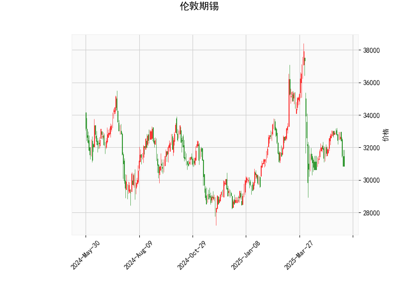

# 伦敦期锡技术分析与投资策略

## 一、技术指标解析

### 1. 当前价格与布林带
- **当前价30850**位于布林带下轨（29038）与中轨（33026）之间，靠近下轨约5.8%空间，显示价格处于**超卖区域**。
- **布林带开口扩张**（上轨37014→下轨29038），标准差放大，表明**市场波动率显著增强**，短期可能面临方向选择。

### 2. RSI指标
- **RSI=34.3**接近超卖阈值30，但尚未触发极端超卖信号。结合价格靠近布林带下轨，暗示**短期存在反弹修复需求**，但需警惕中轨（33026）的压制作用。

### 3. MACD指标
- **MACD线(-237)远低于信号线(-67)**，柱状图(-169)呈现明显空头排列，显示**下跌动能强劲且趋势延续**。需等待柱状图缩窄或金叉出现才能确认趋势反转。

### 4. K线形态
- **CDLCLOSINGMARUBOZU**（光头光脚阴线）：确认当前空头主导
- **CDLMATCHINGLOW**（匹配低形态）：潜在底部反转信号
- 两种形态组合显示**多空博弈加剧**，需关注价格能否在29000附近形成双底支撑。

---

## 二、投资机会与策略建议

### （一）趋势交易策略
1. **空头策略**（高风险偏好）
   - **入场条件**：价格反弹至中轨33000附近受阻
   - **目标位**：下轨29000，潜在收益空间约12%
   - **止损位**：突破中轨33300后离场

2. **多头反攻策略**（左侧交易）
   - **触发条件**：日线收盘站上31500（突破短期下降趋势线）
   - **目标位**：中轨33000，潜在收益约5%
   - **止损位**：有效跌破29000

### （二）套利机会
1. **波动率套利**
   - 布林带宽度指标（BW%）= (37014-29038)/30850≈25.8%，处于近3年90分位水平
   - 可卖出跨式期权组合，赚取波动率回归收益

2. **期现套利**
   - 关注LME锡库存变化：若现货升水扩大至$200/吨以上，可建立现货多头+期货空头组合
   - 需注意仓储成本与资金占用的对冲成本

### （三）关键风险提示
1. **宏观面风险**：美联储利率政策变化可能引发美元指数波动
2. **供需扰动**：缅甸锡矿复产进度、光伏焊带需求增速变化
3. **技术面失效风险**：若MACD柱状图连续3日缩窄但价格未反弹，需警惕下跌中继形态

---

**核心观察点**：重点关注29000整数关口的支撑有效性，若周线收盘跌破该位置，可能打开至27500的下跌空间（2023年低点延伸）。建议结合COMEX铜、LME锌等关联品种走势进行交叉验证。