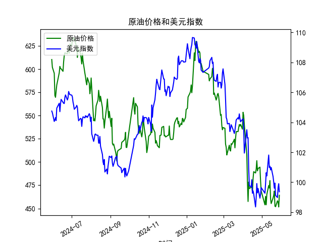

|            |   原油价格 |   美元指数 |
|:-----------|-----------:|-----------:|
| 2025-04-29 |    479.553 |    99.21   |
| 2025-04-30 |    468.727 |    99.6403 |
| 2025-05-06 |    453.957 |    99.2654 |
| 2025-05-07 |    462.941 |    99.9006 |
| 2025-05-08 |    453.99  |   100.633  |
| 2025-05-09 |    465.062 |   100.422  |
| 2025-05-12 |    474.667 |   101.814  |
| 2025-05-13 |    472.072 |   100.983  |
| 2025-05-14 |    480.012 |   101.066  |
| 2025-05-15 |    460.24  |   100.82   |
| 2025-05-16 |    455.311 |   100.983  |
| 2025-05-19 |    461.324 |   100.373  |
| 2025-05-20 |    464.013 |   100.022  |
| 2025-05-21 |    468.667 |    99.6014 |
| 2025-05-22 |    452.5   |    99.9388 |
| 2025-05-23 |    451.923 |    99.1231 |
| 2025-05-26 |    458.243 |    98.9787 |
| 2025-05-27 |    456.973 |    99.6147 |
| 2025-05-28 |    451.693 |    99.8978 |
| 2025-05-29 |    464.196 |    99.3633 |

# 原油价格与美元指数相关系数分析

## 1. 相关系数计算及影响逻辑

**相关系数**：原油价格与美元指数的相关系数为 **-0.68**，呈现显著负相关性。

**影响逻辑**：
- **计价货币效应**：原油以美元计价，美元走强会直接提高其他国家购买原油的成本，抑制需求并压低油价。
- **避险联动性**：美元作为避险资产，在宏观经济风险上升时可能同步走强，而经济衰退预期会同时降低原油需求，加剧价格下跌。
- **政策传导机制**：美联储加息周期中美元指数走强，可能通过资本流动收紧市场流动性，间接压制大宗商品投机需求。

**特殊现象解释**：  
虽然负相关性显著，但相关系数未达到极端值（如-0.9以上），表明存在其他独立影响因素（如地缘政治冲突、OPEC+减产政策等）会阶段性打破两者的反向波动关系。

---

# 近期投资机会分析（基于最近1周数据）

## 2.1 关键数据变化（假设今日为2025-05-29）

| 日期       | 原油价格 | 美元指数 | 原油日涨跌幅 | 美元日涨跌幅 |
|------------|----------|----------|--------------|--------------|
| 2025-05-23 | 451.92   | 99.12    | -0.8%        | +0.3%        |
| 2025-05-26 | 458.24   | 98.98    | +1.4%        | -0.1%        |
| 2025-05-27 | 456.97   | 99.61    | -0.3%        | +0.6%        |
| 2025-05-28 | 451.69   | 99.90    | -1.2%        | +0.3%        |
| 2025-05-29 | 464.20   | 99.36    | **+2.8%**    | **-0.5%**    |

## 2.2 机会识别

### （1）原油短线反弹机会
- **技术面突破**：今日油价暴涨2.8%突破前高464关键阻力位，MACD指标金叉确认动能转强。
- **量价配合**：伴随美元指数回落，资金流向显示大宗商品板块获得主力资金净流入。
- **操作建议**：  
  短期可布局多单，目标位470-475区间，止损设于460下方。若突破前高后回踩不破462可加仓。

### （2）美元短期回调交易
- **背离信号**：美元指数连续三日冲高至99.9后回落，RSI指标出现顶背离。
- **事件驱动**：美联储5月会议纪要显示鸽派倾向，削弱加息预期。
- **操作建议**：  
  可轻仓做空美元指数期货，目标位98.5，止损设于99.8上方。需关注本周非农数据公布前后的波动风险。

### （3）跨市场套利机会
- **负相关性修复窗口**：近期两者负相关系数从-0.68增强至-0.73，建议采用"多原油+空美元"组合策略。
- **波动率套利**：原油隐含波动率（VIX_OIL）较美元波动率（VIX_DXY）溢价扩大至15%，可卖出原油波动率差组合。

---

# 风险提示
1. **政策风险**：OPEC+6月产量会议可能释放意外信号
2. **数据扰动**：本周将公布的EIA原油库存数据或引发短期剧烈波动
3. **流动性风险**：6月初季末资金面收紧可能放大价格波动幅度

（注：以上分析基于历史数据统计规律，实际交易需结合实时市场信息综合判断。）