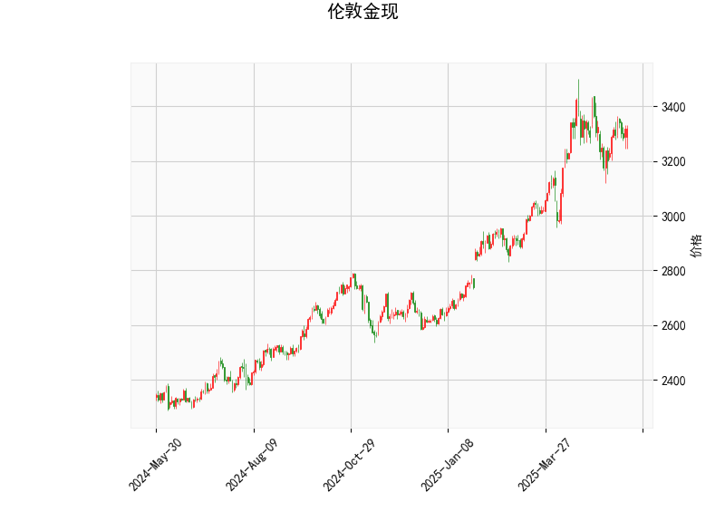

# 伦敦金现技术分析及投资策略

---

## 一、技术分析解读

### 1. 价格与布林轨道
- **当前价3317.795**位于布林带中轨（3196.88）上方，但距离上轨（3481.74）仍有较大空间，显示短期存在向上测试阻力的可能性，但未突破中轨前需警惕回调风险。
- **布林带宽收窄**（上轨-下轨=569.71）暗示市场处于低波动率阶段，可能进入震荡整理期。

### 2. RSI指标
- **RSI 54.23**接近中性区域，既未超买（>70）也未超卖（<30），反映市场多空力量暂时平衡。需关注后续能否突破60确认短期多头趋势。

### 3. MACD指标
- **MACD（23.56）下穿信号线（26.39）**形成"死叉"，且**柱状图-2.83**持续扩大，显示短期动能偏空。但需注意当前MACD值仍在零轴上方，中期趋势尚未完全转弱。

### 4. K线形态
- 当前无显著反转或持续形态，建议关注后续是否出现如"吞没"、"十字星"等关键K线组合。

---

## 二、投资机会与策略建议

### 1. 短期交易策略
- **震荡区间操作**：在布林带中轨（3196）与上轨（3481）之间高抛低吸，止损设于突破区间外2%。
- **突破追单策略**：若价格站稳3350（当前价上方关键整数位）可轻仓试多，目标看3400；若跌破3196中轨则考虑短空，目标3100。

### 2. 套利机会
- **跨期套利**：关注近远月合约价差变化，若出现异常扩大（如近月贴水>5美元）可反向建仓。
- **波动率套利**：通过期权组合做多波动率，因当前布林带收窄后往往伴随波动率爆发。

### 3. 风险提示
- **MACD背离风险**：若价格创新高但MACD未能同步上行，需警惕趋势反转。
- **事件驱动风险**：关注美联储政策会议、地缘冲突等可能打破技术形态的突发事件。

---

## 三、关键支撑/阻力位
| 级别    | 价格区间   | 意义说明               |
|---------|-----------|-----------------------|
| 强阻力 | 3480-3500 | 布林上轨+整数心理关口   |
| 弱阻力 | 3350      | 当前价上方整数关口      |
| 当前价 | 3317.8    | 多空分水岭             |
| 弱支撑 | 3196      | 布林中轨技术支撑位      |
| 强支撑 | 3000      | 整数关口+前低心理支撑   |

**注：建议结合15分钟/小时图确认具体入场时机，仓位控制在总资金5%以内。**