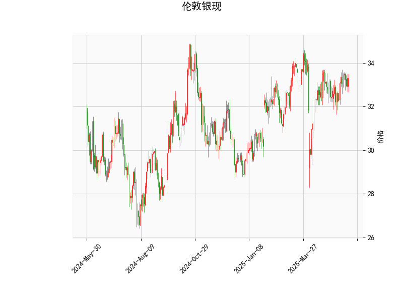

# 伦敦银现技术分析及投资策略

## 一、技术分析解读

### 1. 价格与布林轨道
- **当前价（33.302）**位于布林中轨（32.912）和上轨（34.712）之间，距离上轨约4.2%，距离下轨（31.113）约7%。  
- **隐含波动**：布林带略微向上倾斜（上轨>中轨>下轨），但价格尚未突破上轨，显示市场处于温和上涨趋势中的震荡阶段。

### 2. RSI指标（54.54）
- 处于**中性区间**（50-70），既未超买（>70）也未超卖（<30），短期缺乏明确方向信号。  
- **潜在动能**：若RSI突破60并伴随价格上涨，可能确认多头趋势；若跌破50则警惕回调。

### 3. MACD指标
- **MACD线（0.164）**上穿**信号线（0.119）**，柱状图（0.0458）由负转正，形成**短期金叉**。  
- **动能评估**：MACD绝对值较小，显示当前趋势动能较弱，需警惕假突破。

### 4. K线形态
- **无显著形态**：未出现“吞没”“十字星”等经典反转或持续形态，市场缺乏短期催化剂。

---

## 二、投资机会与策略

### 1. 趋势跟踪策略
- **突破交易**：若价格**站稳34.7（上轨）**，可轻仓做多，目标看向前高35-36区域，止损设于中轨（32.9）下方。  
- **回调做多**：若价格回踩**中轨32.9附近**且MACD保持金叉，可视为支撑位介入，止损设于下轨（31.1）下方。

### 2. 套利机会
- **跨市场套利**：关注黄金/白银比价（若黄金强势而白银滞后，可做多白银/做空黄金）。  
- **美元反向对冲**：若美元指数（DXY）出现回调信号，可同步布局白银多头（白银与美元通常负相关）。

### 3. 风险提示
- **假突破风险**：MACD动能不足可能引发价格反复，需结合成交量验证突破有效性。  
- **事件驱动**：关注美联储利率决议、非农数据等宏观事件，可能引发短期剧烈波动。

---

## 三、结论
当前伦敦银现处于**震荡偏多**格局，短期可关注**布林上轨突破**或**中轨回踩**的顺势机会，中长期需观察MACD动能是否持续放大。建议仓位控制在5%-10%，止损严格设置，并密切跟踪美联储政策动向及地缘政治风险。