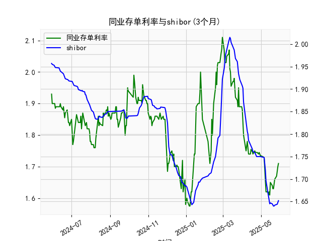

|            |   同业存单利率(3个月) |   shibor(3个月) |
|:-----------|----------------------:|----------------:|
| 2025-04-29 |                 1.74  |           1.75  |
| 2025-04-30 |                 1.735 |           1.75  |
| 2025-05-06 |                 1.73  |           1.748 |
| 2025-05-07 |                 1.69  |           1.737 |
| 2025-05-08 |                 1.66  |           1.72  |
| 2025-05-09 |                 1.62  |           1.696 |
| 2025-05-12 |                 1.62  |           1.672 |
| 2025-05-13 |                 1.61  |           1.662 |
| 2025-05-14 |                 1.62  |           1.653 |
| 2025-05-15 |                 1.61  |           1.645 |
| 2025-05-16 |                 1.65  |           1.647 |
| 2025-05-19 |                 1.64  |           1.645 |
| 2025-05-20 |                 1.63  |           1.642 |
| 2025-05-21 |                 1.63  |           1.64  |
| 2025-05-22 |                 1.655 |           1.64  |
| 2025-05-23 |                 1.66  |           1.642 |
| 2025-05-26 |                 1.67  |           1.643 |
| 2025-05-27 |                 1.69  |           1.644 |
| 2025-05-28 |                 1.7   |           1.647 |
| 2025-05-29 |                 1.71  |           1.652 |

# 同业存单利率与SHIBOR相关性及影响逻辑

## 1. 同业存单利率与SHIBOR的相关性及影响逻辑

### （1）相关性特征
- **同向波动性**：两者均反映银行间市场资金价格，受货币政策（如MLF利率、逆回购操作）、流动性松紧、市场预期等共同因素驱动，长期呈现高度正相关性。
- **利差特征**：同业存单利率通常略高于SHIBOR，因其包含银行信用风险溢价和流动性溢价。当市场对中小银行信用风险担忧上升时（如包商事件），利差可能显著扩大。
- **期限传导性**：3个月SHIBOR作为银行间市场基准利率，直接影响同业存单定价，但同业存单实际发行利率还会受供需关系（如季末考核期发行放量）和监管政策（如MPA考核）扰动。

### （2）影响逻辑
- **货币政策传导**：央行通过OMO/MLF操作向市场注入流动性时，两者同步下行；反之则上行。
- **信用风险溢价**：当市场对银行体系稳定性担忧加剧（如区域性金融风险暴露），同业存单利率可能快速攀升，而SHIBOR因反映大行报价相对稳定。
- **季节性波动**：季末/年末流动性紧张时，同业存单发行利率上行幅度通常大于SHIBOR，反映银行主动负债压力。
- **监管干预**：若监管层限制同业业务扩张（如2017年同业去杠杆），同业存单供需失衡可能导致利率与SHIBOR短期背离。

---

## 2. 近期投资机会分析（基于最近一周数据）

### （1）最新数据动态
- **同业存单利率（AAA 3M）**：  
  近一周从**1.75%→1.71%**（今日较昨日下降4bps），创年内新低，反映银行负债端压力缓解。
- **SHIBOR 3M**：  
  近一周从**1.72%→1.652%**（今日较昨日下降6.8bps），降幅快于同业存单，表明大行资金宽松信号明确。

### （2）关键信号解读
- **利差收窄**：同业存单与SHIBOR利差从**3bps→5.8bps**，显示信用溢价边际下降，市场对银行信用风险担忧缓解。
- **政策宽松预期**：双利率加速下行可能与近期降准预期升温、央行加大逆回购投放有关，暗示资金面持续宽松。

### （3）潜在投资机会
- **利率债短端**：3个月利率快速下行利好1-3年期国债/政金债，可捕捉资本利得。
- **高等级信用债**：银行负债成本下降传导至资产端，AAA级企业债信用利差有望压缩。
- **货币市场工具**：同业存单收益率仍高于SHIBOR，配置短期限存单可锁定相对收益。
- **权益市场联动**：流动性宽松环境下，关注对利率敏感的券商、地产板块估值修复机会。

### （4）风险提示
- **政策节奏变化**：若央行短期未兑现降准，利率下行趋势可能逆转。
- **信用分层风险**：中小银行存单利率若未同步下行，需警惕局部流动性压力。