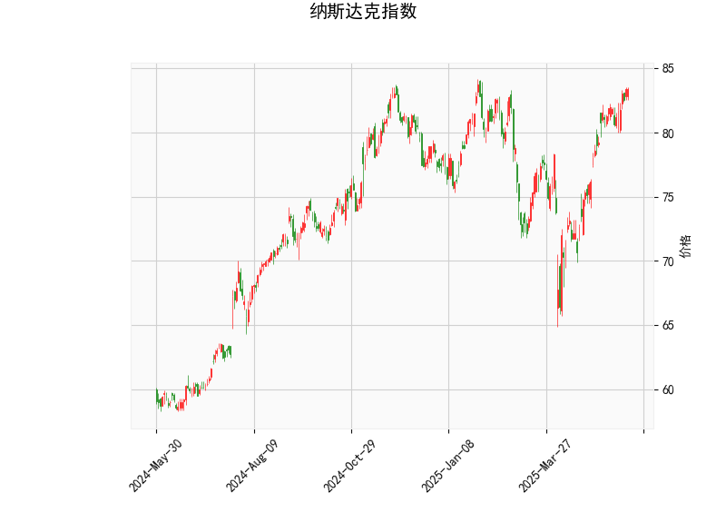

### 纳斯达克指数技术分析结果解读

#### 1. 技术指标分析
- **当前价（83.38）**：  
  当前价格位于布林带中轨（76.45）上方，接近上轨（84.8），表明市场处于短期强势区间，但需警惕上轨附近的阻力压力。

- **RSI（68.45）**：  
  相对强弱指数接近70超买阈值，显示市场短期存在过热风险，但尚未完全进入超买区域。若RSI继续上行突破70，可能触发回调压力；若回落至60以下，则趋势可能延续。

- **MACD（1.906）与信号线（1.839）**：  
  MACD线位于信号线上方，且柱状图（0.067）为正值，表明当前处于多头动能增强阶段。但MACD与信号线差值较小，需关注是否形成“金叉”或动能衰竭。

- **布林带**：  
  价格贴近上轨（84.8），与中轨（76.45）拉开较大距离，反映短期波动率上升。若价格突破上轨，可能加速上涨；若回落至中轨附近，可能测试支撑。

- **K线形态**：  
  无明确反转或持续形态，短期趋势方向需结合其他指标判断。

---

#### 2. 潜在机会与策略
##### **短期看涨机会**：
- **突破交易**：若价格站稳布林带上轨（84.8），可能开启新一轮上行空间，可轻仓追多，目标价参考前高或更高阻力位，止损设于上轨下方（如83.5）。
- **回踩中轨做多**：若价格回调至布林带中轨（76.45）附近且RSI未跌破50，可视为趋势延续信号，逢低买入。

##### **短期回调风险**：
- **超买信号对冲**：  
  RSI接近70且价格逼近布林带上轨，若出现滞涨（如长上影线），可考虑短线做空，目标中轨（76.45），止损设于上轨上方（如85.0）。
- **MACD动能衰竭**：  
  若MACD柱状图缩量或形成“死叉”，可能预示回调，可结合布林带中轨支撑确认离场。

##### **套利策略**：
- **波动率收敛交易**：  
  若价格回落至中轨附近且布林带收窄，可布局波动率扩大的期权策略（如跨式组合），押注突破行情。
- **区间波段操作**：  
  在布林带上轨（84.8）与中轨（76.45）之间高抛低吸，需严格止损。

---

#### 3. 风险提示
- **流动性风险**：重大事件（如美联储政策）可能加剧波动，需关注市场情绪变化。
- **指标背离风险**：若价格创新高但RSI/MACD未同步上行，可能形成顶背离，需警惕反转。
- **止损纪律**：所有策略需配合严格止损（如跌破中轨或上轨失效），避免单边行情损失。