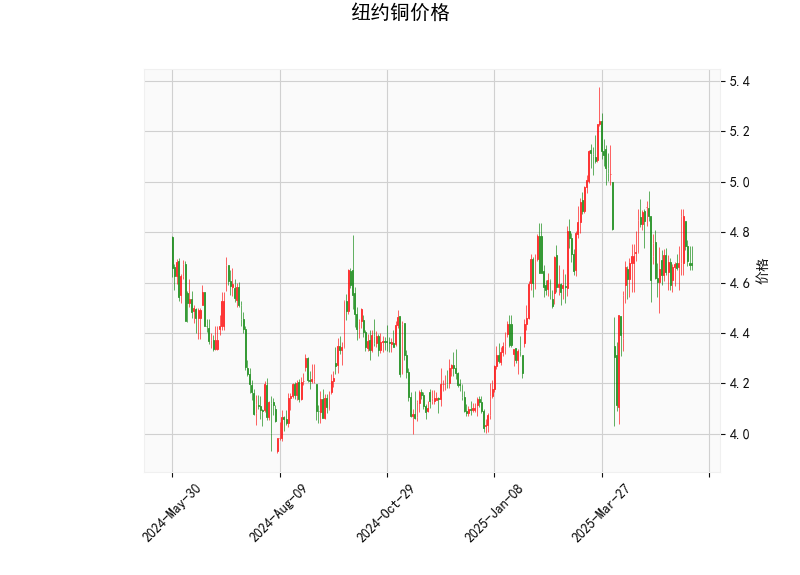

# 纽约铜价技术分析与投资策略

## 一、技术分析结果解读

### 1. 价格与布林带关系
- **当前价（4.671）**低于**布林带中轨（4.786）**，且接近**下轨（4.339）**，表明短期处于弱势区间，但接近支撑位，存在超卖反弹可能性。
- **布林带开口收敛**（上轨5.233至下轨4.339的间距缩小），暗示市场波动率降低，可能进入盘整或方向选择阶段。

### 2. 动能指标
- **RSI（47.42）**：中性区域，无明显超买/超卖信号，多空力量均衡。
- **MACD（-0.005）与信号线（-0.007）**：MACD柱状图（0.002）转正，形成微弱金叉，但绝对值接近零轴，表明短期动能修复但趋势性不强。

### 3. K线形态
- **CDLDOJI（十字星）**、**CDLLONGLEGGEDDOJI（长腿十字星）**、**CDLHIGHWAVE（长影线）**：反映市场犹豫不决，多空博弈激烈。
- **CDLMATCHINGLOW（平底形态）**：暗示短期底部支撑，若配合放量可能触发反弹。
- **CDLSPINNINGTOP（纺锤线）**：延续盘整信号，需等待方向确认。

---

## 二、潜在机会与策略

### 1. 短期交易机会
- **反弹策略**：
  - **入场条件**：价格站稳4.67并突破布林带中轨（4.786），或RSI突破50且MACD持续上行。
  - **目标**：布林带上轨5.23附近（约12%空间）。
  - **止损**：跌破布林带下轨4.34或前低。
- **破位策略**：
  - **下行风险**：若价格跌破4.34且布林带开口扩张，可能加速下跌至更低支撑位（如前低4.0）。
  - **反向操作**：空头可轻仓跟随，止损设于4.67上方。

### 2. 套利与对冲机会
- **跨期套利**：
  - 观察近月合约与远月合约价差。若近月贴水（Contango）扩大，可做空远月、做多近月，捕捉价差回归。
- **波动率策略**：
  - 布林带收窄后可能出现波动率爆发，可布局**跨式期权组合**（Long Straddle），押注突破行情。
- **基本面联动**：
  - 结合铜库存（LME/COMEX）、美元指数及中国需求数据，若宏观面转暖（如美联储降息预期升温），可提前布局多头。

---

## 三、风险提示
1. **假突破风险**：布林带收窄后若未放量突破，可能延续震荡，需警惕反复洗盘。
2. **宏观扰动**：美国通胀数据、地缘冲突等事件可能放大波动，需设置严格止损。
3. **流动性风险**：铜价受大宗商品整体情绪影响，若市场转向避险（如美元走强），可能压制反弹空间。

**结论**：当前技术面偏向震荡筑底，建议以轻仓试多为主，重点关注价格对布林带中轨的突破有效性，并配合基本面数据动态调整仓位。