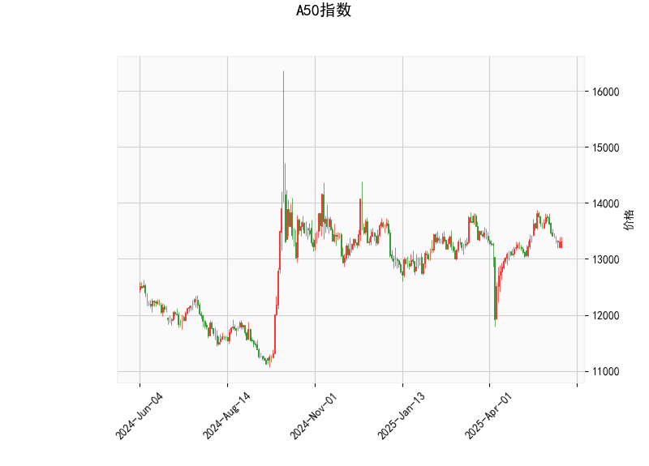

### 一、A50指数技术分析解读

#### 1. **RSI指标**  
当前RSI值为**45.57**，处于中性区间（30-70），表明市场情绪未出现明显超买或超卖，但略微偏向空方。若后续RSI跌破40，可能触发短期抛压；若回升至50以上，则显示多方力量增强。

#### 2. **MACD指标**  
- **MACD线（17.56）**远低于**信号线（67.98）**，且**柱状图（-50.41）**持续负值，说明当前处于空头趋势，短期动能偏弱。需关注MACD线与信号线是否收敛，若形成金叉可能预示反弹。

#### 3. **布林轨道**  
- **当前价（13,310）**接近**中轨（13,311.76）**，显示价格处于短期平衡状态。  
- **上轨（13,987.9）**与当前价差距较大，向上突破需强劲多头动能；**下轨（12,635.6）**是潜在支撑位，若价格跌破中轨可能向下轨靠拢。

#### 4. **K线形态**  
- **CDLBELTHOLD**（多头吞噬形态）：通常出现在下跌趋势末端，暗示空头力量衰竭，可能反转。  
- **CDLGAPSIDESIDEWHITE**（双侧缺口并列白线）：反映市场犹豫，需结合其他指标确认方向。  

---

### 二、投资机会与策略建议

#### 1. **短期交易机会**  
- **看空策略**：若价格跌破布林中轨（13,311），MACD柱状图未收敛，可轻仓做空，目标看向下轨（12,635），止损设在中轨上方（13,350）。  
- **反弹博弈**：若价格站稳中轨且MACD柱状图缩窄，可尝试短多，目标上轨（13,988），止损设在13,250。

#### 2. **套利机会**  
- **区间套利**：利用布林轨道上下轨的均值回归特性，在价格接近下轨时买入，接近上轨时卖出，但需结合RSI和MACD确认趋势强度。  
- **事件驱动**：若出现政策利好（如中国宏观经济数据超预期），可能推动价格向上突破，需关注消息面与量能配合。

#### 3. **风险提示**  
- MACD空头信号较强，需警惕趋势延续风险，避免逆势重仓。  
- K线形态显示市场犹豫，需等待明确方向信号（如放量突破中轨或MACD金叉）。  

---

**总结**：当前A50指数技术面偏空，但接近关键支撑位（布林下轨）和潜在反转形态（CDLBELTHOLD），建议以轻仓区间操作为主，严格止损。