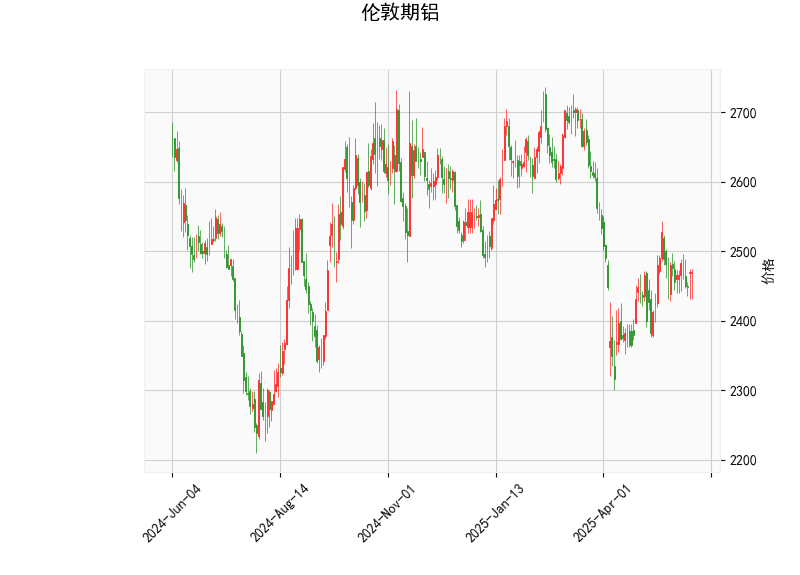

### 一、技术分析结果解读

#### 1. **当前价格与布林轨道**
- **当前价**：2470.5，位于布林轨道中轨（2478.71）附近，略微低于中轨，表明市场处于短期均衡状态，方向未明。
- **布林轨道形态**：
  - **上轨**2673.58，**下轨**2283.83，**带宽**（上轨-下轨）较大（约389.75），显示当前市场波动性较高，但价格未突破上下轨边界。
  - 当前价接近中轨，若后续站稳中轨可能触发向上测试上轨的动能。

#### 2. **RSI（相对强弱指数）**
- **RSI值51.73**：接近中性区域（50），表明多空力量暂时平衡，但需警惕短期超买或超卖信号的切换。若RSI突破55，可能暗示短期多头占优；若跌破45则可能转空。

#### 3. **MACD指标**
- **MACD线（2.196） > 信号线（1.405）**，柱状图（0.79）为正值且扩大，显示短期动能偏多，但需注意MACD仍处于零轴附近，趋势尚未完全确立。

#### 4. **K线形态**
- 包含多个反转/震荡信号：  
  - **十字星（CDLDOJI、CDLLONGLEGGEDDOJI）**：表明市场犹豫不决，可能预示趋势反转。
  - **纺锤线（CDLSPINNINGTOP）**：买卖双方拉锯，需结合其他指标确认方向。
  - **长腿十字线（CDLHIGHWAVE）**：波动性增加，警惕短期剧烈震荡。

---

### 二、投资机会与策略

#### 1. **趋势跟踪策略**
- **看涨条件**：若价格突破中轨（2478.71）并站稳，且MACD柱状图持续扩大，可轻仓试多，目标上轨（2673.58）。
- **看跌条件**：若价格跌破下轨（2283.83），且RSI跌破45，可考虑短空，止损设于中轨上方。

#### 2. **区间套利策略**
- **高抛低吸**：当前价格处于布林带中轨附近，若未突破上下轨，可尝试在价格接近下轨（2283）时买入，中轨附近（2478）止盈；接近上轨（2673）时卖出，中轨附近回补。

#### 3. **风险提示**
- **止损设置**：若价格突破中轨后迅速回落，需警惕假突破风险，建议将止损设在关键支撑/阻力位（如下轨或前低）。
- **K线形态验证**：需结合未来1-2根K线确认反转信号的有效性，避免单凭形态入场。

#### 4. **套利机会**
- **跨期套利**：若远期合约贴水（Contango）扩大，可关注正套（买近月、卖远月）；若库存数据下降或需求预期改善，反套（卖近月、买远月）可能更优。
- **波动率交易**：布林带带宽较大，隐含波动率可能偏高，可考虑卖出宽跨式期权组合（Short Strangle）。

---

### 三、总结
当前伦敦期铝技术面呈现多空博弈状态，短期需关注价格对布林中轨的争夺及MACD动能变化。策略上建议以区间交易为主，等待趋势确认后加仓，同时结合基本面（如库存、全球铝供需）验证技术信号。