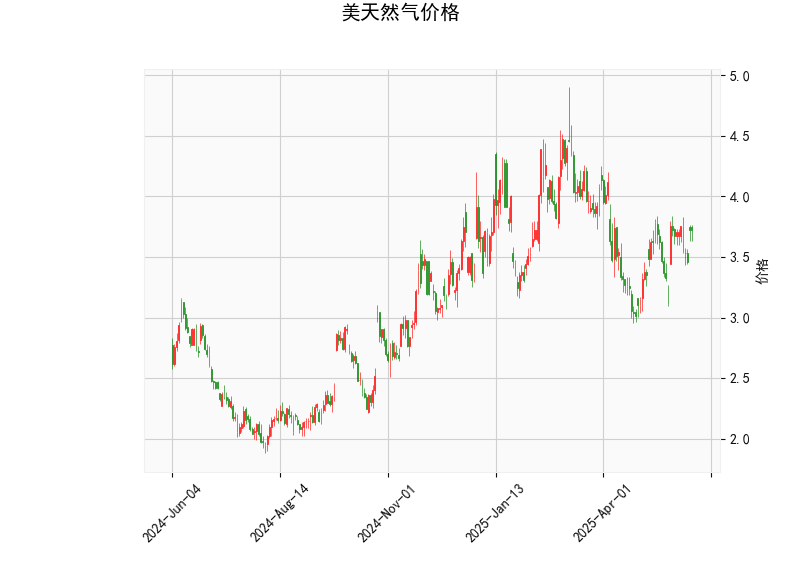

### 技术分析结果解读

#### 1. 关键指标分析
- **当前价（3.722）与布林轨道关系**：  
  当前价格位于布林通道中轨（3.624）附近，略高于中轨，但距离上轨（4.262）仍有约**14.5%**的潜在上行空间，而距离下轨（2.987）的潜在下行空间为**19.7%**。  
  **短期趋势判断**：价格处于中轨附近波动，尚未形成明确单边趋势，但需关注是否突破中轨支撑或压力。

- **RSI（55.1）**：  
  RSI值略高于中性线（50），但未进入超买区间（70以上）。  
  **市场情绪**：当前市场情绪偏向中性，多空力量相对均衡，但需警惕RSI若持续上行可能触发短期看涨信号。

- **MACD指标**：  
  MACD线（0.0349）高于信号线（0.0187），柱状图（0.0162）为正值且呈扩张状态。  
  **动能信号**：MACD金叉初步形成，暗示短期上涨动能可能增强，但需结合其他指标验证趋势持续性。

- **K线形态（CDLMATCHINGLOW）**：  
  该形态通常出现在下跌趋势末端，由两根收盘价相近的阴线组成，暗示空头力量衰竭，可能预示短期底部形成。  
  **反转信号**：若后续价格站稳中轨（3.624）并伴随成交量放大，可能确认反转。

---

### 投资机会与策略建议

#### 2. 潜在机会与策略
##### （1）趋势突破策略
- **看涨条件**：  
  若价格站稳布林中轨（3.624）并伴随MACD柱状图持续扩大，可尝试**逢低做多**，目标看向上轨（4.262），止损设于中轨下方（如3.60）。  
- **看跌条件**：  
  若价格跌破中轨且RSI回落至50以下，可能开启下行通道，目标下看下轨（2.987），止损设于中轨上方（如3.65）。

##### （2）套利与波段策略
- **波动率套利**：  
  当前布林通道宽度（上轨-下轨=1.275）处于中等水平，若预期价格波动率上升（如天气因素或库存报告公布），可考虑**买入跨式期权组合**，同时持有看涨和看跌期权。  
- **MACD动能跟随**：  
  若MACD柱状图持续扩大且RSI突破60，可短线追多，目标涨幅约5%-8%（对应价格3.90-4.00区间）。

##### （3）风险提示
- **假突破风险**：MACD数值绝对值较小，若动能不足可能导致金叉失效。  
- **K线形态需验证**：CDLMATCHINGLOW需配合成交量放大或基本面利好（如寒潮预期）才能确认反转。  
- **事件驱动**：需关注EIA天然气库存数据、极端天气预测及地缘政治事件对供需的影响。

---

### 总结
**短期操作建议**：以区间震荡策略为主（3.60-4.00），突破中轨后顺势跟进；**中长期关注**：若价格站稳4.0上方可能开启上行趋势，反之跌破3.60需警惕加速下跌风险。套利机会需结合事件驱动与波动率变化灵活布局。