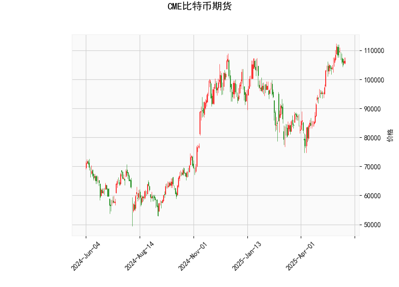

### CME比特币期货技术分析解读

#### 1. 技术指标解析
- **当前价与布林带**：  
  当前价格（106,320）位于布林带中轨（93,491）和上轨（113,915）之间，且明显高于中轨，表明短期趋势偏多。但距离上轨仍有约7,596点的空间，暗示若持续上涨可能触及阻力位（上轨）。布林带收窄（中轨与上下轨间距缩小）可能预示价格波动即将放大。

- **RSI（60.35）**：  
  RSI接近超买阈值（70），但尚未进入超买区域，显示买方力量占优但未过热。需警惕若RSI突破70后可能出现的回调风险。

- **MACD指标**：  
  MACD线（3,442）低于信号线（4,230），且柱状图（-788）为负值，形成“死叉”信号。这表明短期动能减弱，存在回调或盘整可能。但若价格未显著下跌，需关注MACD是否在零轴上方重新形成金叉。

- **K线形态**：  
  当前无明确反转或持续形态（如头肩顶、吞没形态等），需结合其他指标判断方向。

---

#### 2. 潜在机会与策略

##### **短期交易机会**
- **多头策略**：  
  - **入场条件**：价格回踩布林带中轨（93,491）或站稳当前价后突破前高。  
  - **目标**：布林带上轨（113,915）附近。  
  - **止损**：若跌破中轨或MACD柱状图进一步走弱，需止损。

- **空头策略**：  
  - **入场条件**：价格接近布林带上轨且RSI超买（>70），或MACD死叉确认后价格跌破中轨。  
  - **目标**：布林带下轨（73,067）或前低支撑。  
  - **止损**：价格突破上轨或MACD出现反转金叉。

##### **套利机会**
- **跨期套利**：  
  若近月合约与远月合约价差显著偏离历史均值（需结合具体合约数据），可做多贴水合约/做空升水合约，等待价差回归。

- **波动率策略**：  
  布林带收窄后可能伴随波动率爆发，可布局跨式期权组合（同时买入看涨和看跌期权），捕捉突破行情。

##### **风险提示**
- MACD死叉与价格未明显下跌的背离需警惕“假信号”可能，需结合成交量验证。  
- 比特币波动率高，建议采用轻仓+严格止损策略。  
- 关注宏观事件（如监管政策、美联储利率决议）对短期情绪的冲击。

---

### 结论  
当前技术面呈现“多头趋势中的短期回调压力”。建议以中轨（93,491）为多空分界线，上轨（113,915）为关键阻力，优先关注回调后的低多机会，若破位中轨则转向空头。套利需依赖更细致的合约价差数据，波动率策略适合风险偏好较高的投资者。