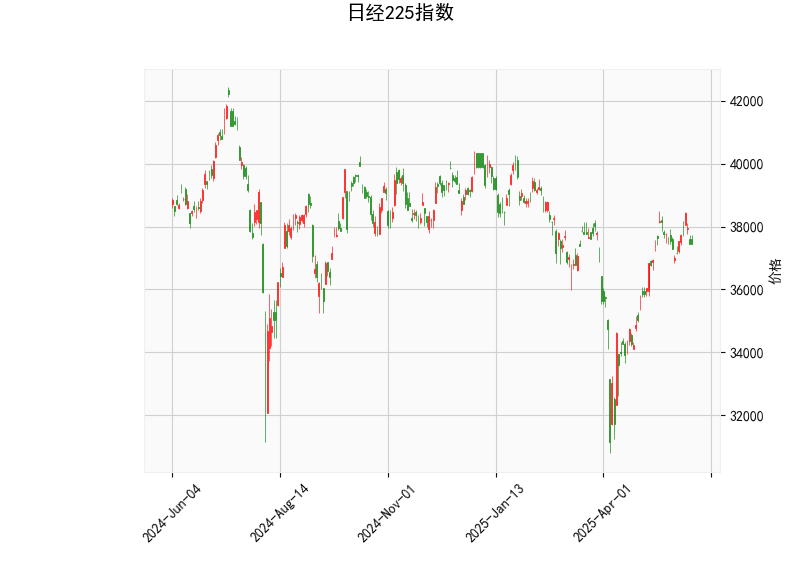

# 日经225指数技术分析与投资策略

## 一、技术分析解读

### 1. **价格与布林轨道**
- **当前价37446.81**位于布林带中轨（36322.40）与上轨（39764.25）之间，距离中轨更近，显示短期趋势中性偏强，但未触及上轨压力位。
- **布林带宽幅较大**（上轨-下轨≈6883点），表明市场波动性较高，需警惕突破或回调风险。

### 2. **RSI指标**
- **RSI 53.75**接近中性值50，显示市场未进入超买（>70）或超卖（<30）区域，短期缺乏明确方向信号。

### 3. **MACD指标**
- **MACD线（418.23）低于信号线（473.89）**，柱状图（-55.67）为负值，形成“死叉”形态，暗示短期可能面临回调压力。
- **MACD绝对值较高**（两线均>400），反映长期仍处于强势趋势中，但短期动能减弱。

### 4. **K线形态**
- **CDLMATCHINGLOW形态**出现，表明市场在连续下跌后出现多头抵抗，可能预示短期底部形成，需配合成交量验证有效性。

---

## 二、投资机会与策略建议

### 1. **趋势跟踪策略**
- **多头机会**：若价格站稳中轨（36322）并伴随MACD柱状图缩窄/转正，可分批建仓，目标看向上轨（39764），止损设于中轨下方（如35800）。
- **空头机会**：若价格跌破中轨且MACD持续走弱，可轻仓试空，目标下轨（32880），止损设于中轨上方（如36800）。

### 2. **波段交易策略**
- **区间操作**：在布林带中轨-上轨间（36322-39764）高抛低吸，结合RSI超买（接近60-65时减仓）和超卖（接近40时加仓）动态调整仓位。

### 3. **事件驱动套利**
- **政策预期博弈**：关注日本央行货币政策动向及日元汇率波动，若日元贬值预期升温，可提前布局日经指数期货多头。

### 4. **风险提示**
- **MACD背离风险**：若价格创高但MACD未能同步回升，需警惕趋势反转。
- **流动性冲击**：全球市场波动（如美股调整）可能引发日经指数连锁反应，需设置严格止损。

---

## 三、关键观察节点
1. **MACD柱状图拐点**：若负值持续收窄，可能预示回调结束。
2. **布林带收窄**：若带宽缩小至5000点以下，需防范趋势性行情启动。
3. **K线形态确认**：CDLMATCHINGLOW后若出现放量阳线，可强化底部信号。