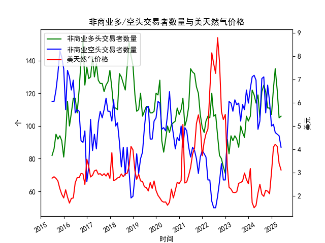

|            |   非商业多头交易者数量 |   非商业空头交易者数量 |   美天然气价格 |
|:-----------|-----------------------:|-----------------------:|---------------:|
| 2023-10-31 |                     93 |                    110 |           2.99 |
| 2023-11-30 |                    106 |                    122 |           2.71 |
| 2023-12-31 |                    103 |                    114 |           2.53 |
| 2024-01-31 |                    106 |                    123 |           3.18 |
| 2024-02-29 |                    122 |                    130 |           1.72 |
| 2024-03-31 |                    119 |                    131 |           1.5  |
| 2024-04-30 |                    114 |                    128 |           1.6  |
| 2024-05-31 |                    119 |                     98 |           2.13 |
| 2024-06-30 |                    105 |                    103 |           2.51 |
| 2024-07-31 |                    121 |                    129 |           2.08 |
| 2024-08-31 |                    125 |                    130 |           1.99 |
| 2024-09-30 |                    121 |                    108 |           2.25 |
| 2024-10-31 |                    111 |                    125 |           2.21 |
| 2024-11-30 |                    111 |                    115 |           2.1  |
| 2024-12-31 |                    107 |                    100 |           3.02 |
| 2025-01-31 |                    123 |                    101 |           4.1  |
| 2025-02-28 |                    135 |                     96 |           4.22 |
| 2025-03-31 |                    122 |                     95 |           4.13 |
| 2025-04-30 |                    105 |                     94 |           3.4  |
| 2025-05-31 |                    106 |                     87 |           3.12 |

### 近期天然气市场投资机会分析（2025年3-5月数据）

#### 1. **价格走势**
- **持续下跌但动能减弱**：
  - **2025年3月→4月**：价格从4.13美元跌至3.40美元（**-17.7%**），跌幅显著。
  - **2025年4月→5月**：价格从3.40美元跌至3.12美元（**-8.2%**），跌幅收窄，显示卖压可能接近尾声。
  - **潜在机会**：若未来价格企稳或出现技术性反弹（如RSI超卖信号），可能形成短期底部。

#### 2. **持仓情绪变化**
- **多头持仓**：
  - **4月大幅减仓**（122→105，**-13.9%**）：反映市场悲观情绪。
  - **5月小幅回升**（105→106，**+0.95%**）：部分投资者试探性看多，情绪边际改善。
  
- **空头持仓**：
  - **连续三个月减仓**（95→94→87），5月降幅扩大（**-7.4%**）：空头获利离场，市场抛售压力缓解。
  
- **多空比率**：
  - **3月**：122/95≈1.28  
  - **5月**：106/87≈1.22  
  （比率回升但仍低于3月，需持续观察反转信号）。

#### 3. **关键信号与机会**
- **空头加速离场**：5月空头持仓创近期新低（87），若延续趋势，可能预示价格接近阶段性低点。
- **价格与持仓背离**：价格下跌但空头减仓，可能暗示市场对进一步下跌分歧减少，存在空头回补驱动的反弹可能。
- **季节性因素**：5月为传统需求淡季，但价格已提前下跌，若夏季库存数据低于预期或极端天气扰动，可能催化反弹。

#### 4. **风险提示**
- **基本面验证**：需关注EIA库存报告、产量数据及天气预测，确认供需是否边际改善。
- **技术面阻力**：若价格反弹至3.40-3.50美元（4月低点），可能面临抛压。
- **宏观扰动**：美联储政策、美元走势及能源替代品（如原油）价格联动。

---

### **结论与策略建议**
- **短期看反弹**：空头持仓锐减+价格跌幅放缓，可轻仓布局多头，目标3.40-3.50美元，止损2.95美元（前低）。
- **中期观望**：若6月数据确认多头增仓且库存下降，可加仓；反之，若价格跌破3.0美元，需警惕趋势延续。
- **对冲策略**：多天然气空原油（若夏季天然气需求预期升温而原油库存高企）。