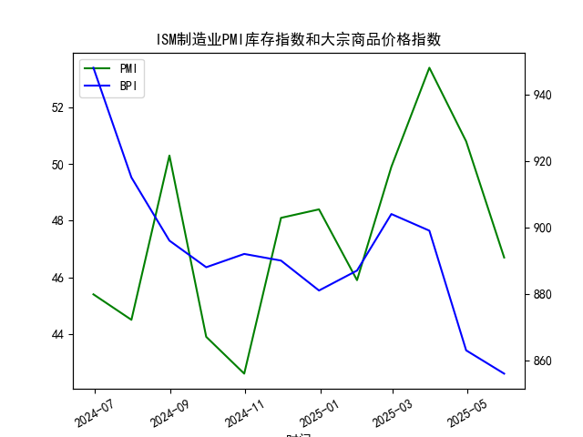

|            |   ISM制造业PMI库存指数 |   大宗商品价格指数BPI |
|:-----------|-----------------------:|----------------------:|
| 2024-06-30 |                   45.4 |                   948 |
| 2024-07-31 |                   44.5 |                   915 |
| 2024-08-31 |                   50.3 |                   896 |
| 2024-09-30 |                   43.9 |                   888 |
| 2024-10-31 |                   42.6 |                   892 |
| 2024-11-30 |                   48.1 |                   890 |
| 2024-12-31 |                   48.4 |                   881 |
| 2025-01-31 |                   45.9 |                   887 |
| 2025-02-28 |                   49.9 |                   904 |
| 2025-03-31 |                   53.4 |                   899 |
| 2025-04-30 |                   50.8 |                   863 |
| 2025-05-31 |                   46.7 |                   856 |

### 1. 关于ISM制造业PMI库存指数与大宗商品价格相关性的分析

#### 观点正确性判断
**该观点部分正确但存在局限性**。  
- **正确性**：在库存周期中，**垒库（补库）阶段通常对应需求扩张预期**，企业为应对未来销售增长而主动增加库存，可能推动大宗商品价格上涨（如2009-2010年、2016-2017年）。  
- **局限性**：  
  1. **PMI库存指数与价格并非简单线性相关**。例如，2022-2023年全球去库阶段，大宗商品价格因供应链扰动和能源危机反而上涨。  
  2. **当前阶段特殊性**：根据提供的数据，2024年6月至2025年5月PMI库存指数在42.6-53.4间波动（50为荣枯线），仅2025年3月（53.4）和4月（50.8）短暂进入垒库，但同期大宗商品价格从948持续下跌至856，显示**需求疲软压制价格**，与“垒库必涨”的规律背离。  

#### 相关性及影响逻辑
- **正向关联场景**：当垒库由**真实需求驱动**（如经济复苏），企业主动补库推升商品价格。  
- **负向关联场景**：若垒库源于**被动积压**（如销售不及预期），或需求端出现**结构性下滑**（如2024年数据中PMI库存与商品价格同步走弱），价格可能不涨反跌。  
- **核心逻辑**：PMI库存指数反映企业对未来需求的预期，而商品价格受**实际供需、流动性、地缘风险**等多因素影响，需结合其他指标综合判断。

---

### 2. 近期投资机会分析

#### 数据局限性
提供的数据为**月频**，无法直接分析周内或日度变化。但可基于最新月份（2025年5月）趋势推断：  
- **PMI库存指数**：从3月53.4（扩张）骤降至5月46.7（收缩），显示**去库加速**。  
- **大宗商品价格指数**：从3月899降至5月856，连续3月下跌，跌幅扩大。  

#### 潜在机会与风险
1. **超跌反弹机会**：  
   - 商品价格已接近2024年6月（948）以来最低点，若PMI库存指数触底（如46.7）后企稳，可能引发空头回补。  
   - **关注品种**：能源（原油、天然气）和工业金属（铜、铝），因其对库存周期敏感度高。  

2. **结构性避险机会**：  
   - 若去库持续，**防御性资产**（黄金、国债）或受益于市场避险情绪。  
   - **风险提示**：需警惕全球经济增长放缓（如中国、欧洲）对商品需求的进一步压制。  

3. **事件驱动机会**：  
   - 若未来1周公布**制造业PMI新订单指数回升**，可能修正市场对“去库-价格下跌”的悲观预期，短期提振商品板块。  

#### 操作建议
- **短期**：轻仓参与超跌品种（如铜、原油）的反弹，设置严格止损。  
- **中长期**：等待PMI库存指数连续2-3月重返扩张区间（>50）后，再布局大宗商品多头。