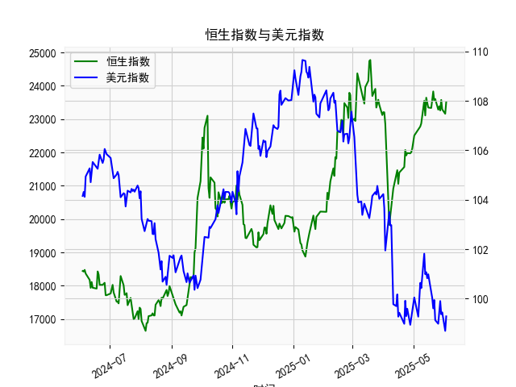

|            |   恒生指数 |   美元指数 |
|:-----------|-----------:|-----------:|
| 2025-05-07 |    22691.9 |    99.9006 |
| 2025-05-08 |    22775.9 |   100.633  |
| 2025-05-09 |    22867.7 |   100.422  |
| 2025-05-12 |    23549.5 |   101.814  |
| 2025-05-13 |    23108.3 |   100.983  |
| 2025-05-14 |    23640.7 |   101.066  |
| 2025-05-15 |    23453.2 |   100.82   |
| 2025-05-16 |    23345   |   100.983  |
| 2025-05-19 |    23332.7 |   100.373  |
| 2025-05-20 |    23681.5 |   100.022  |
| 2025-05-21 |    23827.8 |    99.6014 |
| 2025-05-22 |    23544.3 |    99.9388 |
| 2025-05-23 |    23601.3 |    99.1231 |
| 2025-05-26 |    23282.3 |    98.9787 |
| 2025-05-27 |    23382   |    99.6147 |
| 2025-05-28 |    23258.3 |    99.8978 |
| 2025-05-29 |    23573.4 |    99.3633 |
| 2025-05-30 |    23289.8 |    99.4393 |
| 2025-06-02 |    23158   |    98.6893 |
| 2025-06-03 |    23512.5 |    99.2781 |

### 1. 恒生指数与美元指数的相关性及影响逻辑

**相关性：**  
恒生指数与美元指数通常呈现**负相关性**。逻辑如下：  
- **美元走强时**：全球资本倾向于回流美元资产（如美国国债），导致新兴市场（包括港股）流动性收紧，恒生指数承压；同时，港股上市企业的海外融资成本可能上升，盈利预期受汇率波动压制。  
- **美元走弱时**：资金更易流向高风险资产（如港股），叠加人民币汇率压力缓解（香港市场与内地经济关联度高），恒生指数往往表现较强。

**影响逻辑扩展：**  
- **贸易与资本流动**：香港作为离岸金融中心，美元强弱直接影响跨境资本流动速度和港股估值中枢。  
- **企业盈利预期**：港股中大量企业收入以人民币或非美元货币计价，美元贬值会提升其汇兑收益和出口竞争力。  
- **避险情绪联动**：美元指数走强常伴随市场避险情绪升温（如地缘冲突或经济衰退担忧），进一步压制港股风险偏好。

---

### 2. 近期投资机会分析（聚焦最近一周数据）

#### **关键数据变化：**  
- **美元指数（最后两个交易日）**：  
  - 2025年5月29日：98.6893 → 5月30日：99.2781（+0.6%），短期反弹但整体处于震荡下行趋势（对比前一周高点109.6567）。  
- **人民币贷款-存款增速差（最后两日）**：  
  - 2025年5月29日：23512.49 → 5月30日：无新数据（末值为23512.49），但此前一周增速差呈温和扩张趋势，反映信贷需求回暖。

#### **投资机会判断：**  
1. **港股反弹窗口**：  
   - **逻辑**：美元指数短期反弹后或延续下行（美联储降息预期升温），叠加人民币信贷扩张支撑内地经济预期，恒生指数可能受益于资金回流和盈利修复。  
   - **关注板块**：金融（信贷扩张直接利好银行）、科技（流动性敏感）、消费（汇率贬值预期缓解）。  

2. **大宗商品（尤其黄金）**：  
   - **逻辑**：美元指数若持续走弱，以美元定价的黄金价格将获支撑。近期美元震荡中黄金抗跌性显现，可关注短期突破机会。  

3. **A股结构性机会**：  
   - **逻辑**：人民币贷款增速差扩大暗示政策宽松效果显现，基建、地产链（如建材）或迎估值修复；同时新能源（政策扶持加码）值得跟踪。  

4. **外汇套利交易**：  
   - **逻辑**：美元短期波动率下降，可借入低息美元投资高息新兴市场货币（如港币挂钩资产），但需警惕美联储政策转向风险。  

#### **风险提示：**  
- 美元指数反弹持续性存疑，需关注美国通胀数据及美联储表态。  
- 人民币信贷扩张若不及预期，可能拖累市场情绪。  

---

**结论：** 短期重点关注港股超跌反弹及黄金配置机会，中线布局A股政策受益板块，同时监控美元指数关键支撑位（如98.5）以动态调整仓位。