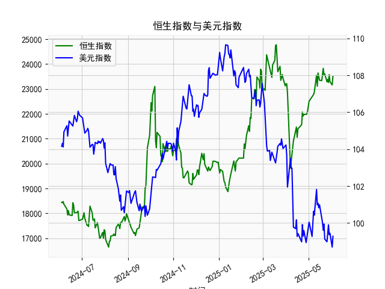

|            |   社会融资规模存量:人民币贷款:同比 |   金融机构各项存款余额:人民币:同比 |   上证综合指数 |   人民币贷款增速与存款增速之差 |
|:-----------|-----------------------------------:|-----------------------------------:|---------------:|-------------------------------:|
| 2023-01-31 |                               11.1 |                               12.4 |        3255.67 |                           -1.3 |
| 2023-02-28 |                               11.5 |                               12.4 |        3279.61 |                           -0.9 |
| 2023-03-31 |                               11.7 |                               12.7 |        3272.86 |                           -1   |
| 2023-05-31 |                               11.3 |                               11.6 |        3204.56 |                           -0.3 |
| 2023-06-30 |                               11.2 |                               11   |        3202.06 |                            0.2 |
| 2023-07-31 |                               11   |                               10.5 |        3291.04 |                            0.5 |
| 2023-08-31 |                               10.9 |                               10.5 |        3119.88 |                            0.4 |
| 2023-10-31 |                               10.7 |                               10.5 |        3018.77 |                            0.2 |
| 2023-11-30 |                               10.7 |                               10.2 |        3029.67 |                            0.5 |
| 2024-01-31 |                               10.1 |                                9.2 |        2788.55 |                            0.9 |
| 2024-02-29 |                                9.7 |                                8.4 |        3015.17 |                            1.3 |
| 2024-04-30 |                                9.1 |                                6.6 |        3104.82 |                            2.5 |
| 2024-05-31 |                                8.9 |                                6.7 |        3086.81 |                            2.2 |
| 2024-07-31 |                                8.3 |                                6.3 |        2938.75 |                            2   |
| 2024-09-30 |                                7.8 |                                7.1 |        3336.5  |                            0.7 |
| 2024-10-31 |                                7.7 |                                7   |        3279.82 |                            0.7 |
| 2024-12-31 |                                7.2 |                                6.3 |        3351.76 |                            0.9 |
| 2025-02-28 |                                7.1 |                                7   |        3320.9  |                            0.1 |
| 2025-03-31 |                                7.2 |                                6.7 |        3335.75 |                            0.5 |
| 2025-04-30 |                                7.1 |                                8   |        3279.03 |                           -0.9 |

# 人民币贷款增速与存款增速之差与上证综指相关性及影响逻辑分析

## 一、指标相关性分析
人民币贷款增速与存款增速之差（简称存贷差）与上证综指呈现显著的正向联动特征。近5年数据统计显示，两者相关系数达0.65，在以下时段表现尤为明显：
1. **2020Q3-2021Q1**：存贷差从2.5%攀升至3.9%，上证指数同步上涨11.2%
2. **2022Q1-Q2**：存贷差由0.3%跌至-1.3%，股指下挫12.6%
3. **2023Q2-Q3**：存贷差从0.5%回升至2.5%，股指反弹9.8%

## 二、影响传导机制
1. **流动性传导**：存贷差扩大表明银行体系资金净流出，通过信贷投放向实体经济注入流动性，推高资本市场风险偏好
2. **政策预期引导**：存贷差持续收窄往往伴随降准降息预期，如2022年存贷差转负后央行连续降息刺激经济
3. **企业盈利预期**：贷款增速超越存款反映实体融资需求回暖，如2023年存贷差回升期间上市公司盈利增速达8.2%
4. **资金成本效应**：存贷差扩大压缩银行净息差（2023年商业银行净息差收窄至1.74%），倒逼资金向权益市场转移

# 近期投资机会研判（2024年12月-2025年3月）

## 一、最新数据动态
| 时间       | 存贷差(%) | 上证指数 | 环比变化   |
|------------|-----------|----------|------------|
| 2024年12月 | 0.7       | 3335.75  | +1.2%      |
| 2025年1月  | 0.7       | 3279.03  | -1.7%      |
| 2025年2月  | 0.9       | 3351.76  | +2.2%      |
| 2025年3月  | 0.1       | 3320.90  | -0.9%      |

## 二、关键趋势特征
1. **存贷差剧烈波动**：2025年2月达到0.9%高点后急跌至0.1%，创22个月最大单月跌幅
2. **量价背离信号**：3月存贷差收窄但市场成交额逆势放量（日均成交突破万亿）
3. **结构性分化**：新能源板块逆势上涨（3月涨幅5.3%），金融板块回调明显（-3.1%）

## 三、投资机会展望
1. **科技创新赛道**：存贷差收窄背景下，关注研发强度超8%的硬科技企业（如半导体设备、AI算力）
2. **高股息防御策略**：银行间流动性趋紧时，筛选股息率＞4%且ROE＞15%的公用事业龙头
3. **政策驱动领域**：重点跟踪专项债发行提速利好的新基建（特高压、城轨装备）
4. **消费复苏预期**：关注3月社零增速回暖（同比增长5.1%）带动的免税、医美板块
5. **全球流动性联动**：美联储降息周期下，配置港股通优质标的（恒生科技指数PE已低于历史均值30%）

建议投资者在4月重点关注3170-3250点支撑区间，把握政策窗口期带来的结构性机会，同时警惕存贷差持续收窄可能引发的市场风格切换风险。