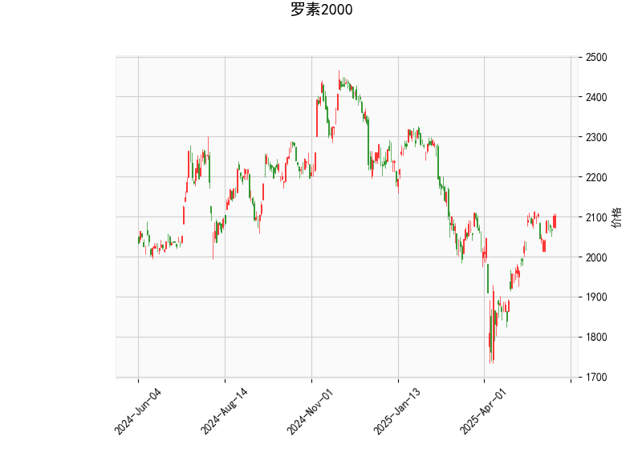

# 罗素2000指数技术分析及投资策略

---

## 一、技术指标解读

### 1. RSI（相对强弱指标）
- **当前值：60.57**  
  处于中性偏强区间（50-70），显示买方力量占优但未超买。需关注是否突破70形成顶背离信号。

### 2. MACD（移动平均收敛发散）
- **MACD线（25.24）> 信号线（24.93）**  
  形成金叉，短期上涨动能增强。但柱状图（0.31）绝对值较小，需观察后续是否持续放量。

### 3. 布林轨道
- **当前价（2102.98）高于中轨（2002.58）**  
  处于多头区域，但距离上轨（2186）仍有约4%空间，短期可能延续震荡上行趋势。
- **轨道宽度（上轨-下轨=366.84）**  
  开口扩大，暗示波动率上升，需警惕突破后的加速行情。

### 4. K线形态
- **CDLGAPSIDESIDEWHITE（上下缺口并列白）**  
  通常出现在趋势延续阶段，需确认缺口支撑有效性。
- **CDLLONGLINE（长实体线）**  
  显示近期单边波动剧烈，可能伴随买方力量集中释放。

---

## 二、潜在机会与策略

### 1. 趋势跟踪策略
- **多头机会**  
  - **入场点**：回踩中轨（2002附近）或突破前高（2186）时建仓。  
  - **目标位**：上轨2186（4%潜在空间），若突破则看至历史高位（~2300）。  
  - **止损**：中轨下方（1980）或MACD死叉信号。

### 2. 均值回归策略
- **布林带套利**  
  - 若价格触及上轨且RSI>70，可轻仓做空，目标中轨（2002），止损设在上轨上方（2200）。  
  - 结合MACD柱状图缩量确认反转信号。

### 3. 事件驱动策略
- **波动率放大机会**  
  - 布林带开口扩大期间，可布局跨式期权组合，捕捉潜在突破行情。  
  - 重点关注美联储政策、中小盘财报季等催化剂。

---

## 三、风险提示
1. **流动性风险**：中小盘成分股流动性低于大盘，需警惕极端行情下的滑点。  
2. **指标钝化风险**：若价格长期贴紧上轨运行，RSI可能失效，需结合成交量验证。  
3. **宏观扰动**：美债收益率倒挂对中小盘估值压制效应需持续跟踪。  

---

**结论**：当前技术面偏多，但需防范高位回调风险。建议以中轨为多空分水岭，配合MACD动能变化动态调整仓位。