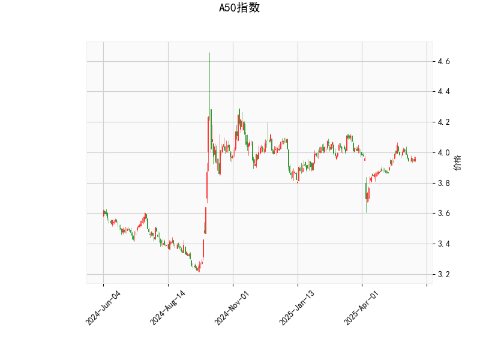

### A50指数技术分析解读

#### 1. 技术指标分析
- **当前价与布林轨道**：  
  当前价（3.957）略微高于布林中轨（3.947），接近上轨（4.126）和下轨（3.768）的中性区间，表明价格处于短期均衡状态。布林带收窄（上下轨间距0.358）可能暗示波动率降低，需警惕后续方向性突破。

- **RSI（49.96）**：  
  接近50的中性值，显示市场多空力量暂时平衡，但若RSI突破50并上行，可能触发短期反弹；若跌破45则可能进入超卖区间。

- **MACD指标**：  
  MACD线（0.0076）低于信号线（0.0133），柱状图（-0.0056）为负值，形成“死叉”形态，表明短期动能偏弱，但两者均接近零轴，需结合其他指标确认趋势。

- **K线形态（CDLGAPSIDESIDEWHITE）**：  
  该形态通常表示市场犹豫不决，可能处于盘整阶段，需关注后续价格对布林带边界的突破。

---

#### 2. 投资机会与策略

##### **潜在机会**：
1. **区间交易策略**：  
   - **买入条件**：若价格触及布林下轨（3.768）且RSI<40，可尝试短线反弹，止损设于下轨下方（如3.75）。  
   - **卖出条件**：若价格接近上轨（4.126）且RSI>55，可考虑逢高减仓，止盈目标中轨（3.947）。

2. **突破跟随策略**：  
   - **向上突破**：若价格站稳上轨且MACD柱转正，可能开启上涨趋势，目标前高（如4.15-4.20）。  
   - **向下突破**：若收盘价跌破下轨且MACD死叉扩大，可能加速下跌，目标3.70-3.65区间。

3. **套利对冲**：  
   - 若持有现货头寸，可卖出短期虚值看涨期权（如行权价4.15）以收取权利金，对冲潜在回调风险。

##### **风险提示**：
- **假突破风险**：当前波动率较低，若突破后快速回归布林带内，需严格止损。  
- **MACD信号滞后**：MACD接近零轴时敏感性下降，建议结合成交量验证趋势强度。  
- **外部事件扰动**：宏观经济数据或政策变动可能打破技术面平衡，需关注市场情绪变化。

---

**结论**：当前A50指数处于震荡收敛阶段，建议以区间交易为主，等待明确突破信号后跟进趋势。短线投资者可关注布林带边界附近的交易机会，中长线需结合基本面（如中国PMI、汇率政策）动态调整仓位。