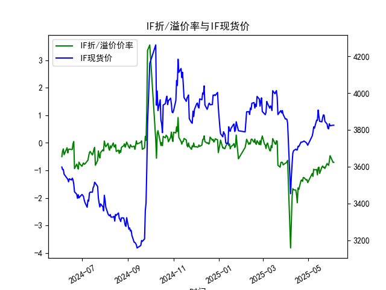
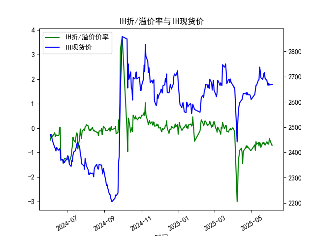
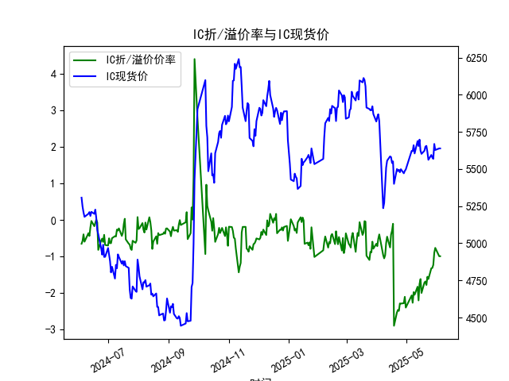
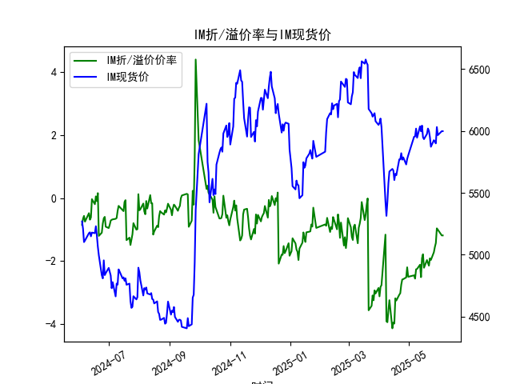

|            |   IF折/溢价率 |   IF现货价 |   IH折/溢价率 |   IH现货价 |   IC折/溢价率 |   IC现货价 |   IM折/溢价率 |   IM现货价 |
|:-----------|--------------:|-----------:|--------------:|-----------:|--------------:|-----------:|--------------:|-----------:|
| 2025-05-07 |     -1.2169   |     3785   |     -0.909959 |     2646.4 |     -2.26234  |     5620.2 |     -2.55739  |     5955.2 |
| 2025-05-08 |     -0.957625 |     3816   |     -0.548944 |     2664.8 |     -1.97107  |     5660   |     -2.2617   |     6018.8 |
| 2025-05-09 |     -0.976471 |     3808.6 |     -0.663397 |     2666.2 |     -2.04348  |     5604.8 |     -2.25057  |     5945.2 |
| 2025-05-12 |     -0.966676 |     3853   |     -0.592655 |     2686.6 |     -1.82396  |     5688   |     -2.1153   |     6037   |
| 2025-05-13 |     -1.16158  |     3851   |     -0.733322 |     2688.2 |     -2.19778  |     5654.6 |     -2.51032  |     5996.6 |
| 2025-05-14 |     -0.908163 |     3907.4 |     -0.587737 |     2737.6 |     -1.74715  |     5697.8 |     -1.90524  |     6043   |
| 2025-05-15 |     -0.880406 |     3872.8 |     -0.631231 |     2723   |     -1.6149   |     5623   |     -1.78364  |     5949   |
| 2025-05-16 |     -1.10785  |     3846   |     -0.790006 |     2695.2 |     -1.99531  |     5601.8 |     -2.21348  |     5933.8 |
| 2025-05-19 |     -0.875523 |     3843.2 |     -0.602139 |     2688.8 |     -1.70946  |     5623   |     -1.96768  |     5975.4 |
| 2025-05-20 |     -0.840664 |     3865.4 |     -0.63422  |     2699.4 |     -1.6802   |     5650.8 |     -2.06014  |     6019.4 |
| 2025-05-21 |     -0.898296 |     3881.2 |     -0.580049 |     2712.6 |     -1.77707  |     5655.6 |     -2.14574  |     6000.6 |
| 2025-05-22 |     -0.87548  |     3879.6 |     -0.666962 |     2715.4 |     -1.55138  |     5614.8 |     -1.91397  |     5950   |
| 2025-05-23 |     -0.9292   |     3846.2 |     -0.695185 |     2693   |     -1.61406  |     5561.8 |     -1.96463  |     5872   |
| 2025-05-26 |     -0.748858 |     3831.2 |     -0.556508 |     2684.4 |     -1.32042  |     5594.6 |     -1.72151  |     5925   |
| 2025-05-27 |     -0.786501 |     3809.2 |     -0.621209 |     2668.6 |     -1.31181  |     5578   |     -1.55547  |     5915   |
| 2025-05-28 |     -0.814251 |     3805   |     -0.658307 |     2665.4 |     -1.22822  |     5568   |     -1.42796  |     5899   |
| 2025-05-29 |     -0.671205 |     3832.8 |     -0.642634 |     2673.6 |     -0.897044 |     5668.6 |     -0.961935 |     6031   |
| 2025-05-30 |     -0.464355 |     3822.4 |     -0.429145 |     2667.2 |     -0.763036 |     5627.8 |     -1.00489  |     5966   |
| 2025-06-03 |     -0.706454 |     3824.8 |     -0.695718 |     2668.6 |     -0.991047 |     5638.4 |     -1.18676  |     5998   |
| 2025-06-04 |     -0.706454 |     3824.8 |     -0.695718 |     2668.6 |     -0.991047 |     5638.4 |     -1.18676  |     5998   |

### 1. 股指期货折/溢价率与现货价的相关性及影响逻辑  
**折/溢价率定义**：期货价格与现货价格的差异比例（溢价率为正时，期货价格高于现货；折价率为负时，期货价格低于现货）。  

#### 相关性逻辑：  
- **短期负相关**：折价率扩大（更负）通常反映市场情绪悲观，投资者预期未来现货价格下跌，导致期货价格贴水（折价）。此时现货价格可能因抛压而承压。  
- **长期均值回归**：套利机制会限制折/溢价率持续偏离。例如，大幅折价可能吸引资金通过“买入期货+卖出现货”套利，推动期货价格回升，间接支撑现货价格。  
- **流动性影响**：市场流动性紧张时，期货折价率可能扩大（投资者急于抛售期货对冲风险），导致现货价格短期承压。  

#### 影响逻辑：  
- **预期驱动**：溢价率上升反映市场对未来上涨的预期（如政策利好），可能吸引资金流入推高现货；反之，折价率扩大可能预示短期看空。  
- **基差收敛**：临近交割日，期货价格会向现货收敛，折/溢价率收窄可能带来套利机会或价格波动。  

---

### 2. 近期投资机会分析（聚焦最近一周数据）  

#### **整体市场特征**：  
- **折价率普遍存在**：IF、IH、IC、IM均维持负值（折价），但幅度分化。其中，IM折价最深（-1.18%），IH折价最浅（-0.69%），反映中小盘（IM、IC）情绪更悲观。  
- **现货价波动收窄**：多数品种现货价近期窄幅震荡，市场缺乏方向性信号。  

#### **分品种机会**：  
1. **IM（中证1000）**：  
   - **折价率扩大**：最新折价率-1.18%（6月4日），较前一日持平，但较一周前（5月28日-1.42%）略有收窄。  
   - **现货价反弹**：现货价从5899.0（5月28日）升至5998.0（6月4日），折价率未同步收缩，显示期货修复滞后。  
   - **机会**：若现货企稳，期货折价率可能收敛，可关注“多IM期货+对冲现货”的基差套利机会。  

2. **IC（中证500）**：  
   - **折价率波动**：折价率从-1.22%（5月28日）收窄至-0.99%（6月4日），同期现货价从5568.0升至5638.4。  
   - **信号**：折价率收窄伴随现货反弹，或反映情绪修复，可关注期货多头趋势延续性。  

3. **IF（沪深300）与IH（上证50）**：  
   - **折价率稳定**：IF、IH折价率近一周变化极小（IF：-0.70%至-0.71%，IH：-0.69%至-0.70%），现货价横盘。  
   - **机会**：低波动下可关注期权波动率策略（如卖出宽跨式组合），或等待折价率突破后跟随趋势。  

#### **今日（6月4日）vs 昨日（6月3日）**：  
- **价格停滞**：所有品种现货价均与前一日持平，折价率亦未变动，反映市场观望情绪浓厚。  
- **策略建议**：短期缺乏催化，需警惕流动性变化或外部事件冲击引发的折价率跳变（如政策预期或外围市场波动）。  

---

### **结论**：  
- **核心机会**：IM、IC的折价率修复空间较大，可布局基差收敛策略；IF、IH适合低风险套利或波动率交易。  
- **风险提示**：折价率持续可能反映资金面紧张或系统性风险，需监控杠杆资金及宏观流动性指标。

