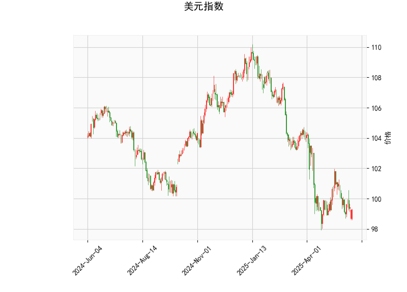

# 美元指数技术分析解读

## 一、美元指数技术指标分析

### 1. 当前价格与布林轨道
- **当前价99.28**明显低于布林中轨（101.16）并接近下轨（97.19），显示美元指数处于**弱势区间**，短期存在**超卖反弹可能**，但若持续跌破下轨可能加速下行。

### 2. RSI指标
- **RSI 42.5**位于中性区间（30-70），但接近弱侧，表明市场尚未出现极端抛压，需警惕**二次探底风险**。

### 3. MACD指标
- **MACD线（-0.4246）与信号线（-0.4233）**负值收敛，柱状图接近零轴，显示**空头动能减弱**，可能进入震荡或趋势反转观察期。

### 4. K线形态组合
- **CDLCLOSINGMARUBOZU（光头光脚阳线）**：暗示短期多头力量占优；
- **CDLGAPSIDESIDEWHITE（跳空缺口+白实体）**：可能预示反弹延续；
- **CDLLONGLINE（长影线）**：反映市场分歧，需警惕冲高回落。

**综合判断**：美元指数短期有技术性反弹需求，但中期下行趋势未改，需关注布林中轨（101.16）压力位。

---

# 对A股/港股市场的策略建议

## 二、跨市场联动机会分析

### 1. 汇率敏感型板块
- **港股流动性溢价**：若美元延续弱势，港币流动性改善将更显著利好**恒生科技（0700.HK）**、**生物医药（HSHKBIO）**等外资重仓板块。
- **AH股溢价套利**：当前AH溢价指数约145（H股折价），可关注**券商（中信证券/海通证券）**、**保险（中国平安）**等折价超20%的H股做多机会。

### 2. 大宗商品传导逻辑
- **黄金/铜产业链**：美元弱势强化商品金融属性，关注**紫金矿业（2899.HK）**、**江西铜业（0358.HK）**的突破机会。
- **能源运输板块**：布伦特原油若突破85美元将刺激VLCC运价，**中远海能（1138.HK）**存在事件驱动机会。

### 3. 技术形态共振标的
- **A股半导体**：中芯国际（688981.SH）周线MACD金叉，若突破55元将打开空间。
- **港股消费**：美团（3690.HK）日线形成W底，止损115港元，目标位140港元。

---

**风险提示**：需同步关注美联储9月议息会议动向及中国PMI数据，若美元超预期反弹需及时止损。建议采用**多空对冲策略**（如做多恒生科技ETF+做空美元指数期货）控制波动风险。