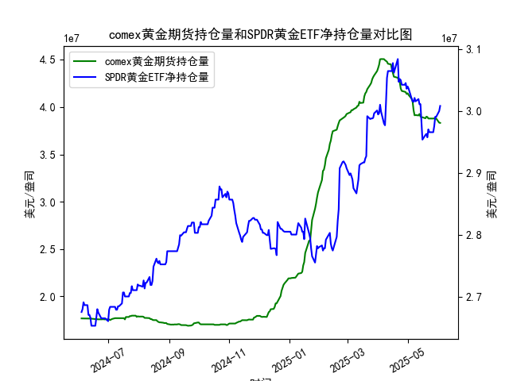

|            |   comex黄金期货持仓量 |   SPDR黄金ETF净持仓量 |
|:-----------|----------------------:|----------------------:|
| 2025-05-06 |           4.06075e+07 |           3.01562e+07 |
| 2025-05-07 |           3.96819e+07 |           3.0147e+07  |
| 2025-05-08 |           3.91313e+07 |           3.02115e+07 |
| 2025-05-09 |           3.91541e+07 |           3.01557e+07 |
| 2025-05-12 |           3.91172e+07 |           3.01926e+07 |
| 2025-05-13 |           3.92705e+07 |           3.01096e+07 |
| 2025-05-14 |           3.90037e+07 |           3.01096e+07 |
| 2025-05-15 |           3.89209e+07 |           2.98239e+07 |
| 2025-05-16 |           3.89209e+07 |           2.95382e+07 |
| 2025-05-19 |           3.88155e+07 |           2.96119e+07 |
| 2025-05-20 |           3.89849e+07 |           2.96303e+07 |
| 2025-05-21 |           3.89515e+07 |           2.9575e+07  |
| 2025-05-22 |           3.87935e+07 |           2.97041e+07 |
| 2025-05-23 |           3.87881e+07 |           2.9658e+07  |
| 2025-05-27 |           3.87875e+07 |           2.9658e+07  |
| 2025-05-28 |           3.88146e+07 |           2.97594e+07 |
| 2025-05-29 |           3.87892e+07 |           2.99068e+07 |
| 2025-05-30 |           3.87892e+07 |           2.99068e+07 |
| 2025-06-02 |           3.83496e+07 |           2.9999e+07  |
| 2025-06-03 |           3.8328e+07  |           3.00819e+07 |

### 1. COMEX黄金期货持仓量与SPDR黄金ETF净持仓量的相关性及影响逻辑

#### **相关性分析**  
COMEX黄金期货持仓量和SPDR黄金ETF净持仓量通常呈现**正相关性**，但两者反映的市场行为不同：  
- **COMEX期货持仓量**：反映投机者和对冲机构的短期交易行为，持仓量增加（尤其是多单）表明市场对金价上涨预期增强，反之则可能预示看空情绪。  
- **SPDR黄金ETF持仓量**：代表实物黄金的长期配置需求，机构和个人投资者通过ETF增减持表达对黄金的中长期信心。  

#### **影响逻辑**  
- **同步上升**：若两者同时增加，表明市场对黄金的短期投机和长期配置需求均旺盛，可能推动金价走强。  
- **背离信号**：  
  - *期货持仓下降+ETF持仓上升*：可能反映投机获利了结，但长期资金仍在布局（如避险需求）。  
  - *期货持仓上升+ETF持仓下降*：短期炒作升温，但机构对中长期趋势存疑。  

---

### 2. 近期投资机会分析（聚焦最近一周及今日变化）

#### **数据观察**  
- **COMEX持仓（最近一周）**：  
  - 从`40607506.812`快速下降至`39131282.687`，显示短期投机资金撤离，可能因市场避险情绪降温或美元走强。  
  - **今日（2025年5月30日）**：最新值为`39681947.657`，较前一日小幅反弹，但未扭转下降趋势。  

- **SPDR ETF持仓（最近一周）**：  
  - 从`29998978.15`稳步上升至`30081919.75`，表明机构资金持续流入黄金ETF，或与地缘风险或通胀预期有关。  
  - **今日（2025年5月30日）**：持仓量微增，显示短期避险需求仍在支撑市场。  

#### **潜在机会**  
1. **短期反弹信号**：  
   - COMEX持仓今日小幅回升，若配合金价止跌，可能触发空头回补行情。  
   - SPDR持仓持续温和增长，显示长期买盘支撑，可关注逢低布局机会。  

2. **背离机会**：  
   - COMEX持仓整体下降反映投机情绪谨慎，但SPDR持仓上升表明机构仍在增持，若金价未大幅下跌，可能预示市场存在“卖预期、买事实”的博弈空间。  

3. **事件驱动风险**：  
   - 需关注美联储政策动向及通胀数据：若降息预期升温，可能推动COMEX持仓反弹；若地缘冲突升级，SPDR持仓或进一步攀升。  

#### **操作建议**  
- **保守策略**：等待COMEX持仓企稳（如连续3日回升）后再介入短期多头。  
- **激进策略**：利用SPDR持仓的稳定性，在价格回调时分批建仓，对冲短期波动风险。  

---

### 总结  
当前市场呈现“短期投机降温、长期配置温和增长”的背离状态，需警惕金价波动放大。若COMEX持仓触底反弹，或SPDR持仓加速上升，可能成为趋势性行情的催化剂。