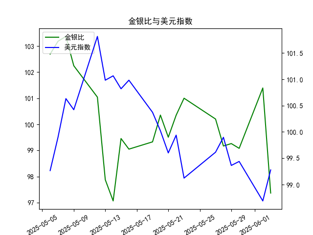

|            |    金价 |   银价 |   美元指数 |   金银比 |
|:-----------|--------:|-------:|-----------:|---------:|
| 2025-05-06 | 3391.45 | 33.025 |    99.2654 | 102.693  |
| 2025-05-07 | 3392.25 | 32.875 |    99.9006 | 103.186  |
| 2025-05-08 | 3352.3  | 32.43  |   100.633  | 103.37   |
| 2025-05-09 | 3324.55 | 32.515 |   100.422  | 102.247  |
| 2025-05-12 | 3235.4  | 32.02  |   101.814  | 101.043  |
| 2025-05-13 | 3227.95 | 32.98  |   100.983  |  97.876  |
| 2025-05-14 | 3191.95 | 32.885 |   101.066  |  97.064  |
| 2025-05-15 | 3191.05 | 32.085 |   100.82   |  99.4561 |
| 2025-05-16 | 3182.95 | 32.135 |   100.983  |  99.0493 |
| 2025-05-19 | 3230.15 | 32.52  |   100.373  |  99.3281 |
| 2025-05-20 | 3261.55 | 32.5   |   100.022  | 100.355  |
| 2025-05-21 | 3299.65 | 33.16  |    99.6014 |  99.5069 |
| 2025-05-22 | 3284    | 32.725 |    99.9388 | 100.351  |
| 2025-05-23 | 3342.65 | 33.095 |    99.1231 | 101.002  |
| 2025-05-27 | 3296.7  | 32.9   |    99.6147 | 100.204  |
| 2025-05-28 | 3300.85 | 33.285 |    99.8978 |  99.1693 |
| 2025-05-29 | 3312.4  | 33.37  |    99.3633 |  99.2628 |
| 2025-05-30 | 3277.55 | 33.08  |    99.4393 |  99.0795 |
| 2025-06-02 | 3370.85 | 33.245 |    98.6893 | 101.394  |
| 2025-06-03 | 3334.75 | 34.25  |    99.2781 |  97.365  |

# 金银比与美元指数的相关性及影响逻辑

## 一、金银比与美元指数的相关性逻辑

1. **金银比的本质**  
   金银比反映黄金与白银价格的相对强弱，其变动受两种金属金融属性与商品属性的博弈影响。黄金的避险属性更突出（受利率、地缘政治驱动），白银的工业属性占比更高（受制造业需求驱动）。

2. **美元指数的传导路径**  
   - **直接关联**：美元指数走强时，以美元计价的大宗商品（包括金银）价格承压，但黄金的抗通胀属性可能使其跌幅小于白银，导致金银比被动上升。
   - **间接关联**：美元强弱反映全球资本流动方向。美元走强常伴随风险偏好下降（如加息周期），此时黄金作为避险资产更受青睐，而白银因工业需求预期转弱，可能加剧金银比扩大。

3. **历史规律**  
   美元指数与金银比通常呈现**弱正相关性**（美元强→金银比升），但需警惕以下例外：
   - **避险共振**：极端风险事件中，金银同步上涨但白银弹性更大（如2020年疫情初期），导致金银比下降。
   - **通胀预期分化**：当实际利率下行推升黄金，而经济复苏预期同时拉动白银工业需求时，二者可能脱钩。

---

## 二、近期投资机会分析（聚焦最近一周）

### 数据关键变化（2025年5月27日-6月3日）
| 日期       | 金银比    | 美元指数 | 金银比日变动 | 美元指数日变动 |
|------------|-----------|----------|--------------|----------------|
| 6月2日     | 101.39    | 98.69    | ▲1.33%       | ▼0.75%         |
| 6月3日     | **97.36** | **99.28**| **▼4.07%**   | ▲0.60%         |

### 核心观察点
1. **金银比单日暴跌**（6月3日环比-4.07%）  
   - **背离信号**：美元指数当日小幅上涨（+0.60%），但金银比却创近1个月最大跌幅，表明白银出现独立于美元的强势表现。
   - **潜在驱动**：可能反映工业金属需求端突发利好（如新能源政策加码、光伏装机数据超预期），或黄金短期超买后的获利回吐。

2. **美元指数触底反弹**  
   - 6月3日美元指数结束三连跌，重回99上方，需关注美联储政策预期变化（如加息信号）对贵金属的压制。

### 投资机会研判
1. **做空金银比（多白银/空黄金）**  
   - **短期逻辑**：近一周金银比从101.39→97.36（累计-4.0%），技术面破位下行。若美元反弹未能压制白银，则比值可能进一步向95-96区间回归。
   - **风险点**：需监控COMEX黄金/白银期货持仓数据，警惕投机多头平仓引发的反向波动。

2. **对冲美元反弹的贵金属空头策略**  
   - 若美元指数站稳99.5上方，可考虑：
     - **做空黄金**（受美元压制更敏感）
     - **做多白银**（工业属性提供支撑，对冲黄金空头风险）

3. **事件驱动套利**  
   - 关注6月初美国非农就业数据：若数据超预期强化加息预期，黄金或加速回调，但白银可能因“新能源产业链补库”的叙事保持韧性，扩大比值收敛空间。

---

## 三、操作建议
- **激进策略**：在97.36金银比水平建立空头头寸，止损位设于99.0，目标位94.5。
- **保守策略**：等待美元指数突破100后再反向布局黄金多头（避险属性回归），同时持有白银多单对冲。