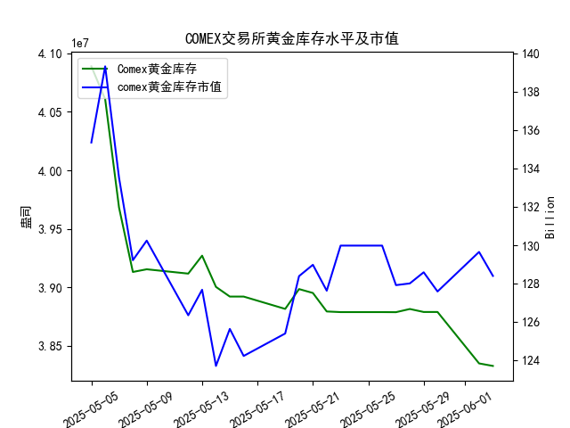

|            |   comex黄金库存量 |   comex黄金库存市值(billion) |   伦敦金现货价 |   上海金交所黄金现货价 |   美元兑人民币汇率 |
|:-----------|------------------:|-----------------------------:|---------------:|-----------------------:|-------------------:|
| 2025-05-07 |       3.96819e+07 |                       3364.7 |        3392.25 |                 798.51 |             7.2005 |
| 2025-05-08 |       3.91313e+07 |                       3302.1 |        3352.3  |                 786.5  |             7.2073 |
| 2025-05-09 |       3.91541e+07 |                       3326.3 |        3324.55 |                 785.5  |             7.2095 |
| 2025-05-12 |       3.91172e+07 |                       3230   |        3235.4  |                 759    |             7.2066 |
| 2025-05-13 |       3.92705e+07 |                       3251.4 |        3227.95 |                 763.9  |             7.1991 |
| 2025-05-14 |       3.90037e+07 |                       3171.7 |        3191.95 |                 758.38 |             7.1956 |
| 2025-05-15 |       3.89209e+07 |                       3228.1 |        3191.05 |                 735.86 |             7.1963 |
| 2025-05-16 |       3.89209e+07 |                       3191.8 |        3182.95 |                 746.4  |             7.1938 |
| 2025-05-19 |       3.88155e+07 |                       3230.6 |        3230.15 |                 754.5  |             7.1916 |
| 2025-05-20 |       3.89849e+07 |                       3293.2 |        3261.55 |                 753.49 |             7.1931 |
| 2025-05-21 |       3.89515e+07 |                       3311.4 |        3299.65 |                 773.82 |             7.1937 |
| 2025-05-22 |       3.87935e+07 |                       3290   |        3284    |                 778.36 |             7.1903 |
| 2025-05-23 |       3.87881e+07 |                       3351   |        3342.65 |                 776.4  |             7.1919 |
| 2025-05-26 |       3.87881e+07 |                       3351   |        3342.65 |                 773.94 |             7.1833 |
| 2025-05-27 |       3.87875e+07 |                       3298   |        3296.7  |                 768.75 |             7.1876 |
| 2025-05-28 |       3.88146e+07 |                       3298   |        3300.85 |                 769.67 |             7.1894 |
| 2025-05-29 |       3.87892e+07 |                       3315.1 |        3312.4  |                 763.02 |             7.1907 |
| 2025-05-30 |       3.87892e+07 |                       3289.4 |        3277.55 |                 768.79 |             7.1848 |
| 2025-06-02 |       3.83496e+07 |                       3380.8 |        3370.85 |                 768.79 |             7.1848 |
| 2025-06-03 |       3.8328e+07  |                       3350   |        3334.75 |                 778.5  |             7.1869 |

### 分析与投资机会判断

#### 1. **COMEX黄金库存与黄金价格的关联性验证**
   - **整体趋势**：近一个月COMEX黄金库存从5月5日的40.89M降至6月3日的38.33M（降幅约6.3%），而同期伦敦金价从3391.45美元/盎司波动至3334.75美元/盎司，上海金价从792.20元/克微降至778.50元/克。库存下降并未伴随金价显著上涨，**整体趋势不支持“高度正相关”结论**。
   - **矛盾点**：库存减少通常预示供应收紧，理论上应推动价格上涨，但实际价格震荡走弱，可能与美元流动性、市场避险情绪等外部因素有关。

---

#### 2. **近期（最近一周）数据变化**
   - **COMEX库存**：
     - **今日（6月3日）库存**：38.33M，较昨日（6月2日）38.35M微降0.02M，延续下降趋势。
     - **周内降幅**：5月28日至6月3日累计下降约0.5M（降速加快）。
   - **伦敦金价**：
     - **今日价格**：3334.75美元/盎司，较昨日（3370.85）下跌36.1美元（跌幅1.07%）。
     - **周内波动**：5月28日以来金价在3277-3370美元区间震荡，未突破前高。
   - **上海金价**：
     - **今日价格**：778.50元/克，较昨日（768.79）上涨9.71元（涨幅1.26%），**逆势走强**。
   - **汇率因素**：美元兑人民币汇率稳定在7.18-7.19区间，对上海金价影响有限。

---

#### 3. **潜在投资机会**
   - **机会一：上海金价与伦敦金价背离套利**
     - **现象**：今日上海金价逆势上涨，伦敦金价下跌，两地价差扩大至约**4.3元/克**（按汇率折算后）。
     - **策略**：做多伦敦金/做空上海金套利，或关注价差收敛机会。
   - **机会二：COMEX库存加速下降的短期反弹**
     - **逻辑**：若市场开始关注库存下降的供应端压力，可能推动金价反弹。
     - **信号**：观察伦敦金价能否站稳3300美元支撑位，结合库存数据验证。
   - **机会三：人民币计价黄金的避险需求**
     - **背景**：上海金价今日上涨或反映国内避险资金流入。
     - **策略**：短期关注上海金交所的日内交易机会，尤其是政策或流动性宽松预期升温时。

---

#### 4. **今日关键信号**
   - **伦敦金价回调风险**：今日金价跌破3350美元关键支撑，需警惕技术性抛压。
   - **上海金价独立性**：受国内政策或需求推动，短期可能继续强于国际市场。
   - **库存边际变化**：COMEX库存若进一步加速下降，可能成为价格反转催化剂。

---

### 结论
近期投资机会主要集中于**跨市场套利**（如沪伦价差）和**上海金价的短期做多**，需警惕伦敦金价的技术性回调风险。COMEX库存持续下降的长期逻辑需结合宏观环境验证，当前市场更关注短期流动性及汇率波动。