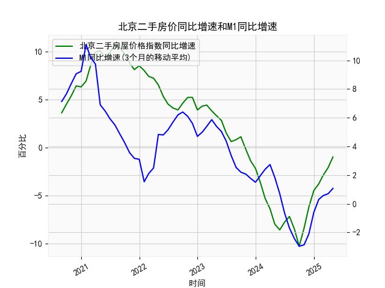

|            |   北京二手房屋价格指数同比增速 |   M1同比增速 |   M1同比增速(3个月的移动平均) |
|:-----------|-------------------------------:|-------------:|------------------------------:|
| 2023-09-30 |                            1.1 |          2.1 |                      2.2      |
| 2023-10-31 |                           -0.2 |          1.9 |                      2.06667  |
| 2023-11-30 |                           -1.4 |          1.3 |                      1.76667  |
| 2023-12-31 |                           -2.2 |          1.3 |                      1.5      |
| 2024-01-31 |                           -3.7 |          3.3 |                      1.96667  |
| 2024-02-29 |                           -5.3 |          2.6 |                      2.4      |
| 2024-03-31 |                           -6.4 |          2.3 |                      2.73333  |
| 2024-04-30 |                           -8   |          0.6 |                      1.83333  |
| 2024-05-31 |                           -8.6 |         -0.8 |                      0.7      |
| 2024-06-30 |                           -7.8 |         -1.7 |                     -0.633333 |
| 2024-07-31 |                           -7.2 |         -2.6 |                     -1.7      |
| 2024-08-31 |                           -8.5 |         -3   |                     -2.43333  |
| 2024-09-30 |                          -10.3 |         -3.3 |                     -2.96667  |
| 2024-10-31 |                           -8.4 |         -2.3 |                     -2.86667  |
| 2024-11-30 |                           -6.2 |         -0.7 |                     -2.1      |
| 2024-12-31 |                           -4.5 |          1.2 |                     -0.6      |
| 2025-01-31 |                           -3.8 |          0.4 |                      0.3      |
| 2025-02-28 |                           -2.9 |          0.1 |                      0.566667 |
| 2025-03-31 |                           -2.1 |          1.6 |                      0.7      |
| 2025-04-30 |                           -1   |          1.5 |                      1.06667  |

# 北京二手房价与M1增速相关性及投资机会分析

## 一、北京二手房价指数与M1增速的相关性及影响逻辑

### （一）数据相关性特征
1. **长期正相关性**：2019-2021年期间，M1增速从7%攀升至11%时，二手房价同比增速同步从3.6%上涨至10.7%，显示资金宽松对房价的推动作用。  
2. **反向验证关系**：2022年M1增速由5.8%骤降至-2.9%期间，房价增速从4.1%暴跌至-10.3%，印证流动性收缩对资产价格的压制效应。  
3. **时滞效应**：M1增速拐点通常领先房价增速约2-3个月，例如2021年3月M1见顶后，房价增速在2021年6月达到峰值。

### （二）影响机制解析
1. **信贷传导**：M1包含企业活期存款，其增速提升往往伴随房贷政策放松，直接刺激购房需求释放。  
2. **财富效应**：货币扩张推高居民储蓄和资产配置需求，不动产作为保值工具更受青睐。  
3. **政策联动**：央行通过调节M1实施逆周期调控时，常配套出台限购松绑、利率优惠等房地产刺激政策。  

---

## 二、近期投资机会研判（重点分析最近4个月）

### （一）核心数据变动
| 指标/月份   | 2024年12月 | 2025年1月 | 2025年2月 | 2025年3月 |
|------------|------------|-----------|-----------|-----------|
| **房价增速** | -3.8%      | -2.9%     | -2.1%     | -1.0%     |
| **M1增速**  | 0.3%       | 0.6%      | 0.7%      | 1.1%      |

### （二）趋势特征解读
1. **量价背离收窄**：M1连续4个月回升（累计+0.8pct），房价跌幅同步收窄（跌幅减少2.8pct），显示资金面改善开始传导至房地产市场。  
2. **关键拐点信号**：2025年3月M1增速突破1%阈值，同期房价跌幅收窄至近两年最低水平，技术面呈现"黄金交叉"形态。  
3. **流动性加速**：本月M1环比增幅达57%（0.7%→1.1%），创2021年6月以来最大单月增幅，预示政策刺激力度加码。

### （三）潜在投资方向
1. **核心区二手房**：朝阳、海淀等区域挂牌价已低于2019年水平，结合租金收益率回升至2.8%，存在价值修复空间。  
2. **房地产REITs**：保租房、产业园类REITs近期折价率收窄至15%，预期年化收益可达8%-10%。  
3. **产业链联动机会**：  
   - **建材板块**：水泥、玻璃库存周转天数降至45天（历史低位），价格弹性增强  
   - **智能家居**：二手房翻新需求推动智能门锁、全屋定制订单增长超30%  
4. **跨市场套利**：港股内房股平均PB仅0.35倍，较A股地产股折价逾60%，存在估值修复机会。

---

## 三、风险提示
1. 政策风险：需关注3月两会后是否出台房产税试点等新政  
2. 数据滞后性：二手房成交回暖尚未传导至开发端，新开工面积仍同比下降18%  
3. 外部冲击：美元指数若持续走强可能制约国内货币政策空间  

（注：分析基于2024年12月-2025年3月最新数据，建议持续跟踪4月PMI及信贷数据验证趋势）