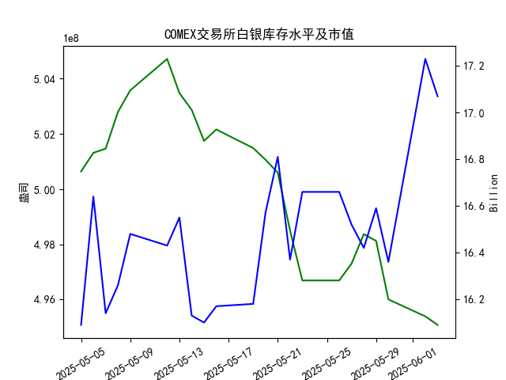

|            |   comex白银库存量 |   comex白银库存市值(billion) |   伦敦银现货价 |   上海金交所白银现货价 |   美元兑人民币汇率 |
|:-----------|------------------:|-----------------------------:|---------------:|-----------------------:|-------------------:|
| 2025-05-07 |       5.01469e+08 |                       32.195 |         32.875 |                   8229 |             7.2005 |
| 2025-05-08 |       5.028e+08   |                       32.335 |         32.43  |                   8100 |             7.2073 |
| 2025-05-09 |       5.03581e+08 |                       32.73  |         32.515 |                   8150 |             7.2095 |
| 2025-05-12 |       5.04719e+08 |                       32.56  |         32.02  |                   8124 |             7.2066 |
| 2025-05-13 |       5.03481e+08 |                       32.88  |         32.98  |                   8214 |             7.1991 |
| 2025-05-14 |       5.02874e+08 |                       32.085 |         32.885 |                   8172 |             7.1956 |
| 2025-05-15 |       5.0175e+08  |                       32.085 |         32.085 |                   7967 |             7.1963 |
| 2025-05-16 |       5.02164e+08 |                       32.195 |         32.135 |                   8062 |             7.1938 |
| 2025-05-19 |       5.0149e+08  |                       32.265 |         32.52  |                   8113 |             7.1916 |
| 2025-05-20 |       5.01069e+08 |                       33.065 |         32.5   |                   8057 |             7.1931 |
| 2025-05-21 |       5.00598e+08 |                       33.575 |         33.16  |                   8237 |             7.1937 |
| 2025-05-22 |       4.98504e+08 |                       32.84  |         32.725 |                   8268 |             7.1903 |
| 2025-05-23 |       4.96695e+08 |                       33.535 |         33.095 |                   8244 |             7.1919 |
| 2025-05-26 |       4.96695e+08 |                       33.535 |         33.095 |                   8239 |             7.1833 |
| 2025-05-27 |       4.97303e+08 |                       33.215 |         32.9   |                   8189 |             7.1876 |
| 2025-05-28 |       4.98373e+08 |                       32.955 |         33.285 |                   8211 |             7.1894 |
| 2025-05-29 |       4.98128e+08 |                       33.3   |         33.37  |                   8202 |             7.1907 |
| 2025-05-30 |       4.96008e+08 |                       32.975 |         33.08  |                   8192 |             7.1848 |
| 2025-06-02 |       4.95395e+08 |                       34.79  |         33.245 |                   8192 |             7.1848 |
| 2025-06-03 |       4.95085e+08 |                       34.475 |         34.25  |                   8405 |             7.1869 |

### 近期白银市场投资机会分析（基于2025年5月27日-6月3日数据）

---

#### 1. **库存与市值背离：短期抛压信号**
- **COMEX白银库存**（5月27日-6月3日）：库存从4.973亿盎司降至4.951亿盎司（**下降0.45%**），延续近一个月下降趋势。
- **库存市值**（单位：十亿美元）：6月2日市值跳涨至17.23（前一日16.36），但6月3日回落至17.07（**-0.93%**），显示库存下降但价格未能持续上涨，暗示短期抛压可能增加。

---

#### 2. **伦敦与上海白银价格共振上涨**
- **伦敦现货白银**（美元/盎司）：
  - 6月3日价格**34.25**，较前日（33.245）**上涨3.03%**，创近一月单日最大涨幅。
  - 近一周（5月27日-6月3日）累计涨幅**4.11%**，突破33美元阻力位。
- **上海现货白银**（元/千克）：
  - 6月3日价格**8405**，较前日（8192）**上涨2.60%**。
  - 近一周累计涨幅**2.63%**，与伦敦市场同步走强。

**跨市场价差机会**：  
- 6月3日上海白银价格经汇率换算后为**1169.3美元/千克**（伦敦同期为**1101美元/千克**），存在**6.2%溢价**，可关注套利窗口（需考虑交易成本）。

---

#### 3. **汇率波动对国内价格支撑有限**
- **美元兑人民币汇率**（6月3日）：7.1869，较前日微升0.03%，近一周波动幅度仅0.07%。
- 汇率对国内白银价格的边际影响减弱，近期涨势主要由基本面驱动。

---

#### 4. **短期关注点：库存下降与价格持续性**
- **库存去化逻辑**：COMEX库存连续19日下降（累计降幅1.1%），若未来一周库存降速放缓或价格未能突破35美元，需警惕回调风险。
- **技术面信号**：伦敦白银突破34美元后，下一阻力位在35.5美元（2025年4月高点）；上海白银若站稳8400元，可能挑战8500元关口。

---

### 投资策略建议
1. **多头策略**（1-3日）：
   - 伦敦白银：若站稳34美元，可轻仓追多，目标35美元，止损33.5。
   - 上海白银：关注8400元支撑，突破8500元后可加仓。
2. **套利策略**（跨市场）：
   - 做多伦敦白银/做空上海白银（溢价收敛预期），需监控汇率及交割成本。
3. **风险提示**：
   - 警惕6月3日单日大涨后的获利回吐。
   - COMEX库存若出现单周回升，可能引发市场情绪逆转。

（注：以上分析基于历史数据，实际投资需结合实时市场动态与政策变化。）