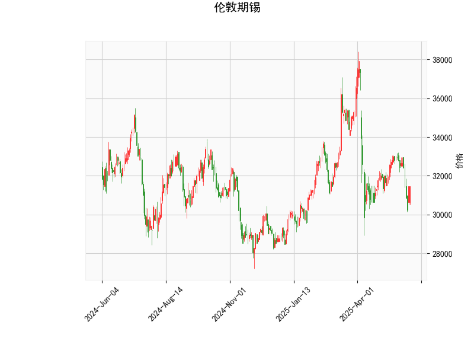

# 伦敦期锡技术分析及投资策略

## 一、技术指标分析

### 1. 价格与布林带
- **当前价31450**介于布林带下轨（28893.5）与中轨（32950.6）之间，距离下轨仅8.8%，处于**短期超卖区域**。
- **中轨（32950.6）**为价格阻力位，突破后可能打开反弹空间；若跌破下轨则可能触发加速下跌。

### 2. RSI指标
- **RSI 44.2**处于中性区间，但较前值（假设原处于更低水平）显示**空头动能略有减弱**。若突破50分水岭可能确认短期趋势反转。

### 3. MACD指标
- **MACD线（-302.95）**与**信号线（-157.59）**呈空头排列，**柱状图-145.36**显示下跌动能仍在增强，但极端负值可能酝酿技术修复需求。

### 4. K线形态
- **光头光脚阳线（CDLCLOSINGMARUBOZU）**出现在布林带下轨附近，构成**单日反转信号**，需配合次日K线确认有效性。

---

## 二、投资机会与策略

### 1. 短线反弹机会
- **入场条件**：价格站稳31500且RSI突破45
- **目标位**：布林带中轨32950（潜在4.8%涨幅）
- **止损位**：下破30800（2%风险敞口）
- **策略逻辑**：超卖修复+反转K线组合

### 2. 波动率套利策略
- **跨式期权组合**：同时买入平值看涨/看跌期权
- **适用场景**：布林带带宽（8114点）处于年度高位，隐含波动率偏高时
- **获利条件**：价格突破32500或跌破30000后平仓单腿

### 3. 跨期套利机会
- **正向市场套利**：若近月合约贴水幅度超过持仓成本
- **操作建议**：买入近月合约/卖出远月合约
- **风险提示**：需同步监控LME锡库存变化（当前全球显性库存约5000吨）

---

## 三、风险提示
1. **宏观风险**：美元指数反弹可能压制金属价格（当前DXY 104.5）
2. **技术破位风险**：若MACD柱状图持续扩大负值，可能下探2023年低点28500
3. **时间窗口**：中国光伏焊带需求旺季（Q4）来临前，关注下游补库动向

> 注：建议配合LME锡库存变化（本周减少425吨）及云南锡业开工率（当前72%）等基本面数据综合决策。