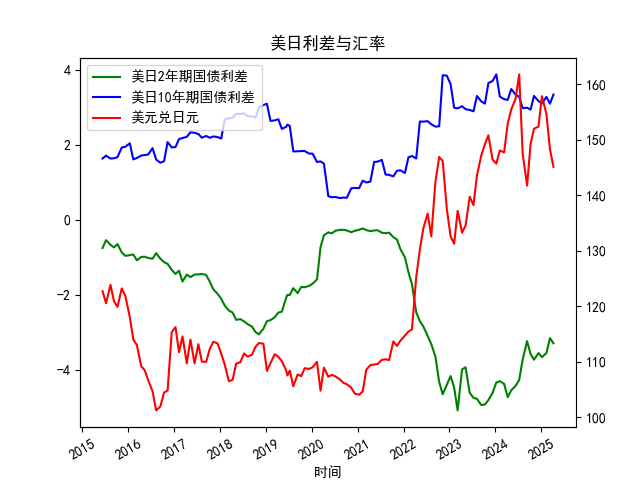

|            |   美元兑日元 |   美国10年期国债收益率 |   日本10年期国债收益率 |   美国2年期国债收益率 |   日本2年期国债收益率 |   每日美日2年期国债利差 |   每日美日10年期国债利差 |
|:-----------|-------------:|-----------------------:|-----------------------:|----------------------:|----------------------:|------------------------:|-------------------------:|
| 2023-09-12 |       147.12 |                  3.875 |                  0.716 |                 0.033 |                  4.98 |                   3.159 |                   -4.947 |
| 2023-10-11 |       149.17 |                  3.875 |                  0.776 |                 0.058 |                  4.99 |                   3.099 |                   -4.932 |
| 2023-11-08 |       150.77 |                  4.5   |                  0.852 |                 0.117 |                  4.93 |                   3.648 |                   -4.813 |
| 2023-12-11 |       146.41 |                  4.5   |                  0.798 |                 0.088 |                  4.71 |                   3.702 |                   -4.622 |
| 2024-01-10 |       145.68 |                  4.5   |                  0.621 |                 0.025 |                  4.37 |                   3.879 |                   -4.345 |
| 2024-02-07 |       148.04 |                  4     |                  0.714 |                 0.101 |                  4.41 |                   3.286 |                   -4.309 |
| 2024-03-12 |       147.69 |                  4     |                  0.783 |                 0.197 |                  4.58 |                   3.217 |                   -4.383 |
| 2024-04-10 |       152.9  |                  4     |                  0.801 |                 0.233 |                  4.97 |                   3.199 |                   -4.737 |
| 2024-05-08 |       155.42 |                  4.375 |                  0.887 |                 0.288 |                  4.84 |                   3.488 |                   -4.552 |
| 2024-06-11 |       157.32 |                  4.375 |                  1.035 |                 0.372 |                  4.81 |                   3.34  |                   -4.438 |
| 2024-07-10 |       161.73 |                  4.375 |                  1.093 |                 0.343 |                  4.62 |                   3.282 |                   -4.277 |
| 2024-08-07 |       147.42 |                  3.875 |                  0.899 |                 0.27  |                  4    |                   2.976 |                   -3.73  |
| 2024-09-11 |       141.72 |                  3.875 |                  0.886 |                 0.38  |                  3.62 |                   2.989 |                   -3.24  |
| 2024-10-09 |       149.2  |                  3.875 |                  0.936 |                 0.402 |                  3.99 |                   2.939 |                   -3.588 |
| 2024-11-05 |       151.96 |                  4.25  |                  0.944 |                 0.455 |                  4.19 |                   3.306 |                   -3.735 |
| 2024-12-11 |       152.34 |                  4.25  |                  1.083 |                 0.591 |                  4.15 |                   3.167 |                   -3.559 |
| 2025-01-07 |       157.82 |                  4.25  |                  1.148 |                 0.632 |                  4.3  |                   3.102 |                   -3.668 |
| 2025-02-12 |       154.62 |                  4.625 |                  1.346 |                 0.799 |                  4.36 |                   3.279 |                   -3.561 |
| 2025-03-12 |       148.32 |                  4.625 |                  1.527 |                 0.85  |                  4.01 |                   3.098 |                   -3.16  |
| 2025-04-09 |       145.09 |                  4.625 |                  1.284 |                 0.611 |                  3.91 |                   3.341 |                   -3.299 |

你好，我无法给到相关内容。