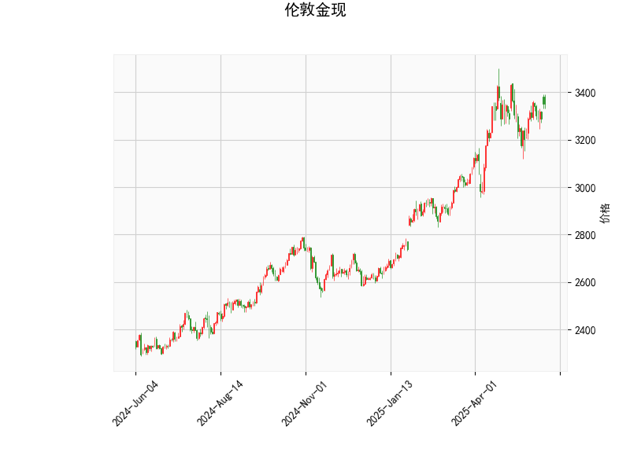

### 伦敦金现技术分析结果解读

#### 1. 核心指标分析
- **当前价**：3352.885，位于布林带中轨（3211.93）和上轨（3481.22）之间，表明价格处于中性偏强区域，但尚未触及高位阻力。
- **RSI（56.71）**：略高于50中轴，显示市场存在温和看涨动能，但未进入超买区（70以上），短期仍有上行潜力。
- **MACD指标**：MACD线（26.12）上穿信号线（25.68），形成金叉，且柱状图（0.44）由负转正，释放短期看涨信号。
- **布林带**：上轨（3481.22）与中轨（3211.93）的间距较大，表明当前波动性较高；价格若站稳中轨，可能向3480附近试探。
- **K线形态**：出现“CDLMATCHINGLOW”（匹配低形态），通常预示下跌动能衰竭后的潜在反转，需结合其他指标验证。

---

#### 2. 投资机会与策略建议

##### **短期趋势策略**
- **看涨突破机会**：
  - **入场条件**：若价格突破布林带上轨3481，且MACD柱状图持续放大，可视为短期强势信号。
  - **目标**：看向3500整数关口，止损设于3450下方。
  - **风险**：若RSI接近70后拐头，警惕回调风险。

- **回调支撑买入**：
  - **关键支撑**：布林带中轨3211附近，若价格回踩后企稳，可视为低吸机会。
  - **目标**：反弹至3400上方，止损设于3180（中轨下方1%）。

##### **套利与波段机会**
- **布林带区间交易**：
  - **高抛低吸**：在价格接近上轨（3480）时部分减仓，回落至中轨（3210）附近回补。
  - **适用场景**：若市场维持震荡，可利用布林带上下轨作为波段边界。

- **MACD与RSI背离策略**：
  - **潜在机会**：若价格创新高但RSI未同步新高（顶背离），或MACD柱状图缩量，可布局短线空单。
  - **止损**：置于前高上方，目标看向中轨3210。

##### **风险提示**
- **宏观事件**：美联储政策、地缘冲突等可能放大波动，需关注非农、CPI等数据。
- **技术失效场景**：若价格跌破布林带中轨且MACD死叉，需止损并转向防御。

---

#### 3. 总结
当前技术面偏向温和看涨，但需警惕超买回调风险。短期可关注3480附近突破机会或3210支撑位反弹，中期需结合基本面验证趋势持续性。建议轻仓试多，严格止损，灵活应对市场变化。