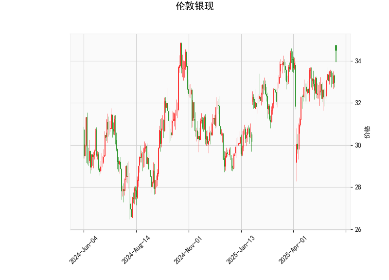

# 伦敦银现技术分析及策略建议

## 一、技术指标解读

### 1. 价格与布林通道
- **当前价34.497**位于布林上轨（34.84）附近，略低于上轨，显示价格处于短期强势区域。
- **中轨32.95**与当前价形成约4.5%的向上偏离，表明中期趋势偏多。
- **布林带收窄**（上中下轨间距约3.78）暗示波动率降低，可能酝酿方向突破。

### 2. RSI指标
- **63.33**处于中性偏强区域，尚未进入超买区（>70），显示上涨动能持续但未过热。
- 若突破70需警惕回调风险，若站稳60上方则维持看涨逻辑。

### 3. MACD指标
- **DIF(0.324)上穿DEA(0.177)**形成金叉，柱状图连续放大（0.147），确认多头动能增强。
- 但绝对值较小，需关注持续放量配合价格突破。

### 4. K线形态
- **CDLMATCHINGLOW**形态出现：
  - 典型反转信号，常见于下跌趋势末端。
  - 需结合位置判断有效性，当前处于布林上轨附近可能降低其反转概率。

## 二、近期机会与策略

### 机会判断
1. **趋势延续机会**  
   - 若价格突破34.84布林上轨，可能开启加速上行，目标看至前高35.5区域。
   - 突破有效性确认条件：连续两小时收盘站上34.85，且MACD柱持续放大。

2. **均值回归机会**  
   - 当前价/上轨溢价率达0.99%，若受阻回落：
     - 第一支撑看中轨32.95（-4.47%）
     - 强支撑看下轨31.06（-9.95%）

### 策略建议

#### 趋势跟踪策略
- **多头策略**（突破确认后）：
  - 入场：34.85上方0.3%处（约34.95）
  - 止损：跌破中轨32.90（-5.8%）
  - 目标：35.50（+1.6%）、36.00（+3.1%）

- **空头策略**（反转信号确认）：
  - 入场：跌破33.80（当前价-2%）
  - 止损：34.90上方（+3.2%）
  - 目标：中轨32.95（-2.5%）

#### 套利策略
1. **跨期套利**  
   - 观察近远月价差变化，若contango结构（远月升水）扩大：
   - 做空近月合约，同时做多远月合约，捕捉基差回归收益。

2. **波动率套利**  
   - 布林带收窄周期可卖出宽跨式期权组合：
     - 卖出34.80看涨期权
     - 卖出34.00看跌期权
     - 收取权利金，赌价格在34.00-34.80区间震荡。

## 三、风险提示
1. **宏观事件风险**：关注美联储利率决议（3月20日）对美元指数的冲击。
2. **持仓量验证**：需配合成交量放大确认突破有效性，当前量能未明确显示。
3. **白银/黄金比价**：当前比价约0.012，若黄金补涨可能压制白银涨幅。

> （注：以上策略需配合实时仓位管理，建议单笔交易风险敞口不超过本金的2%）